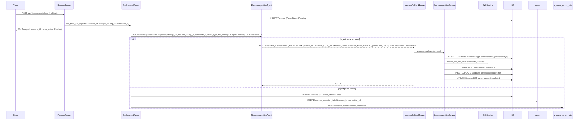
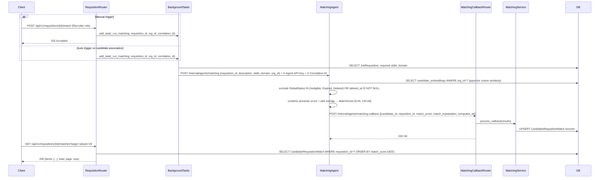
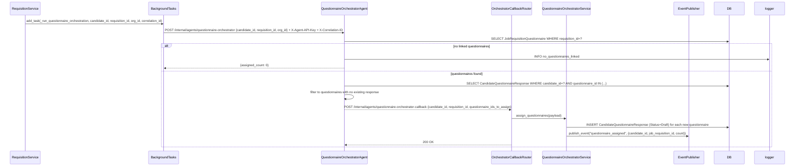
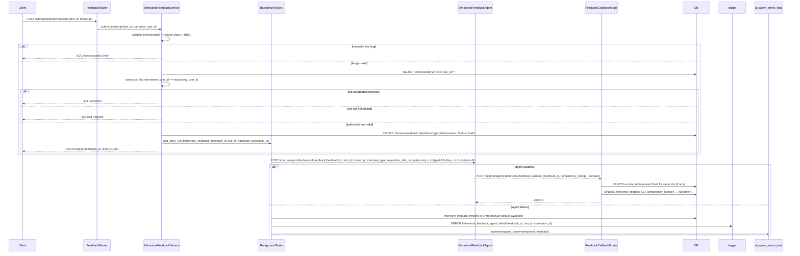

# Design Document: AI Agents

## Overview

The AI Agents module is the intelligence layer of the TalentKru.ai FastAPI backend. It orchestrates four AI-powered agents that automate the most labor-intensive steps in the recruiting pipeline: resume parsing and candidate profile population, semantic candidate-requisition matching, questionnaire assignment, and behavioral interview feedback generation.

All agents follow the same integration pattern: a FastAPI `BackgroundTasks` task invokes the agent via an internal HTTP call, and the agent posts results back to a callback endpoint authenticated with `X-Agent-API-Key`. Every agent has a manual fallback path so recruiters and interviewers are never blocked by an AI failure.

### Key Architectural Decisions

- **Callback pattern over direct invocation**: Agents are external services that post results back to `/internal/agents/*-callback` endpoints. This decouples agent latency from HTTP response times and allows agents to be replaced or upgraded independently.
- **Background tasks open their own sessions**: All `_run_*` background functions use `AsyncSessionFactory()` directly rather than inheriting the request session, which is closed before the background task runs.
- **Correlation ID propagation**: Every background task captures `correlation_id_var.get("")` at dispatch time and forwards it in the `X-Correlation-ID` header to the agent and in all log entries.
- **AGENT_SYSTEM_ID constant**: A fixed UUID sentinel used as `created_by` on all entities created by agent callbacks, making agent-created records distinguishable in the audit trail.
- **Prometheus counter on every agent error**: `ai_agent_errors_total` with `agent_name` label is incremented on any agent failure, enabling alerting without log scraping.
- **Rate limiting on all /internal/agents/* endpoints**: 100 req/min per agent identity (keyed by `X-Agent-API-Key` value), enforced by the shared `RateLimiter` from the Identity and Access module.

### Integration with Other Modules

| Module | Integration Point |
|---|---|
| Platform Foundation | `AuditMixin`, `VersionMixin`, `publish_event()`, `AsyncSessionFactory`, `correlation_id_var`, `require_agent_api_key`, `RateLimiter`, `ai_agent_errors_total` |
| Candidate Lifecycle | `Resume`, `ParseStatus`, `Candidate`, `CandidateJobHistory`, `CandidateSkill`, `SkillService.match_and_link_skills()`, `encrypt_field()`, `GlobalStatus`, `JobRequisition`, `CandidateRequisition`, `Questionnaire`, `JobRequisitionQuestionnaire`, `CandidateQuestionnaireResponse` |
| Interview Workflow | `InterviewSlot`, `InterviewFeedback`, `FeedbackType`, `FeedbackStatus`, `MAX_TRANSCRIPT_CHARS`, `MAX_NARRATIVE_CHARS` |
| Identity and Access | `require_role()`, `require_privilege()`, `RateLimiter` (sliding window, per-agent identity) |


---

## Architecture

### Module Structure

```
app/modules/agents/
├── __init__.py
├── router.py                        # All /internal/agents/* callback endpoints + public trigger endpoints
├── constants.py                     # AGENT_SYSTEM_ID, MAX_MATCH_RESULTS, MAX_MATCH_SCORE
├── resume_ingestion/
│   ├── __init__.py
│   ├── service.py                   # ResumeIngestionService.process_callback()
│   └── schemas.py                   # ResumeIngestionCallbackPayload, JobHistoryItem, EducationItem
├── matching/
│   ├── __init__.py
│   ├── service.py                   # MatchingService.trigger_matching(), process_callback()
│   └── schemas.py                   # MatchingCallbackPayload, MatchResultItem, MatchListResponse
├── questionnaire_orchestrator/
│   ├── __init__.py
│   ├── service.py                   # QuestionnaireOrchestratorService.assign_questionnaires()
│   └── schemas.py                   # QuestionnaireOrchestratorCallbackPayload
└── behavioral_feedback/
    ├── __init__.py
    ├── service.py                   # BehavioralFeedbackService.submit_transcript(), process_callback()
    └── schemas.py                   # TranscriptRequest, BehavioralFeedbackCallbackPayload
```


### Resume Ingestion Agent Flow




### Matching Agent Flow




### Questionnaire Orchestrator Agent Flow




### Behavioral Feedback Agent Flow



---

## Components and Interfaces

### Constants (`app/modules/agents/constants.py`)

```python
from uuid import UUID

# Sentinel UUID used as created_by/updated_by for all agent-created entities.
# Distinguishable in audit trail from human-created records.
AGENT_SYSTEM_ID: UUID = UUID("00000000-0000-0000-0000-000000000001")

MAX_MATCH_RESULTS: int = 100
MAX_MATCH_SCORE: float = 100.00
MIN_MATCH_SCORE: float = 0.00
MAX_MATCH_EXPLANATION_CHARS: int = 1000
MAX_NARRATIVE_CHARS: int = 2000          # agent-generated cap
MAX_NARRATIVE_EXPANDED_CHARS: int = 5000  # interviewer can expand to this
MAX_TRANSCRIPT_CHARS: int = 50000
EMBEDDING_DIMENSIONS: int = 1536         # OpenAI text-embedding-3-small / Gemini embedding
```


### Agent 1: ResumeIngestionAgent

#### Schemas (`app/modules/agents/resume_ingestion/schemas.py`)

```python
from __future__ import annotations
from uuid import UUID
from typing import Any
from pydantic import BaseModel, Field, field_validator


class JobHistoryItem(BaseModel):
    company: str = Field(..., max_length=256)
    title: str = Field(..., max_length=256)
    start_date: str | None = None   # ISO 8601 date string, optional
    end_date: str | None = None
    description: str | None = Field(None, max_length=2000)


class EducationItem(BaseModel):
    institution: str = Field(..., max_length=256)
    degree: str | None = Field(None, max_length=256)
    field_of_study: str | None = Field(None, max_length=256)
    graduation_year: int | None = None


class ResumeIngestionCallbackPayload(BaseModel):
    resume_id: UUID
    candidate_id: UUID | None = None   # None if candidate does not yet exist
    org_id: UUID
    extracted_name: str | None = Field(None, max_length=256)
    extracted_email: str | None = Field(None, max_length=254)
    extracted_phone: str | None = Field(None, max_length=32)
    job_history: list[JobHistoryItem] = Field(default_factory=list)
    skills: list[str] = Field(default_factory=list)
    education: list[EducationItem] = Field(default_factory=list)
    certifications: list[str] = Field(default_factory=list)
    raw_text: str | None = Field(None, max_length=100000)  # for embedding generation

    @field_validator("skills", mode="before")
    @classmethod
    def deduplicate_skills(cls, v: list[str]) -> list[str]:
        seen: set[str] = set()
        result = []
        for s in v:
            key = s.strip().lower()
            if key and key not in seen:
                seen.add(key)
                result.append(s.strip())
        return result


class ResumeIngestionCallbackResponse(BaseModel):
    candidate_id: UUID
    resume_id: UUID
    skills_matched: int
    skills_unmatched: int
```


#### Service (`app/modules/agents/resume_ingestion/service.py`)

```python
from __future__ import annotations
import hashlib
from uuid import UUID, uuid4
from datetime import datetime, timezone
from sqlalchemy.ext.asyncio import AsyncSession
from sqlalchemy import select
from fastapi import HTTPException

from app.crypto import encrypt_field
from app.modules.agents.constants import AGENT_SYSTEM_ID, EMBEDDING_DIMENSIONS
from app.modules.agents.resume_ingestion.schemas import ResumeIngestionCallbackPayload
from app.modules.candidates.models import Candidate, GlobalStatus
from app.modules.resumes.models import Resume, ParseStatus, CandidateJobHistory
from app.modules.skills.service import SkillService
from app.observability.logging import get_logger

logger = get_logger(__name__)


class ResumeIngestionService:
    def __init__(self, db: AsyncSession):
        self.db = db

    async def process_callback(
        self, payload: ResumeIngestionCallbackPayload
    ) -> tuple[Candidate, int, int]:
        """
        Process a resume ingestion callback from the ResumeIngestionAgent.
        Returns (candidate, skills_matched, skills_unmatched).
        """
        resume = await self._get_resume(payload.resume_id, payload.org_id)
        candidate = await self._upsert_candidate(payload)
        await self._upsert_job_history(candidate.candidate_id, payload)
        skill_svc = SkillService(self.db)
        matched, unmatched = await skill_svc.match_and_link_skills(
            candidate_id=candidate.candidate_id,
            org_id=payload.org_id,
            extracted_skills=payload.skills,
        )
        if payload.raw_text:
            await self._store_embedding(candidate.candidate_id, payload.raw_text)
        resume.parse_status = ParseStatus.COMPLETED
        resume.candidate_id = candidate.candidate_id
        await self.db.flush()
        logger.info(
            "resume_ingestion_callback_processed",
            resume_id=str(payload.resume_id),
            candidate_id=str(candidate.candidate_id),
            skills_matched=matched,
            skills_unmatched=unmatched,
        )
        return candidate, matched, unmatched

    async def _get_resume(self, resume_id: UUID, org_id: UUID) -> Resume:
        result = await self.db.execute(
            select(Resume).where(
                Resume.resume_id == resume_id,
                Resume.organization_id == org_id,
                Resume.deleted_at.is_(None),
            )
        )
        resume = result.scalar_one_or_none()
        if not resume:
            raise HTTPException(status_code=404, detail="Resume not found")
        return resume

    async def _upsert_candidate(
        self, payload: ResumeIngestionCallbackPayload
    ) -> Candidate:
        """
        If candidate_id is provided and exists, update PII fields.
        Otherwise create a new Candidate. All PII encrypted before write.
        """
        if payload.candidate_id:
            result = await self.db.execute(
                select(Candidate).where(
                    Candidate.candidate_id == payload.candidate_id,
                    Candidate.organization_id == payload.org_id,
                    Candidate.deleted_at.is_(None),
                )
            )
            candidate = result.scalar_one_or_none()
            if candidate:
                if payload.extracted_name:
                    candidate.name = encrypt_field(payload.extracted_name)
                    candidate.name_hash = hashlib.sha256(
                        payload.extracted_name.lower().encode()
                    ).hexdigest()
                if payload.extracted_email:
                    candidate.email = encrypt_field(payload.extracted_email)
                    candidate.email_hash = hashlib.sha256(
                        payload.extracted_email.lower().encode()
                    ).hexdigest()
                if payload.extracted_phone:
                    candidate.phone = encrypt_field(payload.extracted_phone)
                candidate.updated_by = AGENT_SYSTEM_ID
                await self.db.flush()
                return candidate

        # Create new candidate
        email_hash = (
            hashlib.sha256(payload.extracted_email.lower().encode()).hexdigest()
            if payload.extracted_email
            else None
        )
        # Uniqueness check by email within org
        if email_hash:
            existing = await self.db.execute(
                select(Candidate).where(
                    Candidate.organization_id == payload.org_id,
                    Candidate.email_hash == email_hash,
                    Candidate.deleted_at.is_(None),
                )
            )
            if existing.scalar_one_or_none():
                raise HTTPException(
                    status_code=409,
                    detail="A candidate with this email already exists in the organization",
                )
        candidate = Candidate(
            candidate_id=uuid4(),
            organization_id=payload.org_id,
            name=encrypt_field(payload.extracted_name) if payload.extracted_name else None,
            name_hash=(
                hashlib.sha256(payload.extracted_name.lower().encode()).hexdigest()
                if payload.extracted_name
                else None
            ),
            email=encrypt_field(payload.extracted_email) if payload.extracted_email else None,
            email_hash=email_hash,
            phone=encrypt_field(payload.extracted_phone) if payload.extracted_phone else None,
            global_status=GlobalStatus.ACTIVE,
            created_by=AGENT_SYSTEM_ID,
            updated_by=AGENT_SYSTEM_ID,
        )
        self.db.add(candidate)
        await self.db.flush()
        return candidate

    async def _upsert_job_history(
        self, candidate_id: UUID, payload: ResumeIngestionCallbackPayload
    ) -> None:
        for item in payload.job_history:
            history = CandidateJobHistory(
                candidate_job_history_id=uuid4(),
                candidate_id=candidate_id,
                organization_id=payload.org_id,
                company=item.company,
                title=item.title,
                start_date=item.start_date,
                end_date=item.end_date,
                description=item.description,
                created_by=AGENT_SYSTEM_ID,
                updated_by=AGENT_SYSTEM_ID,
            )
            self.db.add(history)
        await self.db.flush()

    async def _store_embedding(self, candidate_id: UUID, raw_text: str) -> None:
        """
        Generate and upsert a pgvector embedding for the candidate's resume text.
        Embedding generation is delegated to the configured AI model via settings.
        This method stores the result; actual generation happens in the background task.
        """
        from app.modules.agents.matching.service import generate_embedding
        embedding = await generate_embedding(raw_text)
        from app.modules.agents.models import CandidateEmbedding
        result = await self.db.execute(
            select(CandidateEmbedding).where(
                CandidateEmbedding.candidate_id == candidate_id
            )
        )
        existing = result.scalar_one_or_none()
        if existing:
            existing.embedding = embedding
            existing.updated_at = datetime.now(timezone.utc)
        else:
            self.db.add(CandidateEmbedding(
                candidate_embedding_id=uuid4(),
                candidate_id=candidate_id,
                embedding=embedding,
            ))
        await self.db.flush()
```


### Agent 2: MatchingAgent

#### Schemas (`app/modules/agents/matching/schemas.py`)

```python
from __future__ import annotations
from uuid import UUID
from datetime import datetime
from decimal import Decimal
from pydantic import BaseModel, Field, field_validator


class MatchResultItem(BaseModel):
    candidate_id: UUID
    requisition_id: UUID
    match_score: Decimal = Field(..., ge=0, le=100, decimal_places=2)
    match_explanation: str = Field(..., max_length=1000)
    computed_at: datetime


class MatchingCallbackPayload(BaseModel):
    requisition_id: UUID
    org_id: UUID
    results: list[MatchResultItem] = Field(..., max_length=100)

    @field_validator("results")
    @classmethod
    def validate_scores_in_bounds(cls, v: list[MatchResultItem]) -> list[MatchResultItem]:
        for item in v:
            if not (Decimal("0.00") <= item.match_score <= Decimal("100.00")):
                raise ValueError(
                    f"match_score {item.match_score} out of bounds [0.00, 100.00]"
                )
        return v


class MatchListResponse(BaseModel):
    items: list[MatchResultItem]
    total: int
    page: int
    size: int
```


#### Service (`app/modules/agents/matching/service.py`)

```python
from __future__ import annotations
from uuid import UUID, uuid4
from decimal import Decimal
from datetime import datetime, timezone
from sqlalchemy.ext.asyncio import AsyncSession
from sqlalchemy import select, desc
from fastapi import HTTPException
import httpx

from app.config import settings
from app.modules.agents.constants import AGENT_SYSTEM_ID, MAX_MATCH_RESULTS
from app.modules.agents.matching.schemas import MatchingCallbackPayload
from app.modules.agents.models import CandidateRequisitionMatch
from app.modules.candidates.models import Candidate, GlobalStatus
from app.modules.requisitions.models import JobRequisition
from app.observability.logging import get_logger
from app.observability.middleware import correlation_id_var
from app.observability.metrics import ai_agent_errors_total

logger = get_logger(__name__)

# Statuses that disqualify a candidate from matching
EXCLUDED_STATUSES = {GlobalStatus.INELIGIBLE, GlobalStatus.EXPIRED, GlobalStatus.DELETED}


class MatchingService:
    def __init__(self, db: AsyncSession):
        self.db = db

    async def trigger_matching(
        self,
        requisition_id: UUID,
        org_id: UUID,
        background_tasks,
    ) -> None:
        """Enqueue a matching background task for the given requisition."""
        requisition = await self._get_requisition(requisition_id, org_id)
        correlation_id = correlation_id_var.get("")
        background_tasks.add_task(
            _run_matching,
            requisition_id=requisition_id,
            org_id=org_id,
            correlation_id=correlation_id,
        )
        logger.info(
            "matching_task_enqueued",
            requisition_id=str(requisition_id),
            correlation_id=correlation_id,
        )

    async def process_callback(self, payload: MatchingCallbackPayload) -> int:
        """
        Upsert CandidateRequisitionMatch records from agent callback.
        Returns count of records upserted.
        """
        count = 0
        for item in payload.results:
            result = await self.db.execute(
                select(CandidateRequisitionMatch).where(
                    CandidateRequisitionMatch.candidate_id == item.candidate_id,
                    CandidateRequisitionMatch.requisition_id == item.requisition_id,
                    CandidateRequisitionMatch.deleted_at.is_(None),
                )
            )
            existing = result.scalar_one_or_none()
            if existing:
                existing.match_score = item.match_score
                existing.match_explanation = item.match_explanation
                existing.computed_at = item.computed_at
                existing.updated_by = AGENT_SYSTEM_ID
            else:
                self.db.add(CandidateRequisitionMatch(
                    candidate_requisition_match_id=uuid4(),
                    candidate_id=item.candidate_id,
                    requisition_id=item.requisition_id,
                    organization_id=payload.org_id,
                    match_score=item.match_score,
                    match_explanation=item.match_explanation,
                    computed_at=item.computed_at,
                    created_by=AGENT_SYSTEM_ID,
                    updated_by=AGENT_SYSTEM_ID,
                ))
            count += 1
        await self.db.flush()
        logger.info(
            "matching_callback_processed",
            requisition_id=str(payload.requisition_id),
            count=count,
        )
        return count

    async def list_matches(
        self,
        requisition_id: UUID,
        org_id: UUID,
        page: int = 1,
        size: int = 20,
    ) -> tuple[list[CandidateRequisitionMatch], int]:
        """Return paginated matches sorted by match_score DESC."""
        from sqlalchemy import func
        base_stmt = (
            select(CandidateRequisitionMatch)
            .where(
                CandidateRequisitionMatch.requisition_id == requisition_id,
                CandidateRequisitionMatch.organization_id == org_id,
                CandidateRequisitionMatch.deleted_at.is_(None),
            )
        )
        total_result = await self.db.execute(
            select(func.count()).select_from(base_stmt.subquery())
        )
        total = total_result.scalar_one()
        items_result = await self.db.execute(
            base_stmt
            .order_by(desc(CandidateRequisitionMatch.match_score))
            .offset((page - 1) * size)
            .limit(size)
        )
        return items_result.scalars().all(), total

    async def _get_requisition(self, requisition_id: UUID, org_id: UUID) -> JobRequisition:
        result = await self.db.execute(
            select(JobRequisition).where(
                JobRequisition.job_requisition_id == requisition_id,
                JobRequisition.organization_id == org_id,
                JobRequisition.deleted_at.is_(None),
            )
        )
        req = result.scalar_one_or_none()
        if not req:
            raise HTTPException(status_code=404, detail="Requisition not found")
        return req


async def generate_embedding(text: str) -> list[float]:
    """
    Generate a vector embedding for the given text using the configured AI model.
    Returns a list of EMBEDDING_DIMENSIONS floats.
    This is a stub; the actual implementation calls the AI provider SDK.
    """
    from app.modules.agents.constants import EMBEDDING_DIMENSIONS
    # Production: call OpenAI / Gemini embedding API
    # Stub returns zero vector for testing
    return [0.0] * EMBEDDING_DIMENSIONS


async def _run_matching(
    requisition_id: UUID,
    org_id: UUID,
    correlation_id: str,
) -> None:
    """Background task: call MatchingAgent with requisition data."""
    from app.database import AsyncSessionFactory
    async with AsyncSessionFactory() as db:
        try:
            result = await db.execute(
                select(JobRequisition).where(
                    JobRequisition.job_requisition_id == requisition_id,
                    JobRequisition.organization_id == org_id,
                    JobRequisition.deleted_at.is_(None),
                )
            )
            req = result.scalar_one_or_none()
            if not req:
                logger.error(
                    "matching_requisition_not_found",
                    requisition_id=str(requisition_id),
                    correlation_id=correlation_id,
                )
                return
            async with httpx.AsyncClient() as client:
                response = await client.post(
                    f"{settings.AGENT_BASE_URL}/internal/agents/matching",
                    json={
                        "requisition_id": str(requisition_id),
                        "org_id": str(org_id),
                        "description": req.description,
                        "skills": [s.name for s in req.required_skills],
                        "domain": req.domain,
                    },
                    headers={
                        "X-Agent-API-Key": settings.AGENT_API_KEY,
                        "X-Correlation-ID": correlation_id,
                    },
                    timeout=300.0,
                )
                response.raise_for_status()
        except Exception as exc:
            ai_agent_errors_total.labels(agent_name="matching").inc()
            logger.error(
                "matching_agent_failed",
                requisition_id=str(requisition_id),
                correlation_id=correlation_id,
                error=str(exc),
            )
        finally:
            await db.commit()
```


### Agent 3: QuestionnaireOrchestratorAgent

#### Schemas (`app/modules/agents/questionnaire_orchestrator/schemas.py`)

```python
from __future__ import annotations
from uuid import UUID
from pydantic import BaseModel, Field


class QuestionnaireOrchestratorCallbackPayload(BaseModel):
    candidate_id: UUID
    requisition_id: UUID
    org_id: UUID
    questionnaire_ids_to_assign: list[UUID] = Field(default_factory=list)


class QuestionnaireOrchestratorCallbackResponse(BaseModel):
    candidate_id: UUID
    requisition_id: UUID
    assigned_count: int
```

#### Service (`app/modules/agents/questionnaire_orchestrator/service.py`)

```python
from __future__ import annotations
from uuid import UUID, uuid4
from sqlalchemy.ext.asyncio import AsyncSession
from sqlalchemy import select
import httpx

from app.config import settings
from app.modules.agents.constants import AGENT_SYSTEM_ID
from app.modules.agents.questionnaire_orchestrator.schemas import (
    QuestionnaireOrchestratorCallbackPayload,
)
from app.modules.questionnaires.models import (
    CandidateQuestionnaireResponse,
    CandidateQuestionnaireResponseStatus,
)
from app.domain_events.publisher import publish_event
from app.observability.logging import get_logger
from app.observability.middleware import correlation_id_var
from app.observability.metrics import ai_agent_errors_total

logger = get_logger(__name__)


class QuestionnaireOrchestratorService:
    def __init__(self, db: AsyncSession):
        self.db = db

    async def assign_questionnaires(
        self,
        payload: QuestionnaireOrchestratorCallbackPayload,
        background_tasks=None,
    ) -> int:
        """
        Create Draft CandidateQuestionnaireResponse records for questionnaires
        that have no existing response for this candidate.
        Returns count of newly created records.
        Idempotent: calling twice for the same candidate-requisition never creates duplicates.
        """
        if not payload.questionnaire_ids_to_assign:
            logger.info(
                "questionnaire_orchestrator_no_assignments",
                candidate_id=str(payload.candidate_id),
                requisition_id=str(payload.requisition_id),
            )
            return 0

        # Fetch existing responses for this candidate across all questionnaires in the list
        existing_result = await self.db.execute(
            select(CandidateQuestionnaireResponse.questionnaire_id).where(
                CandidateQuestionnaireResponse.candidate_id == payload.candidate_id,
                CandidateQuestionnaireResponse.questionnaire_id.in_(
                    payload.questionnaire_ids_to_assign
                ),
                CandidateQuestionnaireResponse.deleted_at.is_(None),
            )
        )
        already_assigned: set[UUID] = {row[0] for row in existing_result.fetchall()}

        new_ids = [
            qid for qid in payload.questionnaire_ids_to_assign
            if qid not in already_assigned
        ]
        for qid in new_ids:
            self.db.add(CandidateQuestionnaireResponse(
                candidate_questionnaire_response_id=uuid4(),
                candidate_id=payload.candidate_id,
                questionnaire_id=qid,
                job_requisition_id=payload.requisition_id,
                organization_id=payload.org_id,
                status=CandidateQuestionnaireResponseStatus.DRAFT,
                created_by=AGENT_SYSTEM_ID,
                updated_by=AGENT_SYSTEM_ID,
            ))
        await self.db.flush()

        count = len(new_ids)
        if count > 0:
            await publish_event(
                "questionnaire_assigned",
                {
                    "candidate_id": str(payload.candidate_id),
                    "job_requisition_id": str(payload.requisition_id),
                    "count": count,
                },
                self.db,
                background_tasks=background_tasks,
            )
        logger.info(
            "questionnaire_orchestrator_assigned",
            candidate_id=str(payload.candidate_id),
            requisition_id=str(payload.requisition_id),
            count=count,
        )
        return count


async def _run_questionnaire_orchestration(
    candidate_id: UUID,
    requisition_id: UUID,
    org_id: UUID,
    correlation_id: str,
) -> None:
    """Background task: call QuestionnaireOrchestratorAgent."""
    from app.database import AsyncSessionFactory
    async with AsyncSessionFactory() as db:
        try:
            async with httpx.AsyncClient() as client:
                response = await client.post(
                    f"{settings.AGENT_BASE_URL}/internal/agents/questionnaire-orchestrator",
                    json={
                        "candidate_id": str(candidate_id),
                        "requisition_id": str(requisition_id),
                        "org_id": str(org_id),
                    },
                    headers={
                        "X-Agent-API-Key": settings.AGENT_API_KEY,
                        "X-Correlation-ID": correlation_id,
                    },
                    timeout=60.0,
                )
                response.raise_for_status()
        except Exception as exc:
            ai_agent_errors_total.labels(agent_name="questionnaire_orchestrator").inc()
            logger.error(
                "questionnaire_orchestrator_failed",
                candidate_id=str(candidate_id),
                requisition_id=str(requisition_id),
                correlation_id=correlation_id,
                error=str(exc),
            )
        finally:
            await db.commit()
```


### Agent 4: BehavioralFeedbackAgent

#### Schemas (`app/modules/agents/behavioral_feedback/schemas.py`)

```python
from __future__ import annotations
from uuid import UUID
from pydantic import BaseModel, Field, field_validator
from app.modules.agents.constants import MAX_TRANSCRIPT_CHARS, MAX_NARRATIVE_CHARS


class TranscriptRequest(BaseModel):
    slot_id: UUID
    transcript: str = Field(..., max_length=MAX_TRANSCRIPT_CHARS)

    @field_validator("transcript", mode="before")
    @classmethod
    def validate_length(cls, v: str) -> str:
        # Explicit check so the error message is clear
        if len(v) > MAX_TRANSCRIPT_CHARS:
            raise ValueError(
                f"Transcript must not exceed {MAX_TRANSCRIPT_CHARS} characters"
            )
        return v


class BehavioralFeedbackCallbackPayload(BaseModel):
    feedback_id: UUID
    competency_ratings: dict[str, int] = Field(...)
    narrative: str = Field(..., max_length=MAX_NARRATIVE_CHARS)

    @field_validator("competency_ratings")
    @classmethod
    def validate_ratings(cls, v: dict[str, int]) -> dict[str, int]:
        for competency, rating in v.items():
            if not (1 <= rating <= 5):
                raise ValueError(
                    f"Rating for '{competency}' must be between 1 and 5, got {rating}"
                )
        return v


class TranscriptSubmitResponse(BaseModel):
    feedback_id: UUID
    status: str  # "Draft"
```


#### Service (`app/modules/agents/behavioral_feedback/service.py`)

```python
from __future__ import annotations
from uuid import UUID, uuid4
from sqlalchemy.ext.asyncio import AsyncSession
from sqlalchemy import select, and_
from fastapi import HTTPException, BackgroundTasks
import httpx

from app.config import settings
from app.modules.agents.constants import (
    AGENT_SYSTEM_ID,
    MAX_TRANSCRIPT_CHARS,
    MAX_NARRATIVE_CHARS,
)
from app.modules.agents.behavioral_feedback.schemas import (
    BehavioralFeedbackCallbackPayload,
)
from app.modules.feedback.models import InterviewFeedback, FeedbackType, FeedbackStatus
from app.modules.slots.models import InterviewSlot, SlotStatus
from app.observability.logging import get_logger
from app.observability.middleware import correlation_id_var
from app.observability.metrics import ai_agent_errors_total

logger = get_logger(__name__)


class BehavioralFeedbackService:
    def __init__(self, db: AsyncSession):
        self.db = db

    async def submit_transcript(
        self,
        org_id: UUID,
        slot_id: UUID,
        transcript: str,
        requesting_user_id: UUID,
        background_tasks: BackgroundTasks,
    ) -> InterviewFeedback:
        """
        Validate transcript length FIRST, then authorize, then create Draft feedback
        and enqueue the agent background task.
        """
        # 1. Length validation — must happen before any other processing (Requirement 4.1)
        if len(transcript) > MAX_TRANSCRIPT_CHARS:
            raise HTTPException(
                status_code=422,
                detail=f"Transcript must not exceed {MAX_TRANSCRIPT_CHARS} characters",
            )

        # 2. Fetch slot and authorize
        slot = await self._get_slot(slot_id, org_id)
        if slot.interviewer_user_id != requesting_user_id:
            raise HTTPException(
                status_code=403,
                detail="Only the assigned interviewer can submit a transcript",
            )
        if slot.status != SlotStatus.SCHEDULED:
            raise HTTPException(
                status_code=400,
                detail=f"InterviewSlot must be in Scheduled status, got {slot.status}",
            )

        # 3. Create Draft feedback record
        feedback = InterviewFeedback(
            interview_feedback_id=uuid4(),
            interview_slot_id=slot_id,
            organization_id=org_id,
            feedback_type=FeedbackType.AI_GENERATED,
            status=FeedbackStatus.DRAFT,
            created_by=requesting_user_id,
            updated_by=requesting_user_id,
        )
        self.db.add(feedback)
        await self.db.flush()

        # 4. Enqueue background task
        correlation_id = correlation_id_var.get("")
        background_tasks.add_task(
            _run_behavioral_feedback,
            feedback_id=feedback.interview_feedback_id,
            slot_id=slot_id,
            transcript=transcript,
            org_id=org_id,
            correlation_id=correlation_id,
        )
        return feedback

    async def process_callback(
        self, payload: BehavioralFeedbackCallbackPayload
    ) -> InterviewFeedback:
        """
        Update the InterviewFeedback record with agent-generated ratings and narrative.
        Replaces any previously generated draft for the same slot.
        """
        result = await self.db.execute(
            select(InterviewFeedback).where(
                InterviewFeedback.interview_feedback_id == payload.feedback_id,
                InterviewFeedback.deleted_at.is_(None),
            )
        )
        feedback = result.scalar_one_or_none()
        if not feedback:
            raise HTTPException(status_code=404, detail="InterviewFeedback not found")

        # Delete any other AIGenerated Draft for the same slot (replace semantics)
        other_drafts_result = await self.db.execute(
            select(InterviewFeedback).where(
                InterviewFeedback.interview_slot_id == feedback.interview_slot_id,
                InterviewFeedback.feedback_type == FeedbackType.AI_GENERATED,
                InterviewFeedback.status == FeedbackStatus.DRAFT,
                InterviewFeedback.interview_feedback_id != payload.feedback_id,
                InterviewFeedback.deleted_at.is_(None),
            )
        )
        for old_draft in other_drafts_result.scalars().all():
            from datetime import datetime, timezone
            old_draft.deleted_at = datetime.now(timezone.utc)
            old_draft.deleted_by = AGENT_SYSTEM_ID

        feedback.competency_ratings = payload.competency_ratings
        feedback.narrative = payload.narrative
        feedback.updated_by = AGENT_SYSTEM_ID
        await self.db.flush()
        logger.info(
            "behavioral_feedback_callback_processed",
            feedback_id=str(payload.feedback_id),
        )
        return feedback

    async def _get_slot(self, slot_id: UUID, org_id: UUID) -> InterviewSlot:
        result = await self.db.execute(
            select(InterviewSlot).where(
                InterviewSlot.interview_slot_id == slot_id,
                InterviewSlot.organization_id == org_id,
                InterviewSlot.deleted_at.is_(None),
            )
        )
        slot = result.scalar_one_or_none()
        if not slot:
            raise HTTPException(status_code=404, detail="InterviewSlot not found")
        return slot


async def _run_behavioral_feedback(
    feedback_id: UUID,
    slot_id: UUID,
    transcript: str,
    org_id: UUID,
    correlation_id: str,
) -> None:
    """Background task: call BehavioralFeedbackAgent with transcript and context."""
    from app.database import AsyncSessionFactory
    from app.modules.slots.models import InterviewSlot
    from app.modules.requisitions.models import JobRequisition
    async with AsyncSessionFactory() as db:
        try:
            slot_result = await db.execute(
                select(InterviewSlot).where(
                    InterviewSlot.interview_slot_id == slot_id,
                    InterviewSlot.deleted_at.is_(None),
                )
            )
            slot = slot_result.scalar_one_or_none()
            async with httpx.AsyncClient() as client:
                response = await client.post(
                    f"{settings.AGENT_BASE_URL}/internal/agents/behavioral-feedback",
                    json={
                        "feedback_id": str(feedback_id),
                        "slot_id": str(slot_id),
                        "transcript": transcript,
                        "interview_type": slot.type if slot else None,
                    },
                    headers={
                        "X-Agent-API-Key": settings.AGENT_API_KEY,
                        "X-Correlation-ID": correlation_id,
                    },
                    timeout=180.0,
                )
                response.raise_for_status()
        except Exception as exc:
            ai_agent_errors_total.labels(agent_name="behavioral_feedback").inc()
            logger.error(
                "behavioral_feedback_agent_failed",
                feedback_id=str(feedback_id),
                slot_id=str(slot_id),
                correlation_id=correlation_id,
                error=str(exc),
            )
        finally:
            await db.commit()
```


### Router (`app/modules/agents/router.py`)

```python
from __future__ import annotations
from uuid import UUID
from fastapi import APIRouter, Depends, BackgroundTasks, HTTPException
from sqlalchemy.ext.asyncio import AsyncSession

from app.database import get_db_session
from app.middleware.auth import require_agent_api_key
from app.modules.auth.dependencies import require_role
from app.modules.agents.resume_ingestion.schemas import (
    ResumeIngestionCallbackPayload,
    ResumeIngestionCallbackResponse,
)
from app.modules.agents.resume_ingestion.service import ResumeIngestionService
from app.modules.agents.matching.schemas import (
    MatchingCallbackPayload,
    MatchListResponse,
)
from app.modules.agents.matching.service import MatchingService
from app.modules.agents.questionnaire_orchestrator.schemas import (
    QuestionnaireOrchestratorCallbackPayload,
    QuestionnaireOrchestratorCallbackResponse,
)
from app.modules.agents.questionnaire_orchestrator.service import (
    QuestionnaireOrchestratorService,
)
from app.modules.agents.behavioral_feedback.schemas import (
    TranscriptRequest,
    BehavioralFeedbackCallbackPayload,
    TranscriptSubmitResponse,
)
from app.modules.agents.behavioral_feedback.service import BehavioralFeedbackService

# ── Internal callback router (agent-to-server) ──────────────────────────────
internal_router = APIRouter(
    prefix="/internal/agents",
    tags=["agents-internal"],
    dependencies=[Depends(require_agent_api_key)],
)

# ── Public API router (user-facing triggers) ─────────────────────────────────
api_router = APIRouter(prefix="/api/v1", tags=["agents"])


# ── Resume Ingestion Callback ────────────────────────────────────────────────

@internal_router.post(
    "/resume-ingestion-callback",
    response_model=ResumeIngestionCallbackResponse,
    operation_id="resume_ingestion_callback",
    summary="ResumeIngestionAgent posts parsed resume results",
)
async def resume_ingestion_callback(
    payload: ResumeIngestionCallbackPayload,
    db: AsyncSession = Depends(get_db_session),
) -> ResumeIngestionCallbackResponse:
    svc = ResumeIngestionService(db)
    candidate, matched, unmatched = await svc.process_callback(payload)
    return ResumeIngestionCallbackResponse(
        candidate_id=candidate.candidate_id,
        resume_id=payload.resume_id,
        skills_matched=matched,
        skills_unmatched=unmatched,
    )


# ── Matching Callback + Trigger ──────────────────────────────────────────────

@internal_router.post(
    "/matching-callback",
    operation_id="matching_callback",
    summary="MatchingAgent posts computed match results",
)
async def matching_callback(
    payload: MatchingCallbackPayload,
    db: AsyncSession = Depends(get_db_session),
) -> dict:
    svc = MatchingService(db)
    count = await svc.process_callback(payload)
    return {"upserted": count}


@api_router.post(
    "/requisitions/{requisition_id}/match",
    status_code=202,
    operation_id="trigger_matching",
    summary="Manually trigger candidate matching for a requisition",
    dependencies=[Depends(require_role("Recruiter"))],
)
async def trigger_matching(
    requisition_id: UUID,
    background_tasks: BackgroundTasks,
    db: AsyncSession = Depends(get_db_session),
    principal=Depends(require_role("Recruiter")),
) -> dict:
    svc = MatchingService(db)
    await svc.trigger_matching(requisition_id, principal.org_id, background_tasks)
    return {"status": "matching_enqueued", "requisition_id": str(requisition_id)}


@api_router.get(
    "/requisitions/{requisition_id}/matches",
    response_model=MatchListResponse,
    operation_id="list_matches",
    summary="Retrieve paginated match results for a requisition sorted by score",
    dependencies=[Depends(require_role("Recruiter"))],
)
async def list_matches(
    requisition_id: UUID,
    page: int = 1,
    size: int = 20,
    db: AsyncSession = Depends(get_db_session),
    principal=Depends(require_role("Recruiter")),
) -> MatchListResponse:
    svc = MatchingService(db)
    items, total = await svc.list_matches(requisition_id, principal.org_id, page, size)
    return MatchListResponse(items=items, total=total, page=page, size=size)


# ── Questionnaire Orchestrator Callback + Manual Trigger ─────────────────────

@internal_router.post(
    "/questionnaire-orchestrator-callback",
    response_model=QuestionnaireOrchestratorCallbackResponse,
    operation_id="questionnaire_orchestrator_callback",
    summary="QuestionnaireOrchestratorAgent posts assignment results",
)
async def questionnaire_orchestrator_callback(
    payload: QuestionnaireOrchestratorCallbackPayload,
    background_tasks: BackgroundTasks,
    db: AsyncSession = Depends(get_db_session),
) -> QuestionnaireOrchestratorCallbackResponse:
    svc = QuestionnaireOrchestratorService(db)
    count = await svc.assign_questionnaires(payload, background_tasks)
    return QuestionnaireOrchestratorCallbackResponse(
        candidate_id=payload.candidate_id,
        requisition_id=payload.requisition_id,
        assigned_count=count,
    )


@api_router.post(
    "/requisitions/{requisition_id}/questionnaires/assign",
    status_code=202,
    operation_id="manual_assign_questionnaires",
    summary="Manually assign questionnaires to all candidates on a requisition",
    dependencies=[Depends(require_role("Recruiter"))],
)
async def manual_assign_questionnaires(
    requisition_id: UUID,
    background_tasks: BackgroundTasks,
    db: AsyncSession = Depends(get_db_session),
    principal=Depends(require_role("Recruiter")),
) -> dict:
    from app.modules.questionnaire_orchestrator.service import (
        _run_questionnaire_orchestration,
    )
    from app.observability.middleware import correlation_id_var
    from app.modules.requisitions.models import CandidateRequisition
    from sqlalchemy import select

    result = await db.execute(
        select(CandidateRequisition).where(
            CandidateRequisition.job_requisition_id == requisition_id,
            CandidateRequisition.deleted_at.is_(None),
        )
    )
    associations = result.scalars().all()
    correlation_id = correlation_id_var.get("")
    for assoc in associations:
        background_tasks.add_task(
            _run_questionnaire_orchestration,
            candidate_id=assoc.candidate_id,
            requisition_id=requisition_id,
            org_id=principal.org_id,
            correlation_id=correlation_id,
        )
    return {"status": "orchestration_enqueued", "candidate_count": len(associations)}


# ── Behavioral Feedback Callback + Transcript Submission ─────────────────────

@internal_router.post(
    "/behavioral-feedback-callback",
    operation_id="behavioral_feedback_callback",
    summary="BehavioralFeedbackAgent posts generated feedback",
)
async def behavioral_feedback_callback(
    payload: BehavioralFeedbackCallbackPayload,
    db: AsyncSession = Depends(get_db_session),
) -> dict:
    svc = BehavioralFeedbackService(db)
    feedback = await svc.process_callback(payload)
    return {"feedback_id": str(feedback.interview_feedback_id), "status": feedback.status}


@api_router.post(
    "/feedback/transcript",
    response_model=TranscriptSubmitResponse,
    status_code=202,
    operation_id="submit_transcript",
    summary="Submit interview transcript for AI behavioral feedback generation",
)
async def submit_transcript(
    body: TranscriptRequest,
    background_tasks: BackgroundTasks,
    db: AsyncSession = Depends(get_db_session),
    principal=Depends(require_role("Interviewer")),
) -> TranscriptSubmitResponse:
    svc = BehavioralFeedbackService(db)
    feedback = await svc.submit_transcript(
        org_id=principal.org_id,
        slot_id=body.slot_id,
        transcript=body.transcript,
        requesting_user_id=principal.user_id,
        background_tasks=background_tasks,
    )
    return TranscriptSubmitResponse(
        feedback_id=feedback.interview_feedback_id,
        status=feedback.status.value,
    )
```


---

## Data Models

### CandidateRequisitionMatch (`app/modules/agents/models.py`)

This is the only new ORM entity introduced by this module. All other entities referenced (Resume, Candidate, CandidateJobHistory, CandidateSkill, CandidateQuestionnaireResponse, InterviewFeedback) are defined in their respective modules.

```python
from __future__ import annotations
import enum
import uuid
from decimal import Decimal
from datetime import datetime
from sqlalchemy import (
    Column, String, Numeric, DateTime, ForeignKey, Index, UniqueConstraint,
)
from sqlalchemy.dialects.postgresql import UUID, JSONB
from pgvector.sqlalchemy import Vector
from app.base_model import Base, AuditMixin, VersionMixin
from app.modules.agents.constants import EMBEDDING_DIMENSIONS


class CandidateRequisitionMatch(Base, AuditMixin, VersionMixin):
    """
    Persisted output of the MatchingAgent for a single candidate-requisition pair.
    Inherits VersionMixin for optimistic locking (scores are updated on re-runs).
    """
    __tablename__ = "candidate_requisition_matches"

    candidate_requisition_match_id = Column(
        UUID(as_uuid=True), primary_key=True, default=uuid.uuid4
    )
    candidate_id = Column(
        UUID(as_uuid=True),
        ForeignKey("candidates.candidate_id"),
        nullable=False,
        index=True,
    )
    requisition_id = Column(
        UUID(as_uuid=True),
        ForeignKey("job_requisitions.job_requisition_id"),
        nullable=False,
        index=True,
    )
    organization_id = Column(
        UUID(as_uuid=True),
        ForeignKey("organizations.organization_id"),
        nullable=False,
        index=True,
    )
    # Numeric(6,2) stores values from 0.00 to 9999.99; we constrain to [0.00, 100.00] at app layer
    match_score = Column(Numeric(5, 2), nullable=False)
    match_explanation = Column(String(1000), nullable=True)
    computed_at = Column(DateTime(timezone=True), nullable=False)

    __table_args__ = (
        UniqueConstraint(
            "candidate_id",
            "requisition_id",
            name="uq_candidate_requisition_match",
        ),
        Index("idx_crm_requisition_score", "requisition_id", "match_score"),
        Index("idx_crm_org", "organization_id"),
    )


class CandidateEmbedding(Base):
    """
    pgvector embedding for a candidate's resume text.
    Not an AuditMixin entity — it is a derived/computed artifact, not a business record.
    Soft-delete is not applicable; embeddings are replaced on re-ingestion.
    """
    __tablename__ = "candidate_embeddings"

    candidate_embedding_id = Column(
        UUID(as_uuid=True), primary_key=True, default=uuid.uuid4
    )
    candidate_id = Column(
        UUID(as_uuid=True),
        ForeignKey("candidates.candidate_id"),
        nullable=False,
        unique=True,   # one embedding per candidate; replaced on re-ingestion
        index=True,
    )
    embedding = Column(Vector(EMBEDDING_DIMENSIONS), nullable=False)
    updated_at = Column(
        DateTime(timezone=True), nullable=False
    )
```


### DDL for New Tables

```sql
-- candidate_requisition_matches
CREATE TABLE candidate_requisition_matches (
    candidate_requisition_match_id  UUID        PRIMARY KEY DEFAULT uuid_generate_v4(),
    candidate_id                    UUID        NOT NULL REFERENCES candidates(candidate_id),
    requisition_id                  UUID        NOT NULL REFERENCES job_requisitions(job_requisition_id),
    organization_id                 UUID        NOT NULL REFERENCES organizations(organization_id),
    match_score                     NUMERIC(5,2) NOT NULL
                                        CONSTRAINT chk_match_score CHECK (match_score >= 0.00 AND match_score <= 100.00),
    match_explanation               VARCHAR(1000),
    computed_at                     TIMESTAMPTZ NOT NULL,
    version                         INTEGER     NOT NULL DEFAULT 1,
    created_at                      TIMESTAMPTZ NOT NULL DEFAULT NOW(),
    updated_at                      TIMESTAMPTZ NOT NULL DEFAULT NOW(),
    deleted_at                      TIMESTAMPTZ,
    created_by                      UUID,
    updated_by                      UUID,
    deleted_by                      UUID,
    CONSTRAINT uq_candidate_requisition_match UNIQUE (candidate_id, requisition_id)
);
CREATE INDEX idx_crm_requisition_score ON candidate_requisition_matches(requisition_id, match_score DESC)
    WHERE deleted_at IS NULL;
CREATE INDEX idx_crm_org ON candidate_requisition_matches(organization_id)
    WHERE deleted_at IS NULL;

-- candidate_embeddings (pgvector)
-- Requires: CREATE EXTENSION IF NOT EXISTS vector; (already in platform-foundation migration)
CREATE TABLE candidate_embeddings (
    candidate_embedding_id  UUID        PRIMARY KEY DEFAULT uuid_generate_v4(),
    candidate_id            UUID        NOT NULL UNIQUE REFERENCES candidates(candidate_id),
    embedding               vector(1536) NOT NULL,
    updated_at              TIMESTAMPTZ NOT NULL DEFAULT NOW()
);
-- IVFFlat index for approximate nearest-neighbor search (tune lists= based on row count)
CREATE INDEX idx_candidate_embeddings_ivfflat
    ON candidate_embeddings
    USING ivfflat (embedding vector_cosine_ops)
    WITH (lists = 100);
```

**Design rationale for `candidate_embeddings` not inheriting `AuditMixin`**: Embeddings are computed artifacts derived from resume text. They carry no business meaning beyond "this is the current vector for this candidate." Soft-delete semantics do not apply — when a resume is re-ingested, the embedding is replaced in-place. Adding `created_by`/`deleted_at` columns would add noise without value.

**Design rationale for `NUMERIC(5,2)` with a CHECK constraint**: The `match_score` column uses a database-level `CHECK` constraint in addition to the Pydantic validator. This provides defense-in-depth: even if a bug bypasses the application layer, the database will reject out-of-bounds scores.

**Design rationale for partial index on `candidate_requisition_matches`**: The `WHERE deleted_at IS NULL` partial index ensures the query planner uses the index for the common case (active records only) without indexing soft-deleted rows.


---

## Correctness Properties

*A property is a characteristic or behavior that should hold true across all valid executions of a system — essentially, a formal statement about what the system should do. Properties serve as the bridge between human-readable specifications and machine-verifiable correctness guarantees.*

### Property 1: PII Encryption Invariant

*For any* resume ingestion callback payload containing a non-null `extracted_name`, `extracted_email`, or `extracted_phone`, the values stored in the `candidates` table for those fields must be the AES-256-GCM ciphertext of the plaintext values, not the plaintext itself. Specifically, `decrypt_field(stored_value) == plaintext` must hold, and `stored_value != plaintext` must hold for all non-empty inputs.

**Validates: Requirements 1.5**

### Property 2: Soft-Delete Exclusion in Matching

*For any* set of candidates in an organization where some have `deleted_at IS NOT NULL` or `global_status IN ('Ineligible', 'Expired', 'Deleted')`, the matching results returned by `GET /api/v1/requisitions/{id}/matches` must contain zero records whose `candidate_id` maps to an excluded candidate. This must hold regardless of how high the excluded candidate's computed match score would have been.

**Validates: Requirements 2.3**

### Property 3: Questionnaire Assignment Idempotency

*For any* candidate-requisition pair, invoking the questionnaire orchestrator callback twice with the same `questionnaire_ids_to_assign` list must result in exactly the same number of `CandidateQuestionnaireResponse` records as a single invocation. The second invocation must create zero new records and must not modify the `status` or `created_at` of records created by the first invocation.

**Validates: Requirements 3.2**

### Property 4: MatchScore Bounds Invariant

*For any* `CandidateRequisitionMatch` record persisted to the database, `match_score` must satisfy `0.00 <= match_score <= 100.00`. This must hold both at the Pydantic validation layer (callback payload) and at the database layer (CHECK constraint), such that no record with an out-of-bounds score can exist in the table regardless of the code path that attempted to write it.

**Validates: Requirements 2.4**

### Property 5: Transcript Length Gate Ordering

*For any* call to `POST /api/v1/feedback/transcript` with a transcript exceeding 50,000 characters, the server must return a 422 response without creating any `InterviewFeedback` record, without querying the `InterviewSlot` table, and without enqueuing any background task. The length check must be the first operation performed, before authorization and before any database access.

**Validates: Requirements 4.1**

### Property 6: Rate Limit Enforcement on Agent Endpoints

*For any* agent identity (identified by `X-Agent-API-Key` value), after exactly 100 requests to any `/internal/agents/*` endpoint within a 60-second sliding window, the 101st request within that window must receive a 429 Too Many Requests response with a `Retry-After` header. Requests from a different agent identity within the same window must not be affected.

**Validates: Requirements 1.8, 2.9, 3.6, 4.7**

### Property 7: Single AI-Generated Draft Per Slot

*For any* `InterviewSlot`, at any point in time, there must be at most one `InterviewFeedback` record with `feedback_type = AIGenerated` and `status = Draft` and `deleted_at IS NULL`. When the behavioral feedback callback is processed for a slot that already has such a record, the old record must be soft-deleted before the new one is updated, preserving the at-most-one invariant.

**Validates: Requirements 4.4**

### Property 8: Competency Rating Bounds Invariant

*For any* `BehavioralFeedbackCallbackPayload`, every value in the `competency_ratings` dictionary must be an integer in the range [1, 5] inclusive. This must be enforced at the Pydantic validation layer such that a payload with any rating outside this range is rejected with a 422 response before any database write occurs.

**Validates: Requirements 4.3**


---

## Error Handling

### Agent Failure Strategy

All four agents follow the same failure handling pattern:

1. The background task catches all exceptions from the `httpx` call.
2. `ai_agent_errors_total.labels(agent_name=<name>).inc()` is incremented.
3. The error is logged with `correlation_id`, entity IDs, and the exception message.
4. The entity is left in a recoverable state (e.g., `ParseStatus.FAILED`, `FeedbackStatus.DRAFT`) so the manual fallback path remains available.
5. The session is committed in the `finally` block to persist the failure state.

### Validation Errors (422)

Pydantic validation errors on callback payloads are handled by FastAPI's default exception handler, which returns a structured 422 response. The correlation ID is included in the response via the `X-Correlation-ID` response header set by `CorrelationIDMiddleware`.

### Authorization Errors

| Condition | HTTP Status | Detail |
|---|---|---|
| Missing or invalid `X-Agent-API-Key` | 401 | "Invalid or missing X-Agent-API-Key" |
| User is not the assigned interviewer | 403 | "Only the assigned interviewer can submit a transcript" |
| Slot not in Scheduled status | 400 | "InterviewSlot must be in Scheduled status" |
| Insufficient role for manual trigger | 403 | "Insufficient role" |

### Rate Limit Errors (429)

When the sliding window limit is exceeded, the response includes:
- `HTTP 429 Too Many Requests`
- `Retry-After: <seconds>` header
- Body: `{"detail": "Rate limit exceeded. Retry after <N> seconds."}`

### Duplicate Candidate on Ingestion (409)

If the ingestion callback provides an email that already exists for a different candidate in the same organization, the service raises `HTTPException(409)`. The `Resume.parse_status` is set to `FAILED` and the error is logged. The recruiter can resolve the conflict manually via the candidate merge endpoint.

---

## Testing Strategy

### Dual Testing Approach

Unit tests cover specific examples, edge cases, and error conditions. Property-based tests verify universal correctness properties across randomly generated inputs. Both are required for comprehensive coverage.

### Property-Based Testing Library

Use **Hypothesis** (Python) for all property-based tests. Each property test runs a minimum of 100 iterations.

```python
# Example property test structure
from hypothesis import given, settings as hyp_settings
from hypothesis import strategies as st

@given(
    name=st.text(min_size=1, max_size=256),
    email=st.emails(),
    phone=st.text(min_size=0, max_size=32),
)
@hyp_settings(max_examples=100)
def test_pii_encryption_invariant(name, email, phone):
    """
    Feature: ai-agents, Property 1: PII Encryption Invariant
    For any candidate PII, stored values must be ciphertext, not plaintext.
    """
    encrypted_name = encrypt_field(name)
    encrypted_email = encrypt_field(email)
    assert encrypted_name != name
    assert decrypt_field(encrypted_name) == name
    assert encrypted_email != email
    assert decrypt_field(encrypted_email) == email
```

### Unit Test Coverage

| Component | Test Focus |
|---|---|
| `ResumeIngestionService.process_callback()` | Valid payload → correct entity creation; missing candidate_id → new candidate created; duplicate email → 409 |
| `MatchingService.process_callback()` | Upsert semantics; score bounds; explanation truncation |
| `MatchingService.list_matches()` | Sort order (DESC); pagination; soft-deleted records excluded |
| `QuestionnaireOrchestratorService.assign_questionnaires()` | Idempotency (second call creates 0 records); empty questionnaire list; event published |
| `BehavioralFeedbackService.submit_transcript()` | Length > 50000 → 422 before any DB access; non-interviewer → 403; slot not Scheduled → 400 |
| `BehavioralFeedbackService.process_callback()` | Old draft soft-deleted; new feedback updated; at-most-one invariant |

### Integration Test Coverage

| Scenario | Test Type |
|---|---|
| Full resume ingestion round-trip (upload → callback → candidate created) | Integration |
| Matching trigger → callback → matches retrievable via GET | Integration |
| Questionnaire orchestration triggered on candidate association | Integration |
| Transcript submission → feedback Draft created → callback → feedback updated | Integration |
| Rate limit: 101st request returns 429 | Integration |
| Agent API key missing → 401 | Integration |

### Property Test Tag Format

Each property test must include a comment in the format:

```python
# Feature: ai-agents, Property <N>: <property_text>
```

This enables traceability from test failures back to the design document property.
