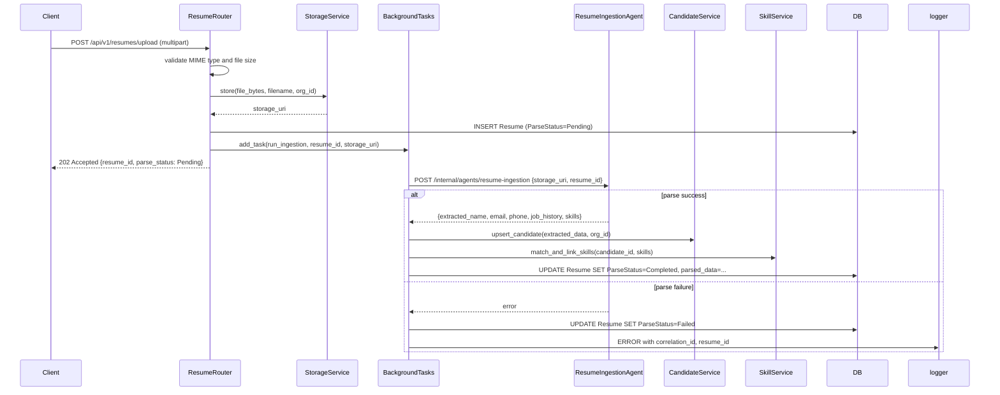
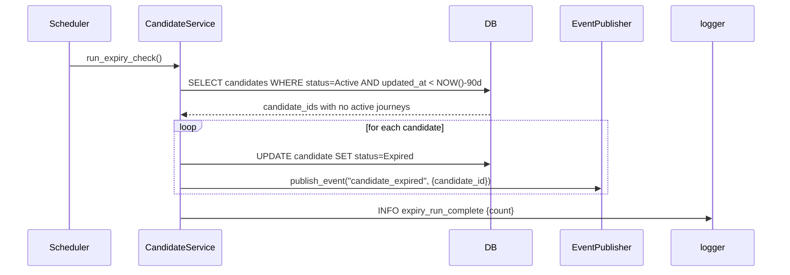
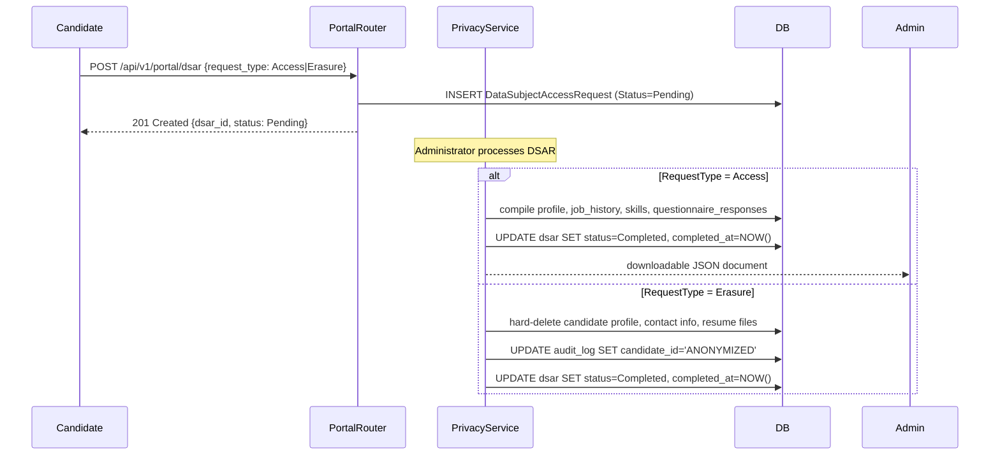

# Design Document: Candidate Lifecycle

## Overview

The Candidate Lifecycle module is the core recruiting data layer of the TalentKru.ai FastAPI backend. It manages candidate profiles, resume upload and AI-driven ingestion, skills taxonomy, job profiles and postings, job requisitions, and data privacy compliance (GDPR/DSAR). Every entity in this module is scoped to an `OrganizationID` derived from the authenticated principal, enforcing strict multi-tenancy.

All design decisions follow the conventions established in the Platform Foundation and Identity and Access modules:
- Async-first SQLAlchemy sessions via `get_db_session()`
- Soft delete only; queries filter `WHERE deleted_at IS NULL`
- Field-level PII encryption via `encrypt_field`/`decrypt_field` (AES-256-GCM) in `app/crypto.py`
- Structured JSON logging via structlog with correlation ID
- Domain events via `publish_event()` with persist-first pattern
- FastAPI `BackgroundTasks` for async resume ingestion
- pgvector for semantic search on candidate embeddings
- `require_role()` and `require_privilege()` dependency factories for authorization

### Key Architectural Decisions

- **PII hashing for search**: `Candidate.name`, `Candidate.email`, and `Candidate.phone` are stored encrypted. SHA-256 hashes (`name_hash`, `email_hash`) enable uniqueness enforcement and exact-match lookups without decrypting every row.
- **Storage abstraction**: A `StorageService` interface with `LocalStorageBackend` and `S3StorageBackend` implementations is selected at startup via `STORAGE_BACKEND`. This keeps resume upload logic independent of deployment environment.
- **Ingestion via internal agent endpoint**: Resume parsing is delegated to the `ResumeIngestionAgent` via `POST /internal/agents/resume-ingestion`. The background task calls this endpoint with `X-Agent-API-Key`, keeping AI logic decoupled from the web layer.
- **Expiry scheduler**: A FastAPI lifespan background task runs every 24 hours to mark stale `Active` candidates as `Expired`. It uses a database-level query to identify candidates with no active journeys and no field changes for 90 days, avoiding in-memory state.
- **DSAR workflow isolation**: Access and Erasure DSAR workflows are implemented as separate service methods. The router dispatches to the correct method based on `RequestType`, ensuring the data compilation workflow is never triggered for non-Access requests.
- **Retention purge scheduler**: A separate lifespan background task runs every 24 hours to purge candidate and resume data exceeding the organization's configured retention period, logging each purge action to the audit log.


---

## Architecture

### Module Structure

```
app/modules/
├── candidates/
│   ├── router.py          # GET/POST/PATCH /candidates, DELETE /candidates/{id}
│   ├── service.py         # Candidate CRUD, GlobalStatus FSM, expiry scheduler
│   ├── schemas.py         # CandidateCreate, CandidateUpdate, CandidateResponse
│   └── models.py          # Candidate
├── resumes/
│   ├── router.py          # POST /resumes/upload, GET /candidates/{id}/resumes
│   ├── service.py         # File validation, storage dispatch, ingestion task
│   ├── schemas.py         # ResumeUploadResponse, ResumeResponse
│   ├── models.py          # Resume, CandidateJobHistory
│   └── storage.py         # StorageService, LocalStorageBackend, S3StorageBackend
├── skills/
│   ├── router.py          # GET/POST /domains, GET/POST /skills, GET/POST /candidate-skills
│   ├── service.py         # Skill taxonomy CRUD, case-insensitive matching, unmatched review
│   ├── schemas.py         # DomainResponse, SkillResponse, CandidateSkillResponse
│   └── models.py          # Domain, Skill, CandidateSkill, RequisitionRequiredSkill, UnmatchedSkillReview
├── job_profile/
│   ├── router.py          # GET/POST/PATCH/DELETE /job-profiles
│   ├── service.py         # JobProfile CRUD, skill association
│   ├── schemas.py         # JobProfileCreate, JobProfileResponse
│   └── models.py          # JobProfile, JobProfileSkill
├── job_posting/
│   ├── router.py          # GET/POST/PATCH/DELETE /job-postings
│   ├── service.py         # JobPosting CRUD, salary overlap filter
│   ├── schemas.py         # JobPostingCreate, JobPostingFilter, JobPostingResponse
│   └── models.py          # JobPosting
├── requisitions/
│   ├── router.py          # GET/POST/PATCH /requisitions, POST /requisitions/{id}/candidates
│   ├── service.py         # Requisition CRUD, status FSM, candidate association
│   ├── schemas.py         # RequisitionCreate, RequisitionUpdate, RequisitionResponse
│   └── models.py          # JobRequisition, CandidateRequisition
├── portal/
│   ├── router.py          # POST /portal/dsar
│   ├── service.py         # DSAR creation for candidate self-service
│   ├── schemas.py         # DSARCreateRequest, DSARResponse
│   └── models.py          # (imports DataSubjectAccessRequest from privacy)
└── privacy/
    ├── router.py          # GET/PATCH /dsar, POST /dsar/{id}/deny
    ├── service.py         # DSAR management, Access/Erasure workflows, retention purge
    ├── schemas.py         # DSARManageResponse, DSARDenyRequest, RetentionPolicyResponse
    └── models.py          # DataSubjectAccessRequest, OrganizationRetentionPolicy
```


### Resume Ingestion Flow



### Candidate Expiry Scheduler Flow



### DSAR Workflow




---

## Components and Interfaces

### 1. Candidate Service (`app/modules/candidates/service.py`)

The `CandidateService` handles candidate CRUD, GlobalStatus FSM enforcement, and the expiry scheduler.

```python
import enum
import hashlib
from uuid import UUID, uuid4
from datetime import datetime, timezone, timedelta
from sqlalchemy.ext.asyncio import AsyncSession
from sqlalchemy import select, and_
from fastapi import HTTPException
from app.crypto import encrypt_field, decrypt_field
from app.modules.candidates.models import Candidate, GlobalStatus
from app.domain_events.publisher import publish_event
from app.observability.logging import get_logger

logger = get_logger(__name__)

# Valid GlobalStatus transitions
VALID_TRANSITIONS: dict[GlobalStatus, set[GlobalStatus]] = {
    GlobalStatus.ACTIVE:       {GlobalStatus.INTERVIEWING, GlobalStatus.INELIGIBLE, GlobalStatus.DELETED},
    GlobalStatus.INTERVIEWING: {GlobalStatus.ACTIVE, GlobalStatus.INELIGIBLE, GlobalStatus.DELETED},
    GlobalStatus.EXPIRED:      {GlobalStatus.ACTIVE, GlobalStatus.DELETED},
    GlobalStatus.INELIGIBLE:   set(),
    GlobalStatus.DELETED:      set(),
}

class CandidateService:
    def __init__(self, db: AsyncSession):
        self.db = db

    async def create_candidate(
        self,
        org_id: UUID,
        name: str,
        email: str,
        phone: str | None,
        location: str | None,
        created_by: UUID,
    ) -> Candidate:
        email_hash = hashlib.sha256(email.lower().encode()).hexdigest()
        name_hash = hashlib.sha256(name.lower().encode()).hexdigest()
        # Uniqueness check
        existing = await self.db.execute(
            select(Candidate).where(
                Candidate.organization_id == org_id,
                Candidate.email_hash == email_hash,
                Candidate.deleted_at.is_(None),
            )
        )
        if existing.scalar_one_or_none():
            raise HTTPException(status_code=409, detail="A candidate with this email already exists in the organization")
        candidate = Candidate(
            candidate_id=uuid4(),
            organization_id=org_id,
            name=encrypt_field(name),
            name_hash=name_hash,
            email=encrypt_field(email),
            email_hash=email_hash,
            phone=encrypt_field(phone) if phone else None,
            location=location,
            global_status=GlobalStatus.ACTIVE,
        )
        self.db.add(candidate)
        await self.db.flush()
        await publish_event("candidate_created", {"candidate_id": str(candidate.candidate_id)}, self.db)
        return candidate

    async def transition_status(
        self,
        candidate: Candidate,
        new_status: GlobalStatus,
        ineligibility_reason: str | None,
        updated_by: UUID,
    ) -> Candidate:
        if new_status not in VALID_TRANSITIONS.get(candidate.global_status, set()):
            raise HTTPException(
                status_code=400,
                detail=f"Transition from {candidate.global_status} to {new_status} is not permitted",
            )
        if new_status == GlobalStatus.INELIGIBLE:
            if not ineligibility_reason or not ineligibility_reason.strip():
                raise HTTPException(status_code=400, detail="IneligibilityReason is required when setting status to Ineligible")
            candidate.ineligibility_reason = ineligibility_reason
        if new_status == GlobalStatus.DELETED:
            candidate.deleted_at = datetime.now(timezone.utc)
            candidate.deleted_by = updated_by
        candidate.global_status = new_status
        await self.db.flush()
        await publish_event("candidate_status_changed", {
            "candidate_id": str(candidate.candidate_id),
            "new_status": new_status.value,
        }, self.db)
        return candidate

    async def run_expiry_check(self) -> int:
        """Marks Active candidates with no active journeys and 90-day inactivity as Expired."""
        cutoff = datetime.now(timezone.utc) - timedelta(days=90)
        # Subquery: candidates with active journeys (OverallStatus Active or OnHold)
        from app.modules.journeys.models import InterviewJourney, JourneyOverallStatus
        active_journey_subq = (
            select(InterviewJourney.candidate_id)
            .where(InterviewJourney.overall_status.in_([
                JourneyOverallStatus.ACTIVE, JourneyOverallStatus.ON_HOLD
            ]))
            .where(InterviewJourney.deleted_at.is_(None))
        )
        result = await self.db.execute(
            select(Candidate).where(
                and_(
                    Candidate.global_status == GlobalStatus.ACTIVE,
                    Candidate.updated_at < cutoff,
                    Candidate.deleted_at.is_(None),
                    ~Candidate.candidate_id.in_(active_journey_subq),
                )
            )
        )
        candidates = result.scalars().all()
        for c in candidates:
            c.global_status = GlobalStatus.EXPIRED
            await publish_event("candidate_expired", {"candidate_id": str(c.candidate_id)}, self.db)
        await self.db.flush()
        logger.info("expiry_run_complete", count=len(candidates))
        return len(candidates)
```


### 2. Resume Storage Service (`app/modules/resumes/storage.py`)

```python
import abc
import os
import uuid
from pathlib import Path
import boto3
from app.config import settings
from app.observability.logging import get_logger

logger = get_logger(__name__)

ALLOWED_MIME_TYPES = {"application/pdf", "application/msword",
                      "application/vnd.openxmlformats-officedocument.wordprocessingml.document"}
MAX_FILE_SIZE_BYTES = 10 * 1024 * 1024  # 10 MB

class StorageService(abc.ABC):
    @abc.abstractmethod
    async def store(self, file_bytes: bytes, filename: str, org_id: uuid.UUID) -> str:
        """Store file and return storage URI."""

    @abc.abstractmethod
    async def delete(self, storage_uri: str) -> None:
        """Permanently delete a stored file."""

class LocalStorageBackend(StorageService):
    def __init__(self, base_path: str = None):
        self.base_path = Path(base_path or settings.STORAGE_LOCAL_PATH)

    async def store(self, file_bytes: bytes, filename: str, org_id: uuid.UUID) -> str:
        dest_dir = self.base_path / str(org_id)
        dest_dir.mkdir(parents=True, exist_ok=True)
        unique_name = f"{uuid.uuid4()}_{filename}"
        dest = dest_dir / unique_name
        dest.write_bytes(file_bytes)
        return f"local://{dest}"

    async def delete(self, storage_uri: str) -> None:
        path = Path(storage_uri.removeprefix("local://"))
        if path.exists():
            path.unlink()

class S3StorageBackend(StorageService):
    def __init__(self):
        self.client = boto3.client("s3")
        self.bucket = settings.RESUME_BUCKET_NAME

    async def store(self, file_bytes: bytes, filename: str, org_id: uuid.UUID) -> str:
        key = f"{org_id}/{uuid.uuid4()}_{filename}"
        self.client.put_object(Bucket=self.bucket, Key=key, Body=file_bytes)
        return f"s3://{self.bucket}/{key}"

    async def delete(self, storage_uri: str) -> None:
        key = storage_uri.split("/", 3)[-1]
        self.client.delete_object(Bucket=self.bucket, Key=key)

def get_storage_service() -> StorageService:
    if settings.STORAGE_BACKEND == "s3":
        return S3StorageBackend()
    return LocalStorageBackend()
```

### 3. Resume Ingestion Service (`app/modules/resumes/service.py`)

```python
import httpx
from uuid import UUID
from fastapi import BackgroundTasks, HTTPException
from sqlalchemy.ext.asyncio import AsyncSession
from app.config import settings
from app.modules.resumes.models import Resume, ParseStatus
from app.modules.resumes.storage import StorageService, ALLOWED_MIME_TYPES, MAX_FILE_SIZE_BYTES
from app.observability.logging import get_logger
from app.observability.middleware import correlation_id_var

logger = get_logger(__name__)

class ResumeService:
    def __init__(self, db: AsyncSession, storage: StorageService):
        self.db = db
        self.storage = storage

    def validate_file(self, mime_type: str, file_size: int) -> None:
        if mime_type not in ALLOWED_MIME_TYPES:
            raise HTTPException(status_code=422, detail=f"Unsupported file format: {mime_type}. Accepted: PDF, DOC, DOCX")
        if file_size > MAX_FILE_SIZE_BYTES:
            raise HTTPException(status_code=422, detail=f"File size {file_size} bytes exceeds maximum of 10 MB")

    async def upload_resume(
        self,
        file_bytes: bytes,
        filename: str,
        mime_type: str,
        org_id: UUID,
        uploaded_by: UUID,
        candidate_id: UUID | None,
        background_tasks: BackgroundTasks,
    ) -> Resume:
        self.validate_file(mime_type, len(file_bytes))
        storage_uri = await self.storage.store(file_bytes, filename, org_id)
        resume = Resume(
            organization_id=org_id,
            candidate_id=candidate_id,
            storage_location=storage_uri,
            mime_type=mime_type,
            file_name=filename,
            file_size_bytes=len(file_bytes),
            uploaded_by_user_id=uploaded_by,
            is_primary=candidate_id is None,  # first resume for candidate becomes primary
            parse_status=ParseStatus.PENDING,
        )
        self.db.add(resume)
        await self.db.flush()
        background_tasks.add_task(
            _run_ingestion,
            resume_id=resume.resume_id,
            storage_uri=storage_uri,
            org_id=org_id,
            correlation_id=correlation_id_var.get(""),
        )
        return resume

async def _run_ingestion(resume_id: UUID, storage_uri: str, org_id: UUID, correlation_id: str) -> None:
    from app.database import AsyncSessionFactory
    async with AsyncSessionFactory() as db:
        resume = await db.get(Resume, resume_id)
        try:
            async with httpx.AsyncClient() as client:
                response = await client.post(
                    "http://localhost:8000/internal/agents/resume-ingestion",
                    json={"storage_uri": storage_uri, "resume_id": str(resume_id), "org_id": str(org_id)},
                    headers={"X-Agent-API-Key": settings.AGENT_API_KEY, "X-Correlation-ID": correlation_id},
                    timeout=120.0,
                )
                response.raise_for_status()
                parsed = response.json()
            await _apply_ingestion_results(resume, parsed, org_id, db)
            resume.parse_status = ParseStatus.COMPLETED
            resume.parsed_data = parsed
        except Exception as exc:
            resume.parse_status = ParseStatus.FAILED
            logger.error("resume_ingestion_failed", resume_id=str(resume_id),
                         correlation_id=correlation_id, error=str(exc))
        finally:
            await db.commit()
```


### 4. Skill Matching Service (`app/modules/skills/service.py`)

```python
from uuid import UUID, uuid4
from sqlalchemy.ext.asyncio import AsyncSession
from sqlalchemy import select, func
from app.modules.skills.models import Skill, CandidateSkill, SkillSource, UnmatchedSkillReview
from app.observability.logging import get_logger

logger = get_logger(__name__)

class SkillService:
    def __init__(self, db: AsyncSession):
        self.db = db

    async def match_and_link_skills(
        self,
        candidate_id: UUID,
        org_id: UUID,
        extracted_skills: list[str],
    ) -> None:
        """
        Case-insensitive match each extracted skill name against the Skill taxonomy.
        Matched skills → create CandidateSkill(source=parsed).
        Unmatched skills → create CandidateSkill(source=parsed) + UnmatchedSkillReview.
        Zero skills → no-op (ingestion still completes).
        """
        for skill_name in extracted_skills:
            result = await self.db.execute(
                select(Skill).where(func.lower(Skill.name) == skill_name.lower().strip())
            )
            skill = result.scalar_one_or_none()
            if skill:
                # Upsert CandidateSkill
                existing = await self.db.execute(
                    select(CandidateSkill).where(
                        CandidateSkill.candidate_id == candidate_id,
                        CandidateSkill.skill_id == skill.skill_id,
                    )
                )
                if not existing.scalar_one_or_none():
                    self.db.add(CandidateSkill(
                        candidate_skill_id=uuid4(),
                        candidate_id=candidate_id,
                        skill_id=skill.skill_id,
                        proficiency_rank=1,
                        years_of_experience=0,
                        source=SkillSource.PARSED,
                    ))
            else:
                # Unmatched: flag for review, do not block ingestion
                self.db.add(UnmatchedSkillReview(
                    unmatched_skill_review_id=uuid4(),
                    candidate_id=candidate_id,
                    organization_id=org_id,
                    unmatched_skill_name=skill_name,
                ))
                logger.warning("unmatched_skill", candidate_id=str(candidate_id), skill_name=skill_name)
        await self.db.flush()
```

### 5. Job Posting Service (`app/modules/job_posting/service.py`)

```python
from uuid import UUID, uuid4
from sqlalchemy.ext.asyncio import AsyncSession
from sqlalchemy import select, and_
from fastapi import HTTPException
from app.modules.job_posting.models import JobPosting
from app.modules.job_profile.models import JobProfile

class JobPostingService:
    def __init__(self, db: AsyncSession):
        self.db = db

    async def create_posting(
        self,
        org_id: UUID,
        job_profile_id: UUID,
        description: str,
        work_locations: list[str],
        salary_min: float,
        salary_max: float,
        salary_currency: str,
        sourcing_channel: str,
        created_by: UUID,
    ) -> JobPosting:
        # Validate JobProfile exists and belongs to org
        profile = await self.db.get(JobProfile, job_profile_id)
        if not profile or profile.organization_id != org_id or profile.deleted_at is not None:
            raise HTTPException(status_code=400, detail="A valid JobProfile is required to create a job posting")
        posting = JobPosting(
            job_posting_id=uuid4(),
            organization_id=org_id,
            job_profile_id=job_profile_id,
            description=description,
            work_locations=work_locations,
            salary_min=salary_min,
            salary_max=salary_max,
            salary_currency=salary_currency,
            sourcing_channel=sourcing_channel,
        )
        self.db.add(posting)
        await self.db.flush()
        return posting

    async def list_postings(
        self,
        org_id: UUID,
        location: str | None = None,
        salary_filter_min: float | None = None,
        salary_filter_max: float | None = None,
        sourcing_channel: str | None = None,
        offset: int = 0,
        limit: int = 50,
    ) -> list[JobPosting]:
        stmt = select(JobPosting).where(
            JobPosting.organization_id == org_id,
            JobPosting.deleted_at.is_(None),
        )
        if location:
            stmt = stmt.where(JobPosting.work_locations.any(location))
        if salary_filter_min is not None and salary_filter_max is not None:
            # Overlap: posting.salary_min <= filter_max AND posting.salary_max >= filter_min
            stmt = stmt.where(
                and_(
                    JobPosting.salary_min <= salary_filter_max,
                    JobPosting.salary_max >= salary_filter_min,
                )
            )
        if sourcing_channel:
            stmt = stmt.where(JobPosting.sourcing_channel == sourcing_channel)
        result = await self.db.execute(stmt.offset(offset).limit(limit))
        return result.scalars().all()
```


### 6. Requisition Service (`app/modules/requisitions/service.py`)

```python
from uuid import UUID, uuid4
from sqlalchemy.ext.asyncio import AsyncSession
from sqlalchemy import select
from fastapi import HTTPException
from app.modules.requisitions.models import JobRequisition, RequisitionStatus, CandidateRequisition
from app.modules.candidates.models import Candidate, GlobalStatus

VALID_REQUISITION_TRANSITIONS: dict[RequisitionStatus, set[RequisitionStatus]] = {
    RequisitionStatus.OPEN:    {RequisitionStatus.ON_HOLD, RequisitionStatus.CLOSED, RequisitionStatus.CANCELLED},
    RequisitionStatus.ON_HOLD: {RequisitionStatus.OPEN, RequisitionStatus.CANCELLED},
    RequisitionStatus.CLOSED:  set(),
    RequisitionStatus.CANCELLED: set(),
}

class RequisitionService:
    def __init__(self, db: AsyncSession):
        self.db = db

    async def transition_status(
        self,
        requisition: JobRequisition,
        new_status: RequisitionStatus,
    ) -> JobRequisition:
        if new_status not in VALID_REQUISITION_TRANSITIONS.get(requisition.status, set()):
            raise HTTPException(
                status_code=400,
                detail=f"Transition from {requisition.status} to {new_status} is not permitted",
            )
        requisition.status = new_status
        await self.db.flush()
        return requisition

    async def associate_candidate(
        self,
        requisition: JobRequisition,
        candidate: Candidate,
        created_by: UUID,
    ) -> CandidateRequisition:
        if requisition.status != RequisitionStatus.OPEN:
            raise HTTPException(status_code=400, detail="Candidate can only be associated with an Open requisition")
        if candidate.global_status not in (GlobalStatus.ACTIVE, GlobalStatus.INTERVIEWING):
            raise HTTPException(status_code=400, detail="Candidate must have Active or Interviewing status to be associated")
        # Duplicate check
        existing = await self.db.execute(
            select(CandidateRequisition).where(
                CandidateRequisition.candidate_id == candidate.candidate_id,
                CandidateRequisition.job_requisition_id == requisition.job_requisition_id,
                CandidateRequisition.deleted_at.is_(None),
            )
        )
        if existing.scalar_one_or_none():
            raise HTTPException(status_code=409, detail="Candidate is already associated with this requisition")
        assoc = CandidateRequisition(
            candidate_requisition_id=uuid4(),
            candidate_id=candidate.candidate_id,
            job_requisition_id=requisition.job_requisition_id,
        )
        self.db.add(assoc)
        await self.db.flush()
        return assoc
```

### 7. Privacy Service (`app/modules/privacy/service.py`)

```python
from uuid import UUID
from datetime import datetime, timezone
from sqlalchemy.ext.asyncio import AsyncSession
from sqlalchemy import select, update, delete
from fastapi import HTTPException
from app.modules.privacy.models import DataSubjectAccessRequest, DSARRequestType, DSARStatus
from app.modules.privacy.models import OrganizationRetentionPolicy
from app.modules.candidates.models import Candidate
from app.modules.resumes.models import Resume
from app.observability.logging import get_logger

logger = get_logger(__name__)

class PrivacyService:
    def __init__(self, db: AsyncSession):
        self.db = db

    async def process_access_dsar(self, dsar: DataSubjectAccessRequest) -> dict:
        """Compile all personal data for the candidate and return as JSON. Only for RequestType=Access."""
        if dsar.request_type != DSARRequestType.ACCESS:
            raise HTTPException(status_code=400, detail="This workflow only processes Access requests")
        # Compile data (profile, job history, skills, questionnaire responses, availability, journey metadata)
        candidate = await self.db.get(Candidate, dsar.candidate_id)
        # ... compile all associated records ...
        compiled = {"candidate_id": str(dsar.candidate_id), "profile": {}, "job_history": [], "skills": []}
        dsar.status = DSARStatus.COMPLETED
        dsar.completed_at = datetime.now(timezone.utc)
        await self.db.flush()
        return compiled

    async def process_erasure_dsar(self, dsar: DataSubjectAccessRequest) -> None:
        """Hard-delete personal data and anonymize audit trail."""
        # Hard-delete candidate profile, contact info, resume files, questionnaire answers, availability slots
        await self.db.execute(delete(Resume).where(Resume.candidate_id == dsar.candidate_id))
        candidate = await self.db.get(Candidate, dsar.candidate_id)
        if candidate:
            await self.db.delete(candidate)
        # Anonymize audit trail: replace candidate_id with placeholder
        await self.db.execute(
            update(AuditLog)
            .where(AuditLog.candidate_id == dsar.candidate_id)
            .values(candidate_id=None, anonymized=True, anonymized_placeholder="ANONYMIZED")
        )
        dsar.status = DSARStatus.COMPLETED
        dsar.completed_at = datetime.now(timezone.utc)
        await self.db.flush()

    async def deny_dsar(self, dsar: DataSubjectAccessRequest, denial_reason: str, denied_by: UUID) -> None:
        if not denial_reason or len(denial_reason.strip()) < 10:
            raise HTTPException(status_code=400, detail="DenialReason must be at least 10 characters")
        dsar.status = DSARStatus.DENIED
        dsar.denial_reason = denial_reason
        await self.db.flush()
        logger.info("dsar_denied", dsar_id=str(dsar.dsar_id), denied_by=str(denied_by), reason=denial_reason)

    async def run_retention_purge(self) -> dict:
        """Purge candidate and resume data exceeding the organization's retention period."""
        from datetime import timedelta
        policies = await self.db.execute(select(OrganizationRetentionPolicy))
        purge_counts = {"candidates": 0, "resumes": 0}
        for policy in policies.scalars().all():
            now = datetime.now(timezone.utc)
            candidate_cutoff = now - timedelta(days=policy.candidate_data_retention_days)
            resume_cutoff = now - timedelta(days=policy.resume_retention_days)
            # Purge expired resumes
            expired_resumes = await self.db.execute(
                select(Resume).where(
                    Resume.organization_id == policy.organization_id,
                    Resume.created_at < resume_cutoff,
                )
            )
            for resume in expired_resumes.scalars().all():
                await self.db.delete(resume)
                purge_counts["resumes"] += 1
                logger.info("retention_purge_resume", resume_id=str(resume.resume_id),
                            org_id=str(policy.organization_id))
            # Purge expired candidate data
            expired_candidates = await self.db.execute(
                select(Candidate).where(
                    Candidate.organization_id == policy.organization_id,
                    Candidate.created_at < candidate_cutoff,
                    Candidate.deleted_at.isnot(None),
                )
            )
            for candidate in expired_candidates.scalars().all():
                await self.db.delete(candidate)
                purge_counts["candidates"] += 1
                logger.info("retention_purge_candidate", candidate_id=str(candidate.candidate_id),
                            org_id=str(policy.organization_id))
        await self.db.flush()
        return purge_counts
```


### 8. Scheduler Registration (`app/main.py` lifespan)

```python
import asyncio
from contextlib import asynccontextmanager
from fastapi import FastAPI
from app.modules.candidates.service import CandidateService
from app.modules.privacy.service import PrivacyService
from app.database import AsyncSessionFactory

@asynccontextmanager
async def lifespan(app: FastAPI):
    # Start background schedulers
    expiry_task = asyncio.create_task(_run_expiry_scheduler())
    retention_task = asyncio.create_task(_run_retention_scheduler())
    yield
    expiry_task.cancel()
    retention_task.cancel()

async def _run_expiry_scheduler():
    while True:
        await asyncio.sleep(24 * 3600)
        async with AsyncSessionFactory() as db:
            service = CandidateService(db)
            await service.run_expiry_check()
            await db.commit()

async def _run_retention_scheduler():
    while True:
        await asyncio.sleep(24 * 3600)
        async with AsyncSessionFactory() as db:
            service = PrivacyService(db)
            await service.run_retention_purge()
            await db.commit()
```

### 9. Router Authorization Patterns

All routers use `require_role()` from `app/modules/auth/dependencies.py`:

```python
# candidates/router.py
from app.modules.auth.dependencies import require_role

router = APIRouter(prefix="/api/v1/candidates", tags=["candidates"])

@router.post("/", dependencies=[Depends(require_role("Recruiter", "Administrator"))],
             operation_id="create_candidate", summary="Create a new candidate profile",
             description="Creates a candidate profile within the authenticated user's organization. Email must be unique within the organization.")
async def create_candidate(...): ...

# resumes/router.py
@router.post("/resumes/upload", dependencies=[Depends(require_role("Recruiter", "Administrator"))],
             operation_id="upload_resume", summary="Upload a resume file",
             description="Uploads a resume file (PDF/DOC/DOCX, max 10 MB) and enqueues background ingestion.")
async def upload_resume(...): ...

@router.get("/candidates/{candidate_id}/resumes",
            dependencies=[Depends(require_role("Recruiter", "Administrator", "HiringManager"))],
            operation_id="list_candidate_resumes", summary="List resumes for a candidate",
            description="Returns paginated resume metadata and parsed fields for the specified candidate.")
async def list_resumes(...): ...

# job_profile/router.py and job_posting/router.py
@router.post("/job-profiles", dependencies=[Depends(require_role("Recruiter"))],
             operation_id="create_job_profile", summary="Create a job profile",
             description="Creates a job profile with associated required and desired skills. Recruiter role required.")
async def create_job_profile(...): ...
```


---

## Data Models

### Candidate (`app/modules/candidates/models.py`)

```python
import enum
from sqlalchemy import Column, String, Enum as SQLEnum, UniqueConstraint
from sqlalchemy.dialects.postgresql import UUID
from app.base_model import Base, AuditMixin, VersionMixin
import uuid

class GlobalStatus(str, enum.Enum):
    ACTIVE       = "Active"
    INTERVIEWING = "Interviewing"
    EXPIRED      = "Expired"
    INELIGIBLE   = "Ineligible"
    DELETED      = "Deleted"

class Candidate(Base, AuditMixin, VersionMixin):
    __tablename__ = "candidates"

    candidate_id     = Column(UUID(as_uuid=True), primary_key=True, default=uuid.uuid4)
    organization_id  = Column(UUID(as_uuid=True), ForeignKey("organizations.organization_id"), nullable=False)
    name             = Column(String(512), nullable=False)       # AES-256-GCM encrypted
    name_hash        = Column(String(64),  nullable=False)       # SHA-256 for search
    email            = Column(String(512), nullable=False)       # AES-256-GCM encrypted
    email_hash       = Column(String(64),  nullable=False)       # SHA-256 for uniqueness
    phone            = Column(String(200), nullable=True)        # AES-256-GCM encrypted
    location         = Column(String(200), nullable=True)
    global_status    = Column(SQLEnum(GlobalStatus), nullable=False, default=GlobalStatus.ACTIVE)
    ineligibility_reason = Column(String(1000), nullable=True)

    __table_args__ = (
        UniqueConstraint("organization_id", "email_hash", name="uq_candidates_org_email"),
    )
```

### Resume (`app/modules/resumes/models.py`)

```python
class ParseStatus(str, enum.Enum):
    PENDING   = "Pending"
    COMPLETED = "Completed"
    FAILED    = "Failed"

class Resume(Base, AuditMixin):
    __tablename__ = "resumes"

    resume_id           = Column(UUID(as_uuid=True), primary_key=True, default=uuid.uuid4)
    candidate_id        = Column(UUID(as_uuid=True), ForeignKey("candidates.candidate_id"), nullable=True)
    organization_id     = Column(UUID(as_uuid=True), ForeignKey("organizations.organization_id"), nullable=False)
    storage_location    = Column(String(1024), nullable=False)
    mime_type           = Column(String(128), nullable=False)
    file_name           = Column(String(255), nullable=False)
    file_size_bytes     = Column(Integer, nullable=False)
    uploaded_by_user_id = Column(UUID(as_uuid=True), ForeignKey("users.user_id"), nullable=False)
    is_primary          = Column(Boolean, nullable=False, default=False)
    parse_status        = Column(SQLEnum(ParseStatus), nullable=False, default=ParseStatus.PENDING)
    parsed_data         = Column(JSONB, nullable=True)
    # parsed_data schema: {extracted_name, extracted_email, extracted_phone, summary, job_history, skills}
```

### CandidateJobHistory (`app/modules/resumes/models.py`)

```python
class CandidateJobHistory(Base, AuditMixin):
    __tablename__ = "candidate_job_history"

    candidate_job_history_id = Column(UUID(as_uuid=True), primary_key=True, default=uuid.uuid4)
    candidate_id    = Column(UUID(as_uuid=True), ForeignKey("candidates.candidate_id"), nullable=False)
    organization_id = Column(UUID(as_uuid=True), ForeignKey("organizations.organization_id"), nullable=False)
    company_name    = Column(String(200), nullable=False)
    job_title       = Column(String(200), nullable=False)
    start_date      = Column(Date, nullable=False)
    end_date        = Column(Date, nullable=True)
    description     = Column(String(2000), nullable=True)
    is_current      = Column(Boolean, nullable=False, default=False)
```

### Domain, Skill, CandidateSkill, RequisitionRequiredSkill (`app/modules/skills/models.py`)

```python
class Domain(Base, AuditMixin):
    __tablename__ = "domains"

    domain_id   = Column(UUID(as_uuid=True), primary_key=True, default=uuid.uuid4)
    name        = Column(String(100), nullable=False, unique=True)
    description = Column(String(500), nullable=True)

class Skill(Base, AuditMixin):
    __tablename__ = "skills"

    skill_id    = Column(UUID(as_uuid=True), primary_key=True, default=uuid.uuid4)
    domain_id   = Column(UUID(as_uuid=True), ForeignKey("domains.domain_id"), nullable=False)
    name        = Column(String(100), nullable=False)

    __table_args__ = (UniqueConstraint("domain_id", "name", name="uq_skills_domain_name"),)

class SkillSource(str, enum.Enum):
    MANUAL   = "manual"
    PARSED   = "parsed"
    INFERRED = "inferred"

class CandidateSkill(Base, AuditMixin):
    __tablename__ = "candidate_skills"

    candidate_skill_id  = Column(UUID(as_uuid=True), primary_key=True, default=uuid.uuid4)
    candidate_id        = Column(UUID(as_uuid=True), ForeignKey("candidates.candidate_id"), nullable=False)
    skill_id            = Column(UUID(as_uuid=True), ForeignKey("skills.skill_id"), nullable=False)
    proficiency_rank    = Column(Integer, nullable=False)   # 1-5
    years_of_experience = Column(Integer, nullable=False, default=0)  # 0-50
    source              = Column(SQLEnum(SkillSource), nullable=False)

    __table_args__ = (UniqueConstraint("candidate_id", "skill_id", name="uq_candidate_skills"),)

class RequisitionRequiredSkill(Base, AuditMixin):
    __tablename__ = "requisition_required_skills"

    requisition_required_skill_id = Column(UUID(as_uuid=True), primary_key=True, default=uuid.uuid4)
    job_requisition_id  = Column(UUID(as_uuid=True), ForeignKey("job_requisitions.job_requisition_id"), nullable=False)
    skill_id            = Column(UUID(as_uuid=True), ForeignKey("skills.skill_id"), nullable=False)
    required_proficiency_rank = Column(Integer, nullable=False)  # 1-5
    weight              = Column(Integer, nullable=False)         # 1-10

    __table_args__ = (UniqueConstraint("job_requisition_id", "skill_id", name="uq_req_required_skills"),)

class UnmatchedSkillReview(Base, AuditMixin):
    __tablename__ = "unmatched_skill_reviews"

    unmatched_skill_review_id = Column(UUID(as_uuid=True), primary_key=True, default=uuid.uuid4)
    candidate_id        = Column(UUID(as_uuid=True), ForeignKey("candidates.candidate_id"), nullable=False)
    organization_id     = Column(UUID(as_uuid=True), ForeignKey("organizations.organization_id"), nullable=False)
    unmatched_skill_name = Column(String(200), nullable=False)
    resolved            = Column(Boolean, nullable=False, default=False)
```


### JobProfile, JobProfileSkill (`app/modules/job_profile/models.py`)

```python
class SkillDesignation(str, enum.Enum):
    REQUIRED = "required"
    DESIRED  = "desired"

class JobProfile(Base, AuditMixin, VersionMixin):
    __tablename__ = "job_profiles"

    job_profile_id  = Column(UUID(as_uuid=True), primary_key=True, default=uuid.uuid4)
    organization_id = Column(UUID(as_uuid=True), ForeignKey("organizations.organization_id"), nullable=False)
    name            = Column(String(200), nullable=False)

class JobProfileSkill(Base, AuditMixin):
    __tablename__ = "job_profile_skills"

    job_profile_skill_id    = Column(UUID(as_uuid=True), primary_key=True, default=uuid.uuid4)
    job_profile_id          = Column(UUID(as_uuid=True), ForeignKey("job_profiles.job_profile_id"), nullable=False)
    skill_id                = Column(UUID(as_uuid=True), ForeignKey("skills.skill_id"), nullable=False)
    designation             = Column(SQLEnum(SkillDesignation), nullable=False)
    required_proficiency_rank = Column(Integer, nullable=False)  # 1-5

    __table_args__ = (UniqueConstraint("job_profile_id", "skill_id", name="uq_job_profile_skills"),)
```

### JobPosting (`app/modules/job_posting/models.py`)

```python
class JobPosting(Base, AuditMixin, VersionMixin):
    __tablename__ = "job_postings"

    job_posting_id  = Column(UUID(as_uuid=True), primary_key=True, default=uuid.uuid4)
    organization_id = Column(UUID(as_uuid=True), ForeignKey("organizations.organization_id"), nullable=False)
    job_profile_id  = Column(UUID(as_uuid=True), ForeignKey("job_profiles.job_profile_id"), nullable=False)
    description     = Column(Text, nullable=False)
    work_locations  = Column(ARRAY(String(200)), nullable=False, server_default="{}")
    salary_min      = Column(Numeric(12, 2), nullable=True)
    salary_max      = Column(Numeric(12, 2), nullable=True)
    salary_currency = Column(String(3), nullable=True)
    sourcing_channel = Column(String(100), nullable=True)
```

### JobRequisition, CandidateRequisition (`app/modules/requisitions/models.py`)

```python
class RequisitionStatus(str, enum.Enum):
    OPEN      = "Open"
    ON_HOLD   = "OnHold"
    CLOSED    = "Closed"
    CANCELLED = "Cancelled"

class JobRequisition(Base, AuditMixin, VersionMixin):
    __tablename__ = "job_requisitions"

    job_requisition_id      = Column(UUID(as_uuid=True), primary_key=True, default=uuid.uuid4)
    organization_id         = Column(UUID(as_uuid=True), ForeignKey("organizations.organization_id"), nullable=False)
    external_requisition_id = Column(String(100), nullable=True)
    title                   = Column(String(200), nullable=False)
    department              = Column(String(100), nullable=False)
    location                = Column(String(200), nullable=False)
    hiring_manager_user_id  = Column(UUID(as_uuid=True), ForeignKey("users.user_id"), nullable=False)
    status                  = Column(SQLEnum(RequisitionStatus), nullable=False, default=RequisitionStatus.OPEN)
    description             = Column(String(5000), nullable=True)
    job_profile_id          = Column(UUID(as_uuid=True), ForeignKey("job_profiles.job_profile_id"), nullable=False)

class CandidateRequisition(Base, AuditMixin):
    __tablename__ = "candidate_requisitions"

    candidate_requisition_id = Column(UUID(as_uuid=True), primary_key=True, default=uuid.uuid4)
    candidate_id             = Column(UUID(as_uuid=True), ForeignKey("candidates.candidate_id"), nullable=False)
    job_requisition_id       = Column(UUID(as_uuid=True), ForeignKey("job_requisitions.job_requisition_id"), nullable=False)

    __table_args__ = (UniqueConstraint("candidate_id", "job_requisition_id", name="uq_candidate_requisitions"),)
```

### DataSubjectAccessRequest, OrganizationRetentionPolicy (`app/modules/privacy/models.py`)

```python
class DSARRequestType(str, enum.Enum):
    ACCESS  = "Access"
    ERASURE = "Erasure"

class DSARStatus(str, enum.Enum):
    PENDING    = "Pending"
    PROCESSING = "Processing"
    COMPLETED  = "Completed"
    DENIED     = "Denied"

class DataSubjectAccessRequest(Base, AuditMixin):
    __tablename__ = "data_subject_access_requests"

    dsar_id         = Column(UUID(as_uuid=True), primary_key=True, default=uuid.uuid4)
    candidate_id    = Column(UUID(as_uuid=True), ForeignKey("candidates.candidate_id"), nullable=False)
    organization_id = Column(UUID(as_uuid=True), ForeignKey("organizations.organization_id"), nullable=False)
    request_type    = Column(SQLEnum(DSARRequestType), nullable=False)
    status          = Column(SQLEnum(DSARStatus), nullable=False, default=DSARStatus.PENDING)
    requested_at    = Column(DateTime(timezone=True), nullable=False, server_default=func.now())
    completed_at    = Column(DateTime(timezone=True), nullable=True)
    denial_reason   = Column(String(1000), nullable=True)

class OrganizationRetentionPolicy(Base, AuditMixin):
    __tablename__ = "organization_retention_policies"

    organization_retention_policy_id = Column(UUID(as_uuid=True), primary_key=True, default=uuid.uuid4)
    organization_id                  = Column(UUID(as_uuid=True), ForeignKey("organizations.organization_id"),
                                              nullable=False, unique=True)
    candidate_data_retention_days    = Column(Integer, nullable=False, default=730)
    resume_retention_days            = Column(Integer, nullable=False, default=365)
    audit_log_retention_days         = Column(Integer, nullable=False, default=2555)
```


### Database Schema (DDL Summary)

```sql
CREATE TABLE candidates (
    candidate_id        UUID PRIMARY KEY DEFAULT uuid_generate_v4(),
    organization_id     UUID NOT NULL REFERENCES organizations(organization_id),
    name                VARCHAR(512) NOT NULL,          -- AES-256-GCM encrypted
    name_hash           VARCHAR(64)  NOT NULL,           -- SHA-256 for search
    email               VARCHAR(512) NOT NULL,          -- AES-256-GCM encrypted
    email_hash          VARCHAR(64)  NOT NULL,           -- SHA-256 for uniqueness
    phone               VARCHAR(200),                   -- AES-256-GCM encrypted
    location            VARCHAR(200),
    global_status       VARCHAR(20)  NOT NULL DEFAULT 'Active',
    ineligibility_reason VARCHAR(1000),
    version             INTEGER      NOT NULL DEFAULT 1,
    created_at          TIMESTAMPTZ  NOT NULL DEFAULT NOW(),
    updated_at          TIMESTAMPTZ  NOT NULL DEFAULT NOW(),
    deleted_at          TIMESTAMPTZ,
    created_by          UUID,
    updated_by          UUID,
    deleted_by          UUID,
    CONSTRAINT uq_candidates_org_email UNIQUE (organization_id, email_hash)
);
CREATE INDEX idx_candidates_org_status ON candidates(organization_id, global_status) WHERE deleted_at IS NULL;
CREATE INDEX idx_candidates_name_hash ON candidates(organization_id, name_hash) WHERE deleted_at IS NULL;

CREATE TABLE resumes (
    resume_id           UUID PRIMARY KEY DEFAULT uuid_generate_v4(),
    candidate_id        UUID REFERENCES candidates(candidate_id),
    organization_id     UUID NOT NULL REFERENCES organizations(organization_id),
    storage_location    VARCHAR(1024) NOT NULL,
    mime_type           VARCHAR(128)  NOT NULL,
    file_name           VARCHAR(255)  NOT NULL,
    file_size_bytes     INTEGER       NOT NULL,
    uploaded_by_user_id UUID NOT NULL REFERENCES users(user_id),
    is_primary          BOOLEAN       NOT NULL DEFAULT FALSE,
    parse_status        VARCHAR(16)   NOT NULL DEFAULT 'Pending',
    parsed_data         JSONB,
    created_at          TIMESTAMPTZ   NOT NULL DEFAULT NOW(),
    updated_at          TIMESTAMPTZ   NOT NULL DEFAULT NOW(),
    deleted_at          TIMESTAMPTZ,
    created_by          UUID,
    updated_by          UUID,
    deleted_by          UUID
);
CREATE INDEX idx_resumes_candidate ON resumes(candidate_id) WHERE deleted_at IS NULL;

CREATE TABLE candidate_job_history (
    candidate_job_history_id UUID PRIMARY KEY DEFAULT uuid_generate_v4(),
    candidate_id    UUID NOT NULL REFERENCES candidates(candidate_id),
    organization_id UUID NOT NULL REFERENCES organizations(organization_id),
    company_name    VARCHAR(200) NOT NULL,
    job_title       VARCHAR(200) NOT NULL,
    start_date      DATE         NOT NULL,
    end_date        DATE,
    description     VARCHAR(2000),
    is_current      BOOLEAN      NOT NULL DEFAULT FALSE,
    created_at      TIMESTAMPTZ  NOT NULL DEFAULT NOW(),
    updated_at      TIMESTAMPTZ  NOT NULL DEFAULT NOW(),
    deleted_at      TIMESTAMPTZ,
    created_by      UUID,
    updated_by      UUID,
    deleted_by      UUID
);

CREATE TABLE domains (
    domain_id   UUID PRIMARY KEY DEFAULT uuid_generate_v4(),
    name        VARCHAR(100) NOT NULL UNIQUE,
    description VARCHAR(500),
    created_at  TIMESTAMPTZ  NOT NULL DEFAULT NOW(),
    updated_at  TIMESTAMPTZ  NOT NULL DEFAULT NOW(),
    deleted_at  TIMESTAMPTZ,
    created_by  UUID,
    updated_by  UUID,
    deleted_by  UUID
);

CREATE TABLE skills (
    skill_id    UUID PRIMARY KEY DEFAULT uuid_generate_v4(),
    domain_id   UUID NOT NULL REFERENCES domains(domain_id),
    name        VARCHAR(100) NOT NULL,
    created_at  TIMESTAMPTZ  NOT NULL DEFAULT NOW(),
    updated_at  TIMESTAMPTZ  NOT NULL DEFAULT NOW(),
    deleted_at  TIMESTAMPTZ,
    created_by  UUID,
    updated_by  UUID,
    deleted_by  UUID,
    CONSTRAINT uq_skills_domain_name UNIQUE (domain_id, name)
);

CREATE TABLE candidate_skills (
    candidate_skill_id  UUID PRIMARY KEY DEFAULT uuid_generate_v4(),
    candidate_id        UUID NOT NULL REFERENCES candidates(candidate_id),
    skill_id            UUID NOT NULL REFERENCES skills(skill_id),
    proficiency_rank    INTEGER NOT NULL CHECK (proficiency_rank BETWEEN 1 AND 5),
    years_of_experience INTEGER NOT NULL DEFAULT 0 CHECK (years_of_experience BETWEEN 0 AND 50),
    source              VARCHAR(16) NOT NULL,
    created_at          TIMESTAMPTZ NOT NULL DEFAULT NOW(),
    updated_at          TIMESTAMPTZ NOT NULL DEFAULT NOW(),
    deleted_at          TIMESTAMPTZ,
    created_by          UUID,
    updated_by          UUID,
    deleted_by          UUID,
    CONSTRAINT uq_candidate_skills UNIQUE (candidate_id, skill_id)
);

CREATE TABLE unmatched_skill_reviews (
    unmatched_skill_review_id UUID PRIMARY KEY DEFAULT uuid_generate_v4(),
    candidate_id        UUID NOT NULL REFERENCES candidates(candidate_id),
    organization_id     UUID NOT NULL REFERENCES organizations(organization_id),
    unmatched_skill_name VARCHAR(200) NOT NULL,
    resolved            BOOLEAN NOT NULL DEFAULT FALSE,
    created_at          TIMESTAMPTZ NOT NULL DEFAULT NOW(),
    updated_at          TIMESTAMPTZ NOT NULL DEFAULT NOW(),
    deleted_at          TIMESTAMPTZ,
    created_by          UUID,
    updated_by          UUID,
    deleted_by          UUID
);

CREATE TABLE job_profiles (
    job_profile_id  UUID PRIMARY KEY DEFAULT uuid_generate_v4(),
    organization_id UUID NOT NULL REFERENCES organizations(organization_id),
    name            VARCHAR(200) NOT NULL,
    version         INTEGER      NOT NULL DEFAULT 1,
    created_at      TIMESTAMPTZ  NOT NULL DEFAULT NOW(),
    updated_at      TIMESTAMPTZ  NOT NULL DEFAULT NOW(),
    deleted_at      TIMESTAMPTZ,
    created_by      UUID,
    updated_by      UUID,
    deleted_by      UUID
);

CREATE TABLE job_profile_skills (
    job_profile_skill_id      UUID PRIMARY KEY DEFAULT uuid_generate_v4(),
    job_profile_id            UUID NOT NULL REFERENCES job_profiles(job_profile_id),
    skill_id                  UUID NOT NULL REFERENCES skills(skill_id),
    designation               VARCHAR(16) NOT NULL,
    required_proficiency_rank INTEGER NOT NULL CHECK (required_proficiency_rank BETWEEN 1 AND 5),
    created_at                TIMESTAMPTZ NOT NULL DEFAULT NOW(),
    updated_at                TIMESTAMPTZ NOT NULL DEFAULT NOW(),
    deleted_at                TIMESTAMPTZ,
    created_by                UUID,
    updated_by                UUID,
    deleted_by                UUID,
    CONSTRAINT uq_job_profile_skills UNIQUE (job_profile_id, skill_id)
);

CREATE TABLE job_postings (
    job_posting_id  UUID PRIMARY KEY DEFAULT uuid_generate_v4(),
    organization_id UUID NOT NULL REFERENCES organizations(organization_id),
    job_profile_id  UUID NOT NULL REFERENCES job_profiles(job_profile_id),
    description     TEXT NOT NULL,
    work_locations  VARCHAR(200)[] NOT NULL DEFAULT '{}',
    salary_min      NUMERIC(12,2),
    salary_max      NUMERIC(12,2),
    salary_currency VARCHAR(3),
    sourcing_channel VARCHAR(100),
    version         INTEGER      NOT NULL DEFAULT 1,
    created_at      TIMESTAMPTZ  NOT NULL DEFAULT NOW(),
    updated_at      TIMESTAMPTZ  NOT NULL DEFAULT NOW(),
    deleted_at      TIMESTAMPTZ,
    created_by      UUID,
    updated_by      UUID,
    deleted_by      UUID
);
CREATE INDEX idx_job_postings_salary ON job_postings(organization_id, salary_min, salary_max) WHERE deleted_at IS NULL;

CREATE TABLE job_requisitions (
    job_requisition_id      UUID PRIMARY KEY DEFAULT uuid_generate_v4(),
    organization_id         UUID NOT NULL REFERENCES organizations(organization_id),
    external_requisition_id VARCHAR(100),
    title                   VARCHAR(200) NOT NULL,
    department              VARCHAR(100) NOT NULL,
    location                VARCHAR(200) NOT NULL,
    hiring_manager_user_id  UUID NOT NULL REFERENCES users(user_id),
    status                  VARCHAR(16)  NOT NULL DEFAULT 'Open',
    description             VARCHAR(5000),
    job_profile_id          UUID NOT NULL REFERENCES job_profiles(job_profile_id),
    version                 INTEGER      NOT NULL DEFAULT 1,
    created_at              TIMESTAMPTZ  NOT NULL DEFAULT NOW(),
    updated_at              TIMESTAMPTZ  NOT NULL DEFAULT NOW(),
    deleted_at              TIMESTAMPTZ,
    created_by              UUID,
    updated_by              UUID,
    deleted_by              UUID
);

CREATE TABLE requisition_required_skills (
    requisition_required_skill_id UUID PRIMARY KEY DEFAULT uuid_generate_v4(),
    job_requisition_id  UUID NOT NULL REFERENCES job_requisitions(job_requisition_id),
    skill_id            UUID NOT NULL REFERENCES skills(skill_id),
    required_proficiency_rank INTEGER NOT NULL CHECK (required_proficiency_rank BETWEEN 1 AND 5),
    weight              INTEGER NOT NULL CHECK (weight BETWEEN 1 AND 10),
    created_at          TIMESTAMPTZ NOT NULL DEFAULT NOW(),
    updated_at          TIMESTAMPTZ NOT NULL DEFAULT NOW(),
    deleted_at          TIMESTAMPTZ,
    created_by          UUID,
    updated_by          UUID,
    deleted_by          UUID,
    CONSTRAINT uq_req_required_skills UNIQUE (job_requisition_id, skill_id)
);

CREATE TABLE candidate_requisitions (
    candidate_requisition_id UUID PRIMARY KEY DEFAULT uuid_generate_v4(),
    candidate_id             UUID NOT NULL REFERENCES candidates(candidate_id),
    job_requisition_id       UUID NOT NULL REFERENCES job_requisitions(job_requisition_id),
    created_at               TIMESTAMPTZ NOT NULL DEFAULT NOW(),
    updated_at               TIMESTAMPTZ NOT NULL DEFAULT NOW(),
    deleted_at               TIMESTAMPTZ,
    created_by               UUID,
    updated_by               UUID,
    deleted_by               UUID,
    CONSTRAINT uq_candidate_requisitions UNIQUE (candidate_id, job_requisition_id)
);

CREATE TABLE data_subject_access_requests (
    dsar_id         UUID PRIMARY KEY DEFAULT uuid_generate_v4(),
    candidate_id    UUID NOT NULL REFERENCES candidates(candidate_id),
    organization_id UUID NOT NULL REFERENCES organizations(organization_id),
    request_type    VARCHAR(16)  NOT NULL,
    status          VARCHAR(16)  NOT NULL DEFAULT 'Pending',
    requested_at    TIMESTAMPTZ  NOT NULL DEFAULT NOW(),
    completed_at    TIMESTAMPTZ,
    denial_reason   VARCHAR(1000),
    created_at      TIMESTAMPTZ  NOT NULL DEFAULT NOW(),
    updated_at      TIMESTAMPTZ  NOT NULL DEFAULT NOW(),
    deleted_at      TIMESTAMPTZ,
    created_by      UUID,
    updated_by      UUID,
    deleted_by      UUID
);

CREATE TABLE organization_retention_policies (
    organization_retention_policy_id UUID PRIMARY KEY DEFAULT uuid_generate_v4(),
    organization_id                  UUID NOT NULL UNIQUE REFERENCES organizations(organization_id),
    candidate_data_retention_days    INTEGER NOT NULL DEFAULT 730,
    resume_retention_days            INTEGER NOT NULL DEFAULT 365,
    audit_log_retention_days         INTEGER NOT NULL DEFAULT 2555,
    created_at                       TIMESTAMPTZ NOT NULL DEFAULT NOW(),
    updated_at                       TIMESTAMPTZ NOT NULL DEFAULT NOW(),
    deleted_at                       TIMESTAMPTZ,
    created_by                       UUID,
    updated_by                       UUID,
    deleted_by                       UUID
);
```


---

## Correctness Properties

*A property is a characteristic or behavior that should hold true across all valid executions of a system — essentially, a formal statement about what the system should do. Properties serve as the bridge between human-readable specifications and machine-verifiable correctness guarantees.*

**Property reflection**: After reviewing all prework-identified properties, the following consolidations were made:
- Requirements 1.7 and 1.8 (FSM invalid transition rejection) are merged into Property 2 (GlobalStatus FSM enforcement).
- Requirements 2.2 and 2.3 (file format and size validation) are merged into Property 5 (resume file validation).
- Requirements 3.5 and 3.6 (unmatched skill and zero skills) are merged into Property 9 (unmatched/zero skills do not block ingestion).
- Requirements 4.3 and 4.4 (JobPosting requires JobProfile) are merged into Property 10 (JobPosting requires JobProfile).
- Requirements 5.2 and 5.6 (requisition FSM) are merged into Property 13 (requisition status FSM enforcement).
- Requirements 2.10 and 4.6 (role-based access) are merged into Property 18 (role-based access enforcement).

### Property 1: Candidate email uniqueness within organization

*For any* two candidate creation requests with the same email address targeting the same organization, the second request must be rejected with a 409 Conflict response. *For any* two candidate creation requests with the same email address targeting different organizations, both must succeed.

**Validates: Requirements 1.2**

### Property 2: GlobalStatus FSM — only valid transitions permitted

*For any* candidate in a given GlobalStatus, a request to transition to a status not in the permitted set (Active→Interviewing/Ineligible/Deleted, Interviewing→Active/Ineligible/Deleted, Expired→Active/Deleted) must be rejected with a 400 Bad Request response. *For any* valid transition in the permitted set, the request must succeed and the candidate's GlobalStatus must be updated.

**Validates: Requirements 1.7, 1.8**

### Property 3: Ineligible status requires IneligibilityReason

*For any* candidate status transition to Ineligible where the IneligibilityReason is absent, null, empty, or composed entirely of whitespace characters, the request must be rejected with a 400 Bad Request response and the candidate's GlobalStatus must remain unchanged.

**Validates: Requirements 1.4**

### Property 4: Logical delete excludes candidate from search

*For any* candidate that has been set to Deleted status, all subsequent search queries (by name, email, or status) within the same organization must not return that candidate in their results, while the candidate record must remain in the database with `deleted_at` set to a UTC timestamp.

**Validates: Requirements 1.5**

### Property 5: Resume file format and size validation

*For any* file upload where the MIME type is not one of `application/pdf`, `application/msword`, or `application/vnd.openxmlformats-officedocument.wordprocessingml.document`, or where the file size exceeds 10 MB, the upload must be rejected with a 422 Unprocessable Entity response indicating the specific validation failure. *For any* file with a valid MIME type and size ≤ 10 MB, the upload must succeed.

**Validates: Requirements 2.2, 2.3**

### Property 6: ParseStatus transitions correctly on ingestion outcome

*For any* resume in ParseStatus=Pending, if the ResumeIngestionAgent returns a successful parsed result, the ParseStatus must be updated to Completed and `parsed_data` must be populated. If the agent returns an error or is unreachable, the ParseStatus must be updated to Failed and the error must be logged with the correlation ID.

**Validates: Requirements 2.6, 2.8**

### Property 7: Ingestion upserts all associated records on success

*For any* successful ingestion result payload containing extracted name, email, job history entries, and skills, the service must create or update the Candidate record, create CandidateJobHistory records for each job history entry, and create CandidateSkill records for each matched skill — all within the same transaction.

**Validates: Requirements 2.6**

### Property 8: Skill matching is case-insensitive

*For any* extracted skill name and any existing Skill entity whose name differs only in letter case (e.g., "Python" vs "python" vs "PYTHON"), the matching algorithm must identify them as the same skill and link the CandidateSkill to the existing Skill entity rather than creating a new one.

**Validates: Requirements 3.4**

### Property 9: Unmatched or zero skills do not block ingestion

*For any* ingestion result payload where some or all extracted skill names do not match any existing Skill entity, the ingestion process must complete successfully, set ParseStatus to Completed, create Candidate and CandidateJobHistory records, and create UnmatchedSkillReview records for each unmatched skill name. *For any* ingestion result payload with an empty skills list, the ingestion must complete with ParseStatus=Completed without requiring any CandidateSkill records.

**Validates: Requirements 3.5, 3.6**

### Property 10: JobPosting requires a valid JobProfile

*For any* job posting creation request where the `job_profile_id` field is absent, null, or references a non-existent or deleted JobProfile within the organization, the request must be rejected with a 400 Bad Request response. *For any* job posting creation request with a valid `job_profile_id`, the posting must be stored and associated with the specified profile.

**Validates: Requirements 4.3, 4.4**

### Property 11: Salary range overlap filter correctness

*For any* salary filter with `filter_min` and `filter_max` values, all returned job postings must satisfy the overlap condition: `posting.salary_min <= filter_max AND posting.salary_max >= filter_min`. No posting whose salary range does not overlap with the filter range must appear in the results.

**Validates: Requirements 4.5**

### Property 12: Candidate-requisition association validation

*For any* attempt to associate a candidate with a requisition, the association must be rejected with a 400 Bad Request if the requisition's Status is not Open, or if the candidate's GlobalStatus is not Active or Interviewing. *For any* attempt to associate the same candidate with the same requisition more than once, the second attempt must be rejected with a 409 Conflict. *For any* valid combination (Open requisition, Active/Interviewing candidate, no duplicate), the association must succeed.

**Validates: Requirements 5.3**

### Property 13: Requisition status FSM — transitions only on update

*For any* requisition creation request, the Status must be set to Open regardless of any status value provided in the request body. *For any* update request attempting a status transition not in the permitted set (Open→OnHold/Closed/Cancelled, OnHold→Open/Cancelled), the request must be rejected with a 400 Bad Request response.

**Validates: Requirements 5.2, 5.6**

### Property 14: DSAR Access workflow only triggered for RequestType=Access

*For any* DSAR record with RequestType other than Access (e.g., Erasure), invoking the data compilation workflow must be rejected with a 400 Bad Request response and no personal data must be compiled or returned. *For any* DSAR with RequestType=Access, the workflow must compile all personal data and return it as a downloadable JSON document.

**Validates: Requirements 6.2**

### Property 15: DSAR Erasure hard-deletes personal data and anonymizes audit trail

*For any* DSAR Erasure request, after processing: the candidate's profile record, contact information, resume files, questionnaire answers, and availability slots must be permanently deleted from the database; all audit log entries referencing the candidate's ID must have the candidate identifier replaced with the placeholder "ANONYMIZED"; and the DSAR Status must be updated to Completed.

**Validates: Requirements 6.3**

### Property 16: Retention policy purge respects configured retention days

*For any* organization with a configured `OrganizationRetentionPolicy`, the retention purge scheduler must delete candidate data older than `candidate_data_retention_days` and resume files older than `resume_retention_days`, and must not delete data that has not yet exceeded the configured retention period. Each purge action must be logged in the audit log.

**Validates: Requirements 6.5**

### Property 17: Candidate expiry scheduler only affects qualifying Active candidates

*For any* Active candidate whose `updated_at` timestamp is more than 90 days in the past and who has no associated InterviewJourney with OverallStatus of Active or OnHold, the expiry scheduler must set their GlobalStatus to Expired. *For any* Active candidate who has been updated within the last 90 days, or who has at least one active InterviewJourney, the scheduler must not change their status.

**Validates: Requirements 1.3**

### Property 18: Role-based access enforcement

*For any* user who does not hold the Recruiter role, requests to create, update, or delete a JobProfile or JobPosting must return a 403 Forbidden response. *For any* user who does not hold the Recruiter or Administrator role, resume upload requests must return a 403 Forbidden response. *For any* user who does not hold the Recruiter, Administrator, or HiringManager role, resume listing and retrieval requests must return a 403 Forbidden response. *For any* user who does not hold the Administrator or HRManager role, DSAR management requests (list, status update, denial) must return a 403 Forbidden response.

**Validates: Requirements 2.10, 4.6, 6.6**

### Property 19: DSAR denial requires minimum-length reason

*For any* DSAR denial request where the `denial_reason` field is absent, null, empty, or fewer than 10 characters after stripping whitespace, the request must be rejected with a 400 Bad Request response and the DSAR Status must remain unchanged. *For any* denial request with a valid reason (≥ 10 non-whitespace characters), the denial must be recorded in the audit log with the reason and the denying user's ID.

**Validates: Requirements 6.7**


---

## Error Handling

### HTTP Error Response Conventions

All error responses follow the platform-standard JSON envelope:

```json
{
  "detail": "Human-readable error message",
  "code": "machine_readable_error_code",
  "fields": ["field_name"]
}
```

### Candidate Errors

| Scenario | Status | Detail |
|---|---|---|
| Duplicate email within org | 409 | `"A candidate with this email already exists in the organization"` |
| Name or Email missing on create | 422 | FastAPI validation error with field names |
| Invalid GlobalStatus transition | 400 | `"Transition from {current} to {requested} is not permitted"` |
| Ineligible without IneligibilityReason | 400 | `"IneligibilityReason is required when setting status to Ineligible"` |
| Candidate not found | 404 | `"Candidate not found"` |
| Cross-org candidate access | 403 | `"Access to this resource is forbidden"` |

### Resume Errors

| Scenario | Status | Detail |
|---|---|---|
| Unsupported file format | 422 | `"Unsupported file format: {mime_type}. Accepted: PDF, DOC, DOCX"` |
| File exceeds 10 MB | 422 | `"File size {n} bytes exceeds maximum of 10 MB"` |
| Resume not found | 404 | `"Resume not found"` |
| Ingestion agent unreachable | — | ParseStatus=Failed; logged at ERROR with correlation_id |
| Ingestion agent returns error | — | ParseStatus=Failed; logged at ERROR with correlation_id |

### Skills Errors

| Scenario | Status | Detail |
|---|---|---|
| Duplicate domain name | 409 | `"A domain with this name already exists"` |
| Duplicate skill name within domain | 409 | `"A skill with this name already exists in the domain"` |
| Duplicate CandidateSkill | 409 | `"Candidate already has this skill"` |
| ProficiencyRank out of range | 422 | `"proficiency_rank must be between 1 and 5"` |
| YearsOfExperience out of range | 422 | `"years_of_experience must be between 0 and 50"` |

### Job Profile and Posting Errors

| Scenario | Status | Detail |
|---|---|---|
| JobPosting without JobProfile | 400 | `"A valid JobProfile is required to create a job posting"` |
| JobProfile not found | 404 | `"JobProfile not found"` |
| Non-Recruiter creates/updates/deletes JobProfile or JobPosting | 403 | `"Insufficient role"` |
| Optimistic lock conflict on JobProfile/JobPosting | 409 | `"Resource has been modified by another request"` |

### Requisition Errors

| Scenario | Status | Detail |
|---|---|---|
| Invalid requisition status transition | 400 | `"Transition from {current} to {requested} is not permitted"` |
| Associate candidate with non-Open requisition | 400 | `"Candidate can only be associated with an Open requisition"` |
| Associate candidate with invalid GlobalStatus | 400 | `"Candidate must have Active or Interviewing status to be associated"` |
| Duplicate candidate-requisition association | 409 | `"Candidate is already associated with this requisition"` |
| Requisition not found | 404 | `"Requisition not found"` |

### Privacy and DSAR Errors

| Scenario | Status | Detail |
|---|---|---|
| DSAR Access workflow called for non-Access request | 400 | `"This workflow only processes Access requests"` |
| DSAR denial without reason | 400 | `"DenialReason is required to deny a DSAR"` |
| DSAR denial reason too short | 400 | `"DenialReason must be at least 10 characters"` |
| Non-Administrator/HRManager accesses DSAR management | 403 | `"Insufficient role"` |
| DSAR not found | 404 | `"Data Subject Access Request not found"` |

### Storage Errors

| Scenario | Status | Detail |
|---|---|---|
| S3 upload failure | 500 | `"Internal server error"` + logged at ERROR with correlation_id |
| Local storage write failure | 500 | `"Internal server error"` + logged at ERROR with correlation_id |


---

## Testing Strategy

### Dual Testing Approach

The Candidate Lifecycle module uses both unit/example-based tests and property-based tests:

- **Unit tests**: Verify specific examples, edge cases, error conditions, and integration points between components.
- **Property-based tests**: Verify universal properties across a wide range of generated inputs, catching edge cases that example-based tests miss.

### Property-Based Testing Library

Use **[Hypothesis](https://hypothesis.readthedocs.io/)** (Python) for all property-based tests.

```toml
# pyproject.toml
[tool.pytest.ini_options]
asyncio_mode = "auto"

[project.optional-dependencies]
test = [
    "pytest>=8.0",
    "pytest-asyncio>=0.23",
    "hypothesis>=6.100",
    "httpx>=0.27",
    "pytest-mock>=3.12",
]
```

Each property test must run a minimum of **100 iterations** (Hypothesis default). Tag each test with a comment referencing the design property:

```python
# Feature: candidate-lifecycle, Property N: <property_text>
@given(...)
@settings(max_examples=100)
async def test_...: ...
```

### Property Test Implementations

#### Property 1: Candidate email uniqueness within organization
```python
# Feature: candidate-lifecycle, Property 1: Candidate email uniqueness within organization
@given(
    email=st.emails(),
    name=st.text(min_size=1, max_size=200),
    org_id=st.uuids(),
    other_org_id=st.uuids(),
)
@settings(max_examples=100)
async def test_candidate_email_uniqueness(email, name, org_id, other_org_id, db_session):
    assume(org_id != other_org_id)
    await create_candidate(email=email, name=name, org_id=org_id, db=db_session)
    # Same org → 409
    with pytest.raises(HTTPException) as exc:
        await create_candidate(email=email, name=name, org_id=org_id, db=db_session)
    assert exc.value.status_code == 409
    # Different org → success
    candidate2 = await create_candidate(email=email, name=name, org_id=other_org_id, db=db_session)
    assert candidate2.candidate_id is not None
```

#### Property 2: GlobalStatus FSM enforcement
```python
# Feature: candidate-lifecycle, Property 2: GlobalStatus FSM — only valid transitions permitted
VALID_TRANSITIONS = {
    GlobalStatus.ACTIVE:       {GlobalStatus.INTERVIEWING, GlobalStatus.INELIGIBLE, GlobalStatus.DELETED},
    GlobalStatus.INTERVIEWING: {GlobalStatus.ACTIVE, GlobalStatus.INELIGIBLE, GlobalStatus.DELETED},
    GlobalStatus.EXPIRED:      {GlobalStatus.ACTIVE, GlobalStatus.DELETED},
    GlobalStatus.INELIGIBLE:   set(),
    GlobalStatus.DELETED:      set(),
}

@given(
    from_status=st.sampled_from(list(GlobalStatus)),
    to_status=st.sampled_from(list(GlobalStatus)),
)
@settings(max_examples=100)
async def test_global_status_fsm(from_status, to_status, db_session):
    candidate = await create_candidate_with_status(from_status, db=db_session)
    kwargs = {"ineligibility_reason": "test reason"} if to_status == GlobalStatus.INELIGIBLE else {}
    if to_status in VALID_TRANSITIONS.get(from_status, set()):
        result = await transition_status(candidate, to_status, db=db_session, **kwargs)
        assert result.global_status == to_status
    else:
        with pytest.raises(HTTPException) as exc:
            await transition_status(candidate, to_status, db=db_session, **kwargs)
        assert exc.value.status_code == 400
```

#### Property 3: Ineligible status requires IneligibilityReason
```python
# Feature: candidate-lifecycle, Property 3: Ineligible status requires IneligibilityReason
@given(reason=st.one_of(st.none(), st.just(""), st.text(alphabet=" \t\n", min_size=1, max_size=50)))
@settings(max_examples=100)
async def test_ineligible_requires_reason(reason, db_session):
    candidate = await create_candidate_with_status(GlobalStatus.ACTIVE, db=db_session)
    with pytest.raises(HTTPException) as exc:
        await transition_status(candidate, GlobalStatus.INELIGIBLE, ineligibility_reason=reason, db=db_session)
    assert exc.value.status_code == 400
    await db_session.refresh(candidate)
    assert candidate.global_status == GlobalStatus.ACTIVE
```

#### Property 4: Logical delete excludes from search
```python
# Feature: candidate-lifecycle, Property 4: Logical delete excludes candidate from search
@given(
    name=st.text(min_size=1, max_size=100, alphabet=st.characters(whitelist_categories=("L",))),
    email=st.emails(),
)
@settings(max_examples=100)
async def test_deleted_candidate_excluded_from_search(name, email, db_session):
    org_id = uuid4()
    candidate = await create_candidate(name=name, email=email, org_id=org_id, db=db_session)
    await transition_status(candidate, GlobalStatus.DELETED, db=db_session)
    # Search by name, email, and status — deleted candidate must not appear
    results_by_name = await search_candidates(org_id=org_id, name=name[:3], db=db_session)
    results_by_email = await search_candidates(org_id=org_id, email=email[:5], db=db_session)
    assert all(r.candidate_id != candidate.candidate_id for r in results_by_name)
    assert all(r.candidate_id != candidate.candidate_id for r in results_by_email)
    # Record must still exist in DB
    raw = await db_session.get(Candidate, candidate.candidate_id)
    assert raw is not None
    assert raw.deleted_at is not None
```

#### Property 5: Resume file format and size validation
```python
# Feature: candidate-lifecycle, Property 5: Resume file format and size validation
VALID_MIME_TYPES = {
    "application/pdf",
    "application/msword",
    "application/vnd.openxmlformats-officedocument.wordprocessingml.document",
}

@given(
    mime_type=st.text(min_size=1, max_size=100),
    file_size=st.integers(min_value=1, max_value=20 * 1024 * 1024),
)
@settings(max_examples=200)
def test_resume_file_validation(mime_type, file_size):
    service = ResumeService(db=None, storage=None)
    if mime_type not in VALID_MIME_TYPES or file_size > MAX_FILE_SIZE_BYTES:
        with pytest.raises(HTTPException) as exc:
            service.validate_file(mime_type, file_size)
        assert exc.value.status_code == 422
    else:
        service.validate_file(mime_type, file_size)  # must not raise
```

#### Property 8: Skill matching is case-insensitive
```python
# Feature: candidate-lifecycle, Property 8: Skill matching is case-insensitive
@given(
    base_name=st.text(min_size=2, max_size=50, alphabet=st.characters(whitelist_categories=("L",))),
    case_variant=st.sampled_from(["lower", "upper", "title", "mixed"]),
)
@settings(max_examples=100)
async def test_skill_matching_case_insensitive(base_name, case_variant, db_session):
    domain = await create_domain(db=db_session)
    skill = await create_skill(domain_id=domain.domain_id, name=base_name.lower(), db=db_session)
    variant = {"lower": base_name.lower(), "upper": base_name.upper(),
               "title": base_name.title(), "mixed": base_name.swapcase()}[case_variant]
    candidate = await create_candidate(db=db_session)
    service = SkillService(db=db_session)
    await service.match_and_link_skills(candidate.candidate_id, candidate.organization_id, [variant])
    candidate_skills = await get_candidate_skills(candidate.candidate_id, db=db_session)
    assert any(cs.skill_id == skill.skill_id for cs in candidate_skills)
```

#### Property 11: Salary range overlap filter correctness
```python
# Feature: candidate-lifecycle, Property 11: Salary range overlap filter correctness
@given(
    postings=st.lists(
        st.fixed_dictionaries({"salary_min": st.floats(0, 200000), "salary_max": st.floats(0, 200000)}),
        min_size=1, max_size=20,
    ),
    filter_min=st.floats(0, 200000),
    filter_max=st.floats(0, 200000),
)
@settings(max_examples=100)
async def test_salary_overlap_filter(postings, filter_min, filter_max, db_session):
    assume(filter_min <= filter_max)
    org_id = uuid4()
    profile = await create_job_profile(org_id=org_id, db=db_session)
    for p in postings:
        assume(p["salary_min"] <= p["salary_max"])
        await create_job_posting(org_id=org_id, job_profile_id=profile.job_profile_id,
                                  salary_min=p["salary_min"], salary_max=p["salary_max"], db=db_session)
    service = JobPostingService(db=db_session)
    results = await service.list_postings(org_id=org_id, salary_filter_min=filter_min, salary_filter_max=filter_max)
    for result in results:
        assert result.salary_min <= filter_max
        assert result.salary_max >= filter_min
```

#### Property 13: Requisition status FSM enforcement
```python
# Feature: candidate-lifecycle, Property 13: Requisition status FSM — transitions only on update
VALID_REQ_TRANSITIONS = {
    RequisitionStatus.OPEN:    {RequisitionStatus.ON_HOLD, RequisitionStatus.CLOSED, RequisitionStatus.CANCELLED},
    RequisitionStatus.ON_HOLD: {RequisitionStatus.OPEN, RequisitionStatus.CANCELLED},
    RequisitionStatus.CLOSED:  set(),
    RequisitionStatus.CANCELLED: set(),
}

@given(
    from_status=st.sampled_from(list(RequisitionStatus)),
    to_status=st.sampled_from(list(RequisitionStatus)),
)
@settings(max_examples=100)
async def test_requisition_status_fsm(from_status, to_status, db_session):
    req = await create_requisition_with_status(from_status, db=db_session)
    service = RequisitionService(db=db_session)
    if to_status in VALID_REQ_TRANSITIONS.get(from_status, set()):
        result = await service.transition_status(req, to_status)
        assert result.status == to_status
    else:
        with pytest.raises(HTTPException) as exc:
            await service.transition_status(req, to_status)
        assert exc.value.status_code == 400
```

#### Property 17: Candidate expiry scheduler only affects qualifying Active candidates
```python
# Feature: candidate-lifecycle, Property 17: Candidate expiry scheduler only affects qualifying Active candidates
@given(
    days_since_update=st.integers(min_value=0, max_value=200),
    has_active_journey=st.booleans(),
)
@settings(max_examples=100)
async def test_expiry_scheduler_qualification(days_since_update, has_active_journey, db_session):
    candidate = await create_candidate_with_status(GlobalStatus.ACTIVE, db=db_session)
    # Backdate updated_at
    await db_session.execute(
        update(Candidate)
        .where(Candidate.candidate_id == candidate.candidate_id)
        .values(updated_at=datetime.now(timezone.utc) - timedelta(days=days_since_update))
    )
    if has_active_journey:
        await create_active_journey(candidate_id=candidate.candidate_id, db=db_session)
    service = CandidateService(db=db_session)
    await service.run_expiry_check()
    await db_session.refresh(candidate)
    should_expire = days_since_update >= 90 and not has_active_journey
    if should_expire:
        assert candidate.global_status == GlobalStatus.EXPIRED
    else:
        assert candidate.global_status == GlobalStatus.ACTIVE
```


### Unit Test Coverage

Unit tests cover:

- **Candidate creation**: Required field validation (name, email), 422 for missing fields, 409 for duplicate email within org
- **PII encryption**: Encrypted fields differ from plaintext in DB; decrypted values match original input
- **GlobalStatus defaults**: New candidates always have GlobalStatus=Active
- **Ineligibility validation**: Whitespace-only reason rejected; valid reason accepted
- **Soft delete**: Deleted candidates have `deleted_at` set; excluded from default queries
- **Resume validation**: Each invalid MIME type and oversized file returns 422 with correct message
- **Ingestion background task**: Mock agent returns success → ParseStatus=Completed; mock agent raises → ParseStatus=Failed
- **Skill taxonomy**: Duplicate domain name returns 409; duplicate skill name within domain returns 409
- **Unmatched skill review**: Unmatched skill creates UnmatchedSkillReview record; ingestion still completes
- **Zero skills**: Ingestion with empty skills list completes with ParseStatus=Completed
- **JobPosting without profile**: Returns 400 with correct message
- **Requisition creation**: Status defaults to Open; provided status value is ignored
- **Candidate-requisition association**: All three validation rules enforced independently
- **DSAR creation**: Portal endpoint creates DSAR with Status=Pending
- **DSAR Access workflow**: Non-Access request type returns 400; Access type compiles data
- **DSAR Erasure**: Personal data hard-deleted; audit trail anonymized
- **DSAR denial**: Short reason returns 400; valid reason recorded in audit log
- **Retention purge**: Data within retention period not purged; data exceeding period purged and logged
- **Role enforcement**: Each protected endpoint returns 403 for each unauthorized role

### Integration Tests

Integration tests (using `httpx.AsyncClient` against a test database) cover:

- Full candidate lifecycle: create → upload resume → ingest → search → transition status → delete
- Resume ingestion flow: upload → background task → agent mock → verify Candidate/CandidateJobHistory/CandidateSkill records
- Skill matching: create domain/skill → ingest resume with matching skill name in various cases → verify CandidateSkill linked
- Job posting filter: create postings with various salary ranges → filter with overlap query → verify all results satisfy overlap
- Requisition pipeline: create requisition → associate candidate → transition status → verify FSM enforcement
- DSAR Access: create candidate with full data → submit Access DSAR → process → verify JSON document contains all fields
- DSAR Erasure: create candidate → submit Erasure DSAR → process → verify hard-delete and audit anonymization
- Retention purge: create data with backdated timestamps → run purge → verify only expired data removed
- Expiry scheduler: create Active candidates with various ages and journey states → run scheduler → verify correct candidates expired
- Storage backends: upload resume with LocalStorageBackend → verify file on disk; upload with S3StorageBackend mock → verify S3 call

### Smoke Tests

Run once at deployment time:

- `STORAGE_BACKEND` env var is set to a valid value (`local` or `s3`)
- LocalStorageBackend base directory is writable
- S3 bucket name is configured when `STORAGE_BACKEND=s3`
- All required enum values seeded (GlobalStatus, ParseStatus, RequisitionStatus, DSARRequestType, DSARStatus)
- pgvector extension available for future embedding support
- Alembic migrations complete without error on all candidate-lifecycle tables
- Expiry and retention schedulers start without error on application startup
- Default OrganizationRetentionPolicy created for each organization on org creation

