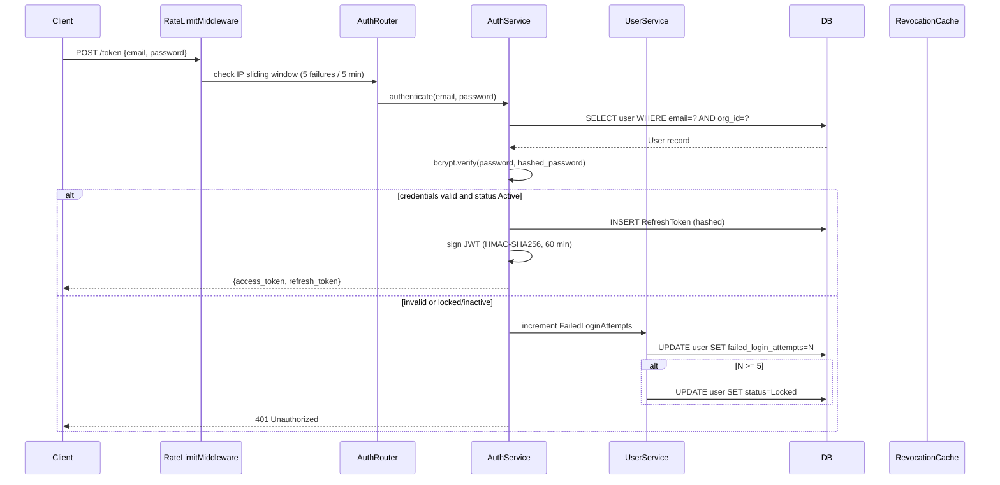
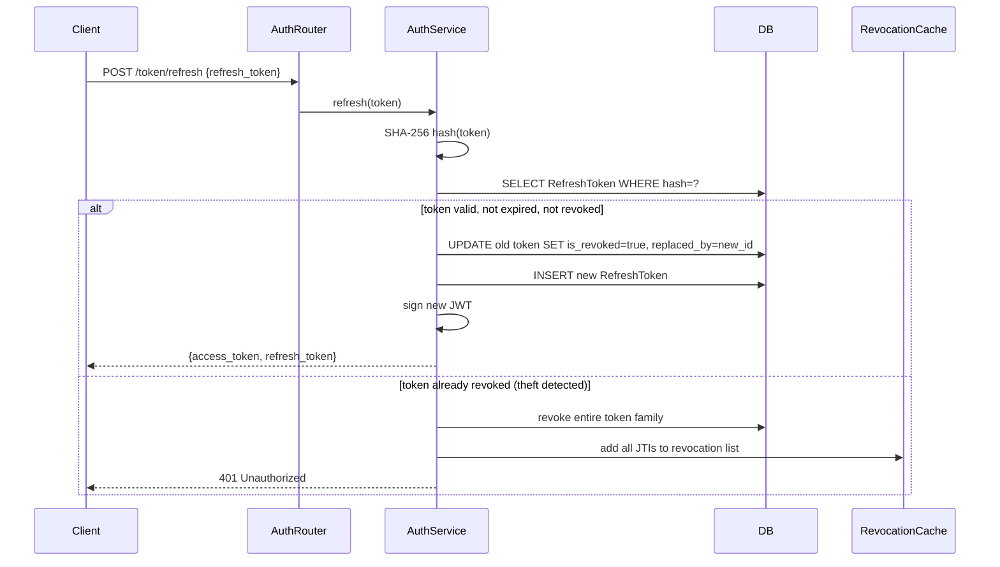
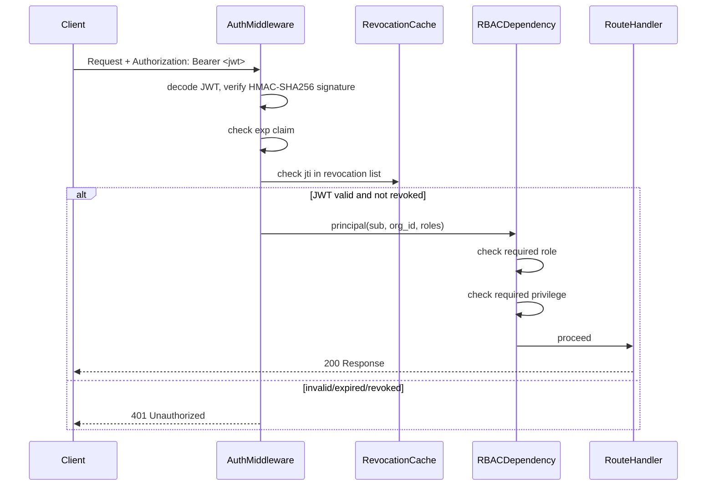

# Design Document: Identity and Access

## Overview

The Identity and Access module is the foundational security layer of the TalentKru.ai FastAPI backend. It governs user lifecycle management, JWT-based local authentication, token refresh and revocation, role-based access control (RBAC), fine-grained privilege management, SuperAdmin on-behalf-of impersonation, user invitation and account setup, password reset, field-level PII encryption, audit logging, and multi-level rate limiting.

All design decisions follow the conventions established in the Platform Foundation module:
- Async-first SQLAlchemy sessions
- Pydantic Settings for configuration with startup validation
- Soft deletion only (no hard deletes)
- Structured JSON logging via structlog
- FastAPI dependency injection for auth and authorization
- Tenant isolation enforced at the query layer

### Key Architectural Decisions

- **Email as username**: No separate username field. The user's email address is the unique login identifier and is stored as the `sub` claim in JWTs.
- **Stateless authentication**: JWTs are self-contained. No server-side session storage. Token revocation is handled via an in-memory cache backed by a persistent `RevokedToken` table.
- **Separate secrets**: `JWT_SIGNING_KEY` (HMAC-SHA256 signing only) and `ENCRYPTION_KEY` (field-level PII encryption only) are intentionally distinct to enforce least privilege.
- **PendingInvitation status**: New users are created with `Status=PendingInvitation` and no password. They activate their account via a single-use invitation token.
- **Password history**: The last 5 bcrypt hashes are retained per user to prevent password reuse.
- **Token family revocation**: Refresh token reuse triggers revocation of the entire token family (linked via `ReplacedByTokenID`) to detect and respond to token theft.
- **In-memory sliding window rate limiting**: No external dependency (Redis, etc.). Suitable for single-instance deployment.

---

## Architecture

### Module Structure

```
app/modules/
├── auth/
│   ├── router.py          # POST /token, POST /token/refresh, POST /admin/impersonate
│   ├── service.py         # Authentication logic, JWT issuance, token refresh/revocation
│   ├── schemas.py         # TokenResponse, LoginRequest, RefreshRequest, ImpersonateRequest
│   ├── dependencies.py    # get_current_principal(), require_role(), require_privilege()
│   └── models.py          # RefreshToken, RevokedToken
├── users/
│   ├── router.py          # GET/POST/PATCH /users, DELETE /admin/users/{id}/sessions
│   ├── service.py         # User CRUD, lockout logic, password history
│   ├── schemas.py         # UserCreate, UserUpdate, UserResponse
│   └── models.py          # User, PasswordHistory
├── rbac/
│   ├── router.py          # GET/POST /roles, GET/POST/DELETE /roles/{name}/privileges
│   ├── service.py         # Role assignment, privilege management
│   ├── schemas.py         # RoleAssignRequest, PrivilegeResponse, RolePrivilegeResponse
│   └── models.py          # Role, UserRole, Privilege, RolePrivilege
├── invitations/
│   ├── router.py          # POST /auth/invitation/accept, POST /auth/invitation/resend
│   ├── service.py         # Token generation, email dispatch, account activation
│   ├── schemas.py         # InvitationAcceptRequest, InvitationResendRequest
│   └── models.py          # InvitationToken
└── password_reset/
    ├── router.py          # POST /auth/password-reset/request, POST /auth/password-reset/confirm
    ├── service.py         # Token generation, email dispatch, password update
    ├── schemas.py         # PasswordResetRequest, PasswordResetConfirm
    └── models.py          # PasswordResetToken
```

### Authentication Flow



### Token Refresh Flow



### Request Authorization Flow



---

## Components and Interfaces

### 1. Authentication Service (`app/modules/auth/service.py`)

The `AuthService` handles credential verification, JWT issuance, and token lifecycle management.

```python
from datetime import datetime, timezone, timedelta
from uuid import uuid4
import hashlib
import secrets
import bcrypt
import jwt
from sqlalchemy.ext.asyncio import AsyncSession
from app.config import settings
from app.modules.auth.models import RefreshToken, RevokedToken
from app.modules.users.models import User, UserStatus

JWT_ALGORITHM = "HS256"
ACCESS_TOKEN_TTL_MINUTES = 60
REFRESH_TOKEN_TTL_DAYS = 7
REFRESH_TOKEN_BYTES = 32

class AuthService:
    def __init__(self, db: AsyncSession, revocation_cache: "RevocationCache"):
        self.db = db
        self.revocation_cache = revocation_cache

    async def authenticate(self, email: str, password: str, org_id: UUID) -> tuple[str, str]:
        """Verify credentials and return (access_token, refresh_token)."""
        user = await self._get_user_by_email(email, org_id)
        if not user or user.status in (UserStatus.LOCKED, UserStatus.INACTIVE):
            await self._handle_failed_attempt(user)
            raise AuthenticationError("Invalid credentials")
        if not bcrypt.checkpw(password.encode(), user.hashed_password.encode()):
            await self._handle_failed_attempt(user)
            raise AuthenticationError("Invalid credentials")
        # Reset failed attempts on success
        user.failed_login_attempts = 0
        user.last_failed_login_at = None
        access_token = self._issue_access_token(user)
        refresh_token = await self._issue_refresh_token(user)
        return access_token, refresh_token

    def _issue_access_token(self, user: User) -> str:
        now = datetime.now(timezone.utc)
        payload = {
            "sub": user.email,
            "org_id": str(user.organization_id),
            "roles": [ur.role_name for ur in user.user_roles],
            "exp": now + timedelta(minutes=ACCESS_TOKEN_TTL_MINUTES),
            "iat": now,
            "jti": str(uuid4()),
        }
        return jwt.encode(payload, settings.JWT_SIGNING_KEY, algorithm=JWT_ALGORITHM)

    async def _issue_refresh_token(self, user: User) -> str:
        raw_token = secrets.token_bytes(REFRESH_TOKEN_BYTES).hex()
        token_hash = hashlib.sha256(raw_token.encode()).hexdigest()
        refresh = RefreshToken(
            refresh_token_id=uuid4(),
            user_id=user.user_id,
            token_hash=token_hash,
            expires_at=datetime.now(timezone.utc) + timedelta(days=REFRESH_TOKEN_TTL_DAYS),
            is_revoked=False,
            issued_at=datetime.now(timezone.utc),
        )
        self.db.add(refresh)
        await self.db.flush()
        return raw_token

    async def _handle_failed_attempt(self, user: User | None) -> None:
        if user is None:
            return
        user.failed_login_attempts = (user.failed_login_attempts or 0) + 1
        user.last_failed_login_at = datetime.now(timezone.utc)
        if user.failed_login_attempts >= 5:
            user.status = UserStatus.LOCKED
        await self.db.flush()
```

**Design rationale**: The `_handle_failed_attempt` method retries the lock operation via SQLAlchemy's optimistic locking (`VersionMixin`). If a concurrent modification causes a `StaleDataError`, the session is refreshed and the update is retried until it succeeds, satisfying Requirement 1.9's retry guarantee.

### 2. JWT Dependency (`app/modules/auth/dependencies.py`)

```python
from fastapi import Depends, HTTPException, status
from fastapi.security import OAuth2PasswordBearer
import jwt
from app.config import settings
from app.modules.auth.service import RevocationCache

oauth2_scheme = OAuth2PasswordBearer(tokenUrl="/api/v1/token")

async def get_current_principal(
    token: str = Depends(oauth2_scheme),
    revocation_cache: RevocationCache = Depends(get_revocation_cache),
) -> Principal:
    credentials_exception = HTTPException(
        status_code=status.HTTP_401_UNAUTHORIZED,
        detail="Could not validate credentials",
        headers={"WWW-Authenticate": "Bearer"},
    )
    try:
        payload = jwt.decode(token, settings.JWT_SIGNING_KEY, algorithms=["HS256"])
    except jwt.ExpiredSignatureError:
        raise credentials_exception
    except jwt.InvalidTokenError:
        raise credentials_exception

    jti = payload.get("jti")
    if jti and revocation_cache.is_revoked(jti):
        raise credentials_exception

    return Principal(
        sub=payload["sub"],
        org_id=UUID(payload["org_id"]),
        roles=payload.get("roles", []),
        jti=jti,
        obo_by=payload.get("obo_by"),
    )

def require_role(*roles: str):
    """FastAPI dependency factory for role-based authorization."""
    async def _check(principal: Principal = Depends(get_current_principal)):
        if not any(r in principal.roles for r in roles):
            raise HTTPException(status_code=403, detail="Insufficient role")
        return principal
    return _check

def require_privilege(privilege_name: str):
    """FastAPI dependency factory for privilege-based authorization."""
    async def _check(
        principal: Principal = Depends(get_current_principal),
        db: AsyncSession = Depends(get_db_session),
    ):
        has_privilege = await check_role_privilege(principal.roles, privilege_name, db)
        if not has_privilege:
            raise HTTPException(status_code=403, detail="Insufficient privilege")
        return principal
    return _check
```

### 3. Token Revocation Cache (`app/modules/auth/service.py`)

```python
import threading
from datetime import datetime, timezone
from collections import defaultdict

class RevocationCache:
    """
    In-memory sliding window cache for revoked JTI claims.
    TTL defaults to 5 minutes (configurable). Thread-safe.
    Backed by persistent RevokedToken table for durability.
    """
    def __init__(self, ttl_seconds: int = 300):
        self._store: dict[str, datetime] = {}
        self._lock = threading.Lock()
        self._ttl = ttl_seconds

    def revoke(self, jti: str) -> None:
        with self._lock:
            self._store[jti] = datetime.now(timezone.utc)

    def is_revoked(self, jti: str) -> bool:
        with self._lock:
            self._evict_expired()
            return jti in self._store

    def _evict_expired(self) -> None:
        now = datetime.now(timezone.utc)
        expired = [
            k for k, v in self._store.items()
            if (now - v).total_seconds() > self._ttl
        ]
        for k in expired:
            del self._store[k]
```

**Design rationale**: The cache is intentionally simple and in-process. On startup, the service loads all non-expired JTIs from the `RevokedToken` table to warm the cache. This ensures revocations survive application restarts.

### 4. Rate Limiter (`app/middleware/rate_limit.py`)

```python
import threading
import time
from collections import deque
from dataclasses import dataclass, field
from fastapi import Request, HTTPException

@dataclass
class SlidingWindowCounter:
    window_seconds: int
    max_requests: int
    _timestamps: deque = field(default_factory=deque)
    _lock: threading.Lock = field(default_factory=threading.Lock)

    def is_allowed(self) -> tuple[bool, int]:
        """Returns (allowed, retry_after_seconds)."""
        now = time.monotonic()
        with self._lock:
            cutoff = now - self.window_seconds
            while self._timestamps and self._timestamps[0] < cutoff:
                self._timestamps.popleft()
            if len(self._timestamps) >= self.max_requests:
                oldest = self._timestamps[0]
                retry_after = int(self.window_seconds - (now - oldest)) + 1
                return False, retry_after
            self._timestamps.append(now)
            return True, 0

class RateLimiter:
    """
    In-memory sliding window rate limiter.
    Keyed by (endpoint_group, identifier) where identifier is IP or org_id.
    """
    def __init__(self):
        self._counters: dict[tuple, SlidingWindowCounter] = {}
        self._lock = threading.Lock()

    def get_counter(
        self, key: tuple, window_seconds: int, max_requests: int
    ) -> SlidingWindowCounter:
        with self._lock:
            if key not in self._counters:
                self._counters[key] = SlidingWindowCounter(window_seconds, max_requests)
            return self._counters[key]

    def check(self, key: tuple, window_seconds: int, max_requests: int) -> int:
        """Returns retry_after_seconds (0 if allowed, >0 if rate limited)."""
        counter = self.get_counter(key, window_seconds, max_requests)
        allowed, retry_after = counter.is_allowed()
        return retry_after
```

**Rate limit configurations**:

| Endpoint Group | Key | Window | Max Requests | Lockout |
|---|---|---|---|---|
| Auth (failed attempts) | source IP | 5 min | 5 failures | 15 min |
| Invitation accept | source IP | 10 min | 10 attempts | — |
| Password reset request | source IP | 10 min | 3 requests | — |
| Password reset confirm | source IP | 10 min | 5 attempts | — |
| Per-tenant API | org_id | 1 min | configurable (default 1000) | — |
| Per-agent | agent identity | 1 min | configurable (default 100) | — |

### 5. Field-Level PII Encryption (`app/crypto.py`)

```python
import base64
import os
from cryptography.hazmat.primitives.ciphers.aead import AESGCM
from app.config import settings

def _get_key() -> bytes:
    """Derive a 32-byte AES key from ENCRYPTION_KEY."""
    raw = settings.ENCRYPTION_KEY.encode()
    # Use first 32 bytes of SHA-256 hash for consistent key length
    import hashlib
    return hashlib.sha256(raw).digest()

def encrypt_field(plaintext: str) -> str:
    """Encrypt a string field using AES-256-GCM. Returns base64-encoded ciphertext."""
    key = _get_key()
    aesgcm = AESGCM(key)
    nonce = os.urandom(12)  # 96-bit nonce for GCM
    ciphertext = aesgcm.encrypt(nonce, plaintext.encode(), None)
    return base64.b64encode(nonce + ciphertext).decode()

def decrypt_field(encoded: str) -> str:
    """Decrypt a base64-encoded AES-256-GCM ciphertext."""
    key = _get_key()
    aesgcm = AESGCM(key)
    raw = base64.b64decode(encoded)
    nonce, ciphertext = raw[:12], raw[12:]
    return aesgcm.decrypt(nonce, ciphertext, None).decode()
```

**Encrypted fields**:
- `User.email` (stored encrypted; plaintext used only in memory)
- `Candidate.email`, `Candidate.phone`, `Candidate.name`
- `CandidateInterviewJourney.candidate_id`, `CandidateInterviewJourney.interview_journey_id` (encrypted on `OfferAccepted` transition)

**Design rationale**: AES-256-GCM provides authenticated encryption, preventing both confidentiality breaches and undetected tampering. A fresh 96-bit nonce per encryption ensures ciphertext uniqueness even for identical plaintexts.

### 6. SuperAdmin Impersonation (`app/modules/auth/service.py`)

```python
async def impersonate(
    super_admin: Principal,
    target_org_id: UUID,
    target_user_id: UUID,
    db: AsyncSession,
) -> str:
    """Issue an on-behalf-of JWT for a SuperAdmin impersonating an Administrator."""
    if super_admin.obo_by is not None:
        raise HTTPException(status_code=403, detail="Nested impersonation is not permitted")

    target_user = await get_user_by_id(target_user_id, target_org_id, db)
    if target_user is None:
        raise HTTPException(status_code=404, detail="User not found")

    target_roles = [ur.role_name for ur in target_user.user_roles]
    if "Administrator" not in target_roles:
        raise HTTPException(status_code=403, detail="Target user must hold the Administrator role")

    now = datetime.now(timezone.utc)
    payload = {
        "sub": target_user.email,
        "org_id": str(target_org_id),
        "roles": target_roles,
        "exp": now + timedelta(minutes=ACCESS_TOKEN_TTL_MINUTES),
        "iat": now,
        "jti": str(uuid4()),
        "obo_by": str(super_admin.sub),  # SuperAdmin's email/UserID
    }
    token = jwt.encode(payload, settings.JWT_SIGNING_KEY, algorithm=JWT_ALGORITHM)

    await write_audit_log(
        db=db,
        actor_id=super_admin.sub,
        action="ImpersonationStarted",
        target_org_id=target_org_id,
        target_user_id=target_user_id,
        timestamp=now,
    )
    return token
```

### 7. Password Policy Validator (`app/modules/auth/service.py`)

```python
import re

PASSWORD_MIN_LENGTH = 12
PASSWORD_PATTERN = re.compile(
    r'^(?=.*[A-Z])(?=.*[a-z])(?=.*\d)(?=.*[^A-Za-z0-9]).{12,}$'
)

def validate_password_policy(password: str) -> list[str]:
    """Returns a list of violated policy rules (empty list = valid)."""
    violations = []
    if len(password) < PASSWORD_MIN_LENGTH:
        violations.append(f"Password must be at least {PASSWORD_MIN_LENGTH} characters")
    if not re.search(r'[A-Z]', password):
        violations.append("Password must contain at least one uppercase letter")
    if not re.search(r'[a-z]', password):
        violations.append("Password must contain at least one lowercase letter")
    if not re.search(r'\d', password):
        violations.append("Password must contain at least one digit")
    if not re.search(r'[^A-Za-z0-9]', password):
        violations.append("Password must contain at least one special character")
    return violations

async def check_password_history(
    user_id: UUID, new_password: str, db: AsyncSession
) -> bool:
    """Returns True if the password matches any of the last 5 stored hashes."""
    history = await get_password_history(user_id, limit=5, db=db)
    for entry in history:
        if bcrypt.checkpw(new_password.encode(), entry.hashed_password.encode()):
            return True
    return False
```

---

## Data Models

### User (`app/modules/users/models.py`)

```python
import enum
from sqlalchemy import Column, String, Integer, DateTime, ForeignKey, Enum as SQLEnum
from sqlalchemy.dialects.postgresql import UUID
from sqlalchemy.orm import relationship
from app.base_model import Base, AuditMixin, VersionMixin
import uuid

class UserStatus(str, enum.Enum):
    ACTIVE = "Active"
    INACTIVE = "Inactive"
    LOCKED = "Locked"
    PENDING_INVITATION = "PendingInvitation"

class User(Base, AuditMixin, VersionMixin):
    __tablename__ = "users"

    user_id = Column(UUID(as_uuid=True), primary_key=True, default=uuid.uuid4)
    organization_id = Column(UUID(as_uuid=True), ForeignKey("organizations.organization_id"), nullable=True)
    email = Column(String(512), nullable=False)          # stored encrypted; 512 to accommodate ciphertext
    email_hash = Column(String(64), nullable=False)      # SHA-256 hash for uniqueness lookups
    given_name = Column(String(100), nullable=False)
    last_name = Column(String(100), nullable=False)
    status = Column(SQLEnum(UserStatus), nullable=False, default=UserStatus.PENDING_INVITATION)
    manager_user_id = Column(UUID(as_uuid=True), ForeignKey("users.user_id"), nullable=True)
    hashed_password = Column(String(60), nullable=True)  # bcrypt hash, nullable until invitation accepted
    failed_login_attempts = Column(Integer, nullable=False, default=0)
    last_failed_login_at = Column(DateTime(timezone=True), nullable=True)
    locale = Column(String(10), nullable=False, default="en-US")

    user_roles = relationship("UserRole", back_populates="user", lazy="selectin")
    password_history = relationship("PasswordHistory", back_populates="user", order_by="PasswordHistory.created_at.desc()")
    refresh_tokens = relationship("RefreshToken", back_populates="user")

    __table_args__ = (
        # Uniqueness enforced on (organization_id, email_hash) to support encrypted email
        UniqueConstraint("organization_id", "email_hash", name="uq_users_org_email"),
    )
```

**Design note on encrypted email**: Because `email` is stored encrypted, a direct `UNIQUE` constraint on the ciphertext would fail (different nonces produce different ciphertexts for the same plaintext). Instead, a deterministic `email_hash` (SHA-256 of the lowercase plaintext email) is stored alongside the encrypted value and used for uniqueness enforcement and lookups.

### PasswordHistory (`app/modules/users/models.py`)

```python
class PasswordHistory(Base):
    __tablename__ = "password_history"

    password_history_id = Column(UUID(as_uuid=True), primary_key=True, default=uuid.uuid4)
    user_id = Column(UUID(as_uuid=True), ForeignKey("users.user_id"), nullable=False)
    hashed_password = Column(String(60), nullable=False)
    created_at = Column(DateTime(timezone=True), server_default=func.now(), nullable=False)

    user = relationship("User", back_populates="password_history")
```

### RefreshToken (`app/modules/auth/models.py`)

```python
class RefreshToken(Base):
    __tablename__ = "refresh_tokens"

    refresh_token_id = Column(UUID(as_uuid=True), primary_key=True, default=uuid.uuid4)
    user_id = Column(UUID(as_uuid=True), ForeignKey("users.user_id"), nullable=False)
    token_hash = Column(String(64), nullable=False, unique=True)  # SHA-256 hex
    expires_at = Column(DateTime(timezone=True), nullable=False)
    is_revoked = Column(Boolean, nullable=False, default=False)
    issued_at = Column(DateTime(timezone=True), nullable=False)
    replaced_by_token_id = Column(UUID(as_uuid=True), ForeignKey("refresh_tokens.refresh_token_id"), nullable=True)

    user = relationship("User", back_populates="refresh_tokens")
    replaced_by = relationship("RefreshToken", remote_side=[refresh_token_id])
```

### RevokedToken (`app/modules/auth/models.py`)

```python
class RevokedToken(Base):
    __tablename__ = "revoked_tokens"

    revoked_token_id = Column(UUID(as_uuid=True), primary_key=True, default=uuid.uuid4)
    jti = Column(String(36), nullable=False, unique=True, index=True)
    revoked_at = Column(DateTime(timezone=True), nullable=False)
    expires_at = Column(DateTime(timezone=True), nullable=False)  # for cleanup
    user_id = Column(UUID(as_uuid=True), ForeignKey("users.user_id"), nullable=True)
    reason = Column(String(64), nullable=True)  # e.g., "logout", "status_change", "password_reset"
```

### Role, UserRole, Privilege, RolePrivilege (`app/modules/rbac/models.py`)

```python
class Role(Base):
    __tablename__ = "roles"

    role_name = Column(String(64), primary_key=True)
    description = Column(String(256), nullable=True)

    user_roles = relationship("UserRole", back_populates="role")
    role_privileges = relationship("RolePrivilege", back_populates="role")

class UserRole(Base, AuditMixin):
    __tablename__ = "user_roles"

    user_role_id = Column(UUID(as_uuid=True), primary_key=True, default=uuid.uuid4)
    user_id = Column(UUID(as_uuid=True), ForeignKey("users.user_id"), nullable=False)
    role_name = Column(String(64), ForeignKey("roles.role_name"), nullable=False)

    user = relationship("User", back_populates="user_roles")
    role = relationship("Role", back_populates="user_roles")

    __table_args__ = (UniqueConstraint("user_id", "role_name", name="uq_user_roles"),)

class Privilege(Base):
    __tablename__ = "privileges"

    privilege_id = Column(UUID(as_uuid=True), primary_key=True, default=uuid.uuid4)
    name = Column(String(100), nullable=False, unique=True)  # snake_case identifier
    description = Column(String(500), nullable=True)
    resource_category = Column(String(64), nullable=False)  # e.g., "candidates", "requisitions"

    role_privileges = relationship("RolePrivilege", back_populates="privilege")

class RolePrivilege(Base, AuditMixin):
    __tablename__ = "role_privileges"

    role_privilege_id = Column(UUID(as_uuid=True), primary_key=True, default=uuid.uuid4)
    role_name = Column(String(64), ForeignKey("roles.role_name"), nullable=False)
    privilege_id = Column(UUID(as_uuid=True), ForeignKey("privileges.privilege_id"), nullable=False)

    role = relationship("Role", back_populates="role_privileges")
    privilege = relationship("Privilege", back_populates="role_privileges")

    __table_args__ = (UniqueConstraint("role_name", "privilege_id", name="uq_role_privileges"),)
```

### InvitationToken (`app/modules/invitations/models.py`)

```python
class InvitationToken(Base):
    __tablename__ = "invitation_tokens"

    invitation_token_id = Column(UUID(as_uuid=True), primary_key=True, default=uuid.uuid4)
    user_id = Column(UUID(as_uuid=True), ForeignKey("users.user_id"), nullable=False)
    token_hash = Column(String(64), nullable=False, unique=True)  # SHA-256 hex
    expires_at = Column(DateTime(timezone=True), nullable=False)  # 72 hours from issuance
    is_used = Column(Boolean, nullable=False, default=False)
    created_at = Column(DateTime(timezone=True), server_default=func.now(), nullable=False)

    user = relationship("User")
```

### PasswordResetToken (`app/modules/password_reset/models.py`)

```python
class PasswordResetToken(Base):
    __tablename__ = "password_reset_tokens"

    password_reset_token_id = Column(UUID(as_uuid=True), primary_key=True, default=uuid.uuid4)
    user_id = Column(UUID(as_uuid=True), ForeignKey("users.user_id"), nullable=False)
    token_hash = Column(String(64), nullable=False, unique=True)  # SHA-256 hex
    expires_at = Column(DateTime(timezone=True), nullable=False)  # 15 minutes from issuance
    is_used = Column(Boolean, nullable=False, default=False)
    created_at = Column(DateTime(timezone=True), server_default=func.now(), nullable=False)

    user = relationship("User")
```

### Database Schema (DDL Summary)

```sql
CREATE TABLE users (
    user_id             UUID PRIMARY KEY DEFAULT uuid_generate_v4(),
    organization_id     UUID REFERENCES organizations(organization_id),
    email               VARCHAR(512) NOT NULL,          -- AES-256-GCM encrypted
    email_hash          VARCHAR(64)  NOT NULL,           -- SHA-256 for uniqueness
    given_name          VARCHAR(100) NOT NULL,
    last_name           VARCHAR(100) NOT NULL,
    status              VARCHAR(20)  NOT NULL DEFAULT 'PendingInvitation',
    manager_user_id     UUID REFERENCES users(user_id),
    hashed_password     VARCHAR(60),                    -- bcrypt, nullable
    failed_login_attempts INTEGER NOT NULL DEFAULT 0,
    last_failed_login_at  TIMESTAMPTZ,
    locale              VARCHAR(10)  NOT NULL DEFAULT 'en-US',
    version             INTEGER      NOT NULL DEFAULT 1,
    created_at          TIMESTAMPTZ  NOT NULL DEFAULT NOW(),
    updated_at          TIMESTAMPTZ  NOT NULL DEFAULT NOW(),
    deleted_at          TIMESTAMPTZ,
    created_by          UUID,
    updated_by          UUID,
    deleted_by          UUID,
    CONSTRAINT uq_users_org_email UNIQUE (organization_id, email_hash)
);

CREATE TABLE password_history (
    password_history_id UUID PRIMARY KEY DEFAULT uuid_generate_v4(),
    user_id             UUID NOT NULL REFERENCES users(user_id),
    hashed_password     VARCHAR(60) NOT NULL,
    created_at          TIMESTAMPTZ NOT NULL DEFAULT NOW()
);
CREATE INDEX idx_password_history_user ON password_history(user_id, created_at DESC);

CREATE TABLE refresh_tokens (
    refresh_token_id    UUID PRIMARY KEY DEFAULT uuid_generate_v4(),
    user_id             UUID NOT NULL REFERENCES users(user_id),
    token_hash          VARCHAR(64) NOT NULL UNIQUE,
    expires_at          TIMESTAMPTZ NOT NULL,
    is_revoked          BOOLEAN NOT NULL DEFAULT FALSE,
    issued_at           TIMESTAMPTZ NOT NULL,
    replaced_by_token_id UUID REFERENCES refresh_tokens(refresh_token_id)
);
CREATE INDEX idx_refresh_tokens_user ON refresh_tokens(user_id);

CREATE TABLE revoked_tokens (
    revoked_token_id    UUID PRIMARY KEY DEFAULT uuid_generate_v4(),
    jti                 VARCHAR(36) NOT NULL UNIQUE,
    revoked_at          TIMESTAMPTZ NOT NULL,
    expires_at          TIMESTAMPTZ NOT NULL,
    user_id             UUID REFERENCES users(user_id),
    reason              VARCHAR(64)
);
CREATE INDEX idx_revoked_tokens_jti ON revoked_tokens(jti);
CREATE INDEX idx_revoked_tokens_expires ON revoked_tokens(expires_at);

CREATE TABLE roles (
    role_name   VARCHAR(64) PRIMARY KEY,
    description VARCHAR(256)
);

CREATE TABLE user_roles (
    user_role_id UUID PRIMARY KEY DEFAULT uuid_generate_v4(),
    user_id      UUID NOT NULL REFERENCES users(user_id),
    role_name    VARCHAR(64) NOT NULL REFERENCES roles(role_name),
    created_at   TIMESTAMPTZ NOT NULL DEFAULT NOW(),
    updated_at   TIMESTAMPTZ NOT NULL DEFAULT NOW(),
    deleted_at   TIMESTAMPTZ,
    created_by   UUID,
    updated_by   UUID,
    deleted_by   UUID,
    CONSTRAINT uq_user_roles UNIQUE (user_id, role_name)
);

CREATE TABLE privileges (
    privilege_id      UUID PRIMARY KEY DEFAULT uuid_generate_v4(),
    name              VARCHAR(100) NOT NULL UNIQUE,
    description       VARCHAR(500),
    resource_category VARCHAR(64) NOT NULL
);

CREATE TABLE role_privileges (
    role_privilege_id UUID PRIMARY KEY DEFAULT uuid_generate_v4(),
    role_name         VARCHAR(64) NOT NULL REFERENCES roles(role_name),
    privilege_id      UUID NOT NULL REFERENCES privileges(privilege_id),
    created_at        TIMESTAMPTZ NOT NULL DEFAULT NOW(),
    updated_at        TIMESTAMPTZ NOT NULL DEFAULT NOW(),
    deleted_at        TIMESTAMPTZ,
    created_by        UUID,
    updated_by        UUID,
    deleted_by        UUID,
    CONSTRAINT uq_role_privileges UNIQUE (role_name, privilege_id)
);

CREATE TABLE invitation_tokens (
    invitation_token_id UUID PRIMARY KEY DEFAULT uuid_generate_v4(),
    user_id             UUID NOT NULL REFERENCES users(user_id),
    token_hash          VARCHAR(64) NOT NULL UNIQUE,
    expires_at          TIMESTAMPTZ NOT NULL,
    is_used             BOOLEAN NOT NULL DEFAULT FALSE,
    created_at          TIMESTAMPTZ NOT NULL DEFAULT NOW()
);

CREATE TABLE password_reset_tokens (
    password_reset_token_id UUID PRIMARY KEY DEFAULT uuid_generate_v4(),
    user_id                 UUID NOT NULL REFERENCES users(user_id),
    token_hash              VARCHAR(64) NOT NULL UNIQUE,
    expires_at              TIMESTAMPTZ NOT NULL,
    is_used                 BOOLEAN NOT NULL DEFAULT FALSE,
    created_at              TIMESTAMPTZ NOT NULL DEFAULT NOW()
);
```

### Default Role and Privilege Seed Data

The following roles are seeded at migration time:

| Role Name | Description |
|---|---|
| `SuperAdministrator` | Cross-tenant platform administration |
| `Administrator` | Organization-level user and configuration management |
| `Recruiter` | Candidate and requisition management |
| `HiringManager` | Interview journey stage transitions |
| `CommitteeMember` | Panel review participation |
| `HRManager` | Reporting and analytics access |
| `Interviewer` | Interview slot management and feedback |

Default privilege categories and their role assignments preserve all coarse-grained rules from Requirement 5. Example privileges:

| Privilege Name | Resource Category | Default Roles |
|---|---|---|
| `users:read` | users | Administrator, SuperAdministrator |
| `users:write` | users | Administrator, SuperAdministrator |
| `roles:assign` | rbac | Administrator, SuperAdministrator |
| `privileges:manage` | rbac | SuperAdministrator |
| `candidates:write` | candidates | Recruiter |
| `requisitions:write` | requisitions | Recruiter |
| `journeys:transition` | journeys | Recruiter, HiringManager |
| `interviews:feedback` | interviews | Interviewer |
| `reports:read` | reporting | Administrator, HRManager |

---

## Correctness Properties

*A property is a characteristic or behavior that should hold true across all valid executions of a system — essentially, a formal statement about what the system should do. Properties serve as the bridge between human-readable specifications and machine-verifiable correctness guarantees.*

**Property reflection**: After reviewing all prework-identified properties, the following consolidations were made:
- Requirements 3.4 (JWT claims) and 5.7 (roles in JWT) are merged into Property 3 (JWT claims completeness).
- Requirements 1.2 and 1.3 (email uniqueness) are merged into Property 1 (email uniqueness within org).
- Requirements 4.1 and 4.7 (token issuance) are merged into Property 4 (authentication token issuance).
- Requirements 8.1 and 8.2 (auth rate limiting) are merged into Property 14 (auth endpoint rate limiting).
- Requirements 9.4 and 9.7 (expired/used invitation token) are merged into Property 17 (invalid invitation token rejection).
- Requirements 10.4 (expired/used reset token) is covered by Property 20 (invalid reset token rejection).
- Requirements 10.5 and 9.5 (password policy on token acceptance) are merged into Property 19 (password policy enforcement).

### Property 1: Email uniqueness within organization

*For any* two user creation requests with the same email address targeting the same organization, the second request must be rejected with a 409 Conflict response. *For any* two user creation requests with the same email address targeting different organizations, both must succeed.

**Validates: Requirements 1.2, 1.3**

### Property 2: Locked user authentication rejection

*For any* user whose Status is Locked or Inactive, a POST /token request with any credentials (valid or invalid) must return a 401 Unauthorized response.

**Validates: Requirements 1.4, 3.8**

### Property 3: JWT claims completeness

*For any* successfully issued access token, decoding it must yield: a `sub` claim equal to the user's email address, an `org_id` claim equal to the user's OrganizationID, a `roles` claim containing all roles currently assigned to the user, an `exp` claim set to exactly 60 minutes from issuance, and a unique `jti` claim.

**Validates: Requirements 3.4, 4.7, 5.7**

### Property 4: Authentication token issuance

*For any* user with Status=Active and valid credentials, a POST /token request must return both an access token (JWT, 60-minute TTL) and a refresh token (opaque string, 7-day TTL), with the refresh token stored as a SHA-256 hash in the RefreshToken table.

**Validates: Requirements 4.1, 3.1**

### Property 5: JWT signature verification

*For any* issued JWT, verifying its signature with `JWT_SIGNING_KEY` using HMAC-SHA256 must succeed. Verifying the same JWT with any other key must fail.

**Validates: Requirements 3.3**

### Property 6: Refresh token rotation

*For any* valid, non-expired, non-revoked refresh token submitted to POST /token/refresh, the operation must: issue a new access token and refresh token, mark the submitted token as revoked (IsRevoked=true), link the old token to the new one via ReplacedByTokenID, and return both new tokens.

**Validates: Requirements 4.2**

### Property 7: Token family revocation on reuse

*For any* refresh token that has already been revoked, submitting it to POST /token/refresh must revoke all tokens in the same family (the entire chain linked via ReplacedByTokenID) and return a 401 Unauthorized response.

**Validates: Requirements 4.3**

### Property 8: Revoked JTI rejection

*For any* access token whose JTI is present in the revocation list (in-memory cache or RevokedToken table), requests to any protected endpoint must return a 401 Unauthorized response.

**Validates: Requirements 4.4**

### Property 9: Status change triggers token revocation

*For any* user whose Status is changed to Locked or Inactive, all active refresh tokens for that user must be revoked (IsRevoked=true) and all active JTI claims must be added to the revocation list.

**Validates: Requirements 4.5**

### Property 10: Non-admin role management rejection

*For any* user who does not hold the Administrator or SuperAdministrator role, requests to user management endpoints (list, create, update users) and role management endpoints must return a 403 Forbidden response.

**Validates: Requirements 5.3, 1.6**

### Property 11: Role assignment audit log

*For any* role assignment or removal operation performed by an Administrator or SuperAdministrator, an audit log entry must be created containing the actor's UserID, the affected user's UserID, the role name, the operation type (assigned/removed), and the timestamp. No audit log entry must be created for read-only access to role management interfaces.

**Validates: Requirements 5.8**

### Property 12: Role minimum privilege invariant

*For any* role in the system, the set of privileges assigned to it must never be empty. Any attempt to remove the last privilege from a role must be rejected with a 400 Bad Request response.

**Validates: Requirements 6.8**

### Property 13: PII encryption round-trip

*For any* plaintext PII field value (User email, Candidate email, Candidate phone, Candidate name), storing the value and then retrieving it must return the original plaintext value, while the value stored in the database must differ from the plaintext (i.e., it is encrypted).

**Validates: Requirements 7.1, 7.2**

### Property 14: Authentication endpoint rate limiting

*For any* source IP address, after accumulating 5 failed authentication attempts within a 5-minute sliding window on POST /token or POST /token/refresh, all subsequent requests from that IP must return a 429 Too Many Requests response with a Retry-After header indicating the remaining lockout duration (15 minutes from the first blocked request), regardless of whether the credentials would succeed.

**Validates: Requirements 8.1, 8.2**

### Property 15: Per-tenant API rate limiting

*For any* organization, once the number of authenticated API requests within a 1-minute window exceeds the organization's configured limit, all subsequent requests within that window must return a 429 Too Many Requests response including X-RateLimit-Limit, X-RateLimit-Remaining, and X-RateLimit-Reset headers.

**Validates: Requirements 8.3, 8.4**

### Property 16: Invitation token generation on user creation

*For any* user creation request, the created user must have Status=PendingInvitation, and an InvitationToken record must exist with a SHA-256 hashed token, an ExpiresAt 72 hours from creation, and IsUsed=false.

**Validates: Requirements 9.1**

### Property 17: Invalid invitation token rejection

*For any* invitation token that is expired (ExpiresAt in the past), already used (IsUsed=true), or does not exist in the InvitationToken table, a POST /auth/invitation/accept request must return a 400 Bad Request response without revealing which condition applies, and the user's Status must remain PendingInvitation.

**Validates: Requirements 9.4, 9.7**

### Property 18: Successful invitation acceptance activates account

*For any* valid, non-expired, unused invitation token paired with a password that satisfies the password policy, POST /auth/invitation/accept must: set the user's Status to Active, store the password as a bcrypt hash, mark the InvitationToken as used (IsUsed=true), add the password to the user's PasswordHistory, and create an audit log entry with action=AccountActivated.

**Validates: Requirements 9.3, 9.8**

### Property 19: Password policy enforcement

*For any* password string that violates the policy (fewer than 12 characters, missing uppercase, missing lowercase, missing digit, missing special character, or matching any of the user's last 5 stored hashes), the password acceptance endpoint (invitation or reset) must return a 422 Unprocessable Entity response indicating which rules were violated, and the associated token (invitation or reset) must remain unused (IsUsed=false).

**Validates: Requirements 9.5, 10.5**

### Property 20: Invalid password reset token rejection

*For any* password reset token that is expired, already used, or does not exist, a POST /auth/password-reset/confirm request must return a 400 Bad Request response without revealing which condition applies.

**Validates: Requirements 10.4**

### Property 21: Password reset triggers session revocation

*For any* successful password reset, all active refresh tokens for the affected user must be revoked and all active JTI claims must be added to the revocation list, forcing re-authentication on all active sessions.

**Validates: Requirements 10.6**

### Property 22: Password reset endpoint non-disclosure

*For any* email address submitted to POST /auth/password-reset/request — whether the email belongs to an existing user, a non-existent user, a locked user, or an inactive user — the response must always be 200 OK. The email service must be called only when the user exists and has Status=Active.

**Validates: Requirements 10.2, 10.7**

### Property 23: OBO JWT org isolation

*For any* request bearing an on-behalf-of JWT, attempts to access resources belonging to an organization other than the one in the JWT's `org_id` claim must return a 403 Forbidden response.

**Validates: Requirements 2.6**

### Property 24: Nested impersonation rejection

*For any* request bearing a JWT that contains an `obo_by` claim, a call to POST /admin/impersonate must return a 403 Forbidden response.

**Validates: Requirements 2.7**

### Property 25: Soft delete preserves records

*For any* entity deletion operation, the record must remain in the database with `deleted_at` set to a UTC timestamp and must not appear in default (non-deleted) query results.

**Validates: Requirements 7.4**

---

## Error Handling

### HTTP Error Response Conventions

All error responses follow the platform-standard JSON envelope:

```json
{
  "detail": "Human-readable error message",
  "code": "machine_readable_error_code",
  "fields": ["field_name"]  // optional, for 422 responses
}
```

### Authentication and Authorization Errors

| Scenario | Status | Detail |
|---|---|---|
| Invalid credentials (any reason) | 401 | `"Invalid credentials"` — never reveals which field was wrong |
| Expired JWT | 401 | `"Token has expired"` |
| Missing or malformed Bearer token | 401 | `"Could not validate credentials"` |
| Revoked JTI | 401 | `"Could not validate credentials"` |
| Locked or Inactive account | 401 | `"Invalid credentials"` — does not reveal account status |
| Insufficient role | 403 | `"Insufficient role"` |
| Insufficient privilege | 403 | `"Insufficient privilege"` |
| Cross-org access attempt | 403 | `"Access denied"` |
| Nested impersonation attempt | 403 | `"Nested impersonation is not permitted"` |
| Impersonation of non-Administrator | 403 | `"Target user must hold the Administrator role"` |

### Validation Errors (422)

Password policy violations return a structured 422 with each violated rule listed in `fields`:

```json
{
  "detail": "Password does not meet policy requirements",
  "code": "password_policy_violation",
  "fields": [
    "Password must be at least 12 characters",
    "Password must contain at least one special character"
  ]
}
```

### Token Errors

| Scenario | Status | Detail |
|---|---|---|
| Invitation token expired, used, or not found | 400 | `"Invalid or expired invitation token"` |
| Password reset token expired, used, or not found | 400 | `"Invalid or expired password reset token"` |
| Refresh token revoked (theft detected) | 401 | `"Could not validate credentials"` |
| Refresh token expired | 401 | `"Could not validate credentials"` |

**Design rationale**: Token error responses deliberately do not distinguish between "expired", "used", and "not found" to prevent enumeration attacks.

### Rate Limit Errors

All rate limit responses include appropriate headers:

```
HTTP/1.1 429 Too Many Requests
Retry-After: 847
X-RateLimit-Limit: 5
X-RateLimit-Remaining: 0
X-RateLimit-Reset: 1720000000
```

### Conflict Errors

| Scenario | Status | Detail |
|---|---|---|
| Duplicate email within org | 409 | `"A user with this email already exists in the organization"` |
| Duplicate role assignment | 400 | `"User already holds this role"` |
| Invalid role name | 400 | `"Role '{name}' is not a supported role"` |
| Non-existent PrivilegeID | 400 | `"Privilege not found"` |
| Removing last privilege from role | 400 | `"A role must retain at least one privilege"` |
| Resend invitation for non-PendingInvitation user | 400 | `"User is not in PendingInvitation status"` |

### Database and Concurrency Errors

- **Optimistic locking conflicts** (`StaleDataError`): The service layer catches `StaleDataError` on user status updates (particularly the lockout operation in Requirement 1.9) and retries the operation after refreshing the session. Maximum 3 retries before propagating a 500.
- **Database connectivity failures**: Propagated as 503 Service Unavailable with a structured error body.
- **Constraint violations**: Caught at the service layer and translated to appropriate 4xx responses before reaching the client.

### Startup Failures

If `JWT_SIGNING_KEY` or `ENCRYPTION_KEY` is missing or empty at startup, the `Settings` model raises a `ValidationError` before the ASGI server begins accepting connections. The error is logged with the missing field name and the process exits with a non-zero code.

---

## Testing Strategy

### Dual Testing Approach

The Identity and Access module uses both unit/example-based tests and property-based tests:

- **Unit tests**: Verify specific examples, edge cases, error conditions, and integration points between components.
- **Property-based tests**: Verify universal properties across a wide range of generated inputs, catching edge cases that example-based tests miss.

### Property-Based Testing Library

Use **[Hypothesis](https://hypothesis.readthedocs.io/)** (Python) for all property-based tests.

```toml
# pyproject.toml
[tool.pytest.ini_options]
asyncio_mode = "auto"

[project.optional-dependencies]
test = [
    "pytest>=8.0",
    "pytest-asyncio>=0.23",
    "hypothesis>=6.100",
    "httpx>=0.27",
    "pytest-mock>=3.12",
]
```

Each property test must run a minimum of **100 iterations** (Hypothesis default). Tag each test with a comment referencing the design property:

```python
# Feature: identity-and-access, Property 1: Email uniqueness within organization
@given(email=st.emails(), org_id_a=st.uuids(), org_id_b=st.uuids())
@settings(max_examples=100)
async def test_email_uniqueness_within_org(email, org_id_a, org_id_b):
    ...
```

### Property Test Implementations

#### Property 1: Email uniqueness within organization
```python
# Feature: identity-and-access, Property 1: Email uniqueness within organization
@given(
    email=st.emails(),
    given_name=st.text(min_size=1, max_size=100),
    last_name=st.text(min_size=1, max_size=100),
)
@settings(max_examples=100)
async def test_duplicate_email_same_org_rejected(email, given_name, last_name, db_session):
    org_id = uuid4()
    await create_user(email=email, org_id=org_id, given_name=given_name, last_name=last_name, db=db_session)
    with pytest.raises(HTTPException) as exc:
        await create_user(email=email, org_id=org_id, given_name=given_name, last_name=last_name, db=db_session)
    assert exc.value.status_code == 409
```

#### Property 3: JWT claims completeness
```python
# Feature: identity-and-access, Property 3: JWT claims completeness
@given(
    email=st.emails(),
    roles=st.lists(st.sampled_from(SUPPORTED_ROLES), min_size=1, max_size=3, unique=True),
)
@settings(max_examples=100)
async def test_jwt_claims_completeness(email, roles, db_session):
    user = await create_active_user(email=email, roles=roles, db=db_session)
    access_token, _ = await auth_service.authenticate(email, "ValidP@ssw0rd!", user.organization_id)
    payload = jwt.decode(access_token, settings.JWT_SIGNING_KEY, algorithms=["HS256"])
    assert payload["sub"] == email
    assert payload["org_id"] == str(user.organization_id)
    assert set(payload["roles"]) == set(roles)
    assert "jti" in payload
    exp_delta = payload["exp"] - payload["iat"]
    assert 3590 <= exp_delta <= 3610  # 60 minutes ± 10 seconds
```

#### Property 7: Token family revocation on reuse
```python
# Feature: identity-and-access, Property 7: Token family revocation on reuse
@given(chain_length=st.integers(min_value=1, max_value=5))
@settings(max_examples=50)
async def test_token_family_revocation_on_reuse(chain_length, db_session):
    user = await create_active_user(db=db_session)
    tokens = [await issue_refresh_token(user, db=db_session)]
    for _ in range(chain_length):
        _, new_token = await auth_service.refresh(tokens[-1])
        tokens.append(new_token)
    # Reuse the first (already-rotated) token
    with pytest.raises(HTTPException) as exc:
        await auth_service.refresh(tokens[0])
    assert exc.value.status_code == 401
    # All tokens in the family must now be revoked
    for token in tokens:
        token_hash = hashlib.sha256(token.encode()).hexdigest()
        db_token = await get_refresh_token_by_hash(token_hash, db=db_session)
        assert db_token.is_revoked
```

#### Property 13: PII encryption round-trip
```python
# Feature: identity-and-access, Property 13: PII encryption round-trip
@given(plaintext=st.text(min_size=1, max_size=254))
@settings(max_examples=200)
def test_pii_encryption_round_trip(plaintext):
    encrypted = encrypt_field(plaintext)
    assert encrypted != plaintext
    decrypted = decrypt_field(encrypted)
    assert decrypted == plaintext
```

#### Property 14: Authentication endpoint rate limiting
```python
# Feature: identity-and-access, Property 14: Authentication endpoint rate limiting
@given(ip=st.ip_addresses(v=4).map(str))
@settings(max_examples=50)
async def test_auth_rate_limiting(ip, client):
    for _ in range(5):
        await client.post("/api/v1/token", data={"username": "x@x.com", "password": "wrong"},
                          headers={"X-Forwarded-For": ip})
    response = await client.post("/api/v1/token", data={"username": "x@x.com", "password": "wrong"},
                                 headers={"X-Forwarded-For": ip})
    assert response.status_code == 429
    assert "Retry-After" in response.headers
```

#### Property 19: Password policy enforcement
```python
# Feature: identity-and-access, Property 19: Password policy enforcement
@given(password=st.text(max_size=11))  # too short
@settings(max_examples=100)
async def test_short_password_rejected(password, db_session):
    user = await create_pending_user(db=db_session)
    token = await create_invitation_token(user, db=db_session)
    response = await accept_invitation(token=token.raw, password=password)
    assert response.status_code == 422
    # Token must remain unused
    db_token = await get_invitation_token(token.invitation_token_id, db=db_session)
    assert not db_token.is_used
```

#### Property 22: Password reset endpoint non-disclosure
```python
# Feature: identity-and-access, Property 22: Password reset endpoint non-disclosure
@given(email=st.emails())
@settings(max_examples=100)
async def test_password_reset_always_200(email, client, mock_email_service):
    response = await client.post("/api/v1/auth/password-reset/request", json={"email": email})
    assert response.status_code == 200
```

### Unit Test Coverage

Unit tests cover:

- **User creation**: Required field validation, email format validation, 422 responses for invalid inputs
- **Password history**: Rejection of last 5 passwords, acceptance of the 6th-oldest password
- **Lockout**: Exactly 5 consecutive failures trigger lock; successful login resets counter
- **JWT startup validation**: Missing `JWT_SIGNING_KEY` raises `ValidationError` before app starts
- **Impersonation**: Non-Administrator target returns 403; OBO JWT contains correct claims
- **Invitation resend**: Non-PendingInvitation user returns 400; existing tokens are invalidated
- **Role assignment**: Invalid role name returns 400; duplicate assignment returns 400
- **Privilege management**: Non-existent PrivilegeID returns 400; last privilege removal returns 400
- **Soft delete**: Deleted entities have `deleted_at` set and are excluded from default queries
- **Audit log**: Audit entries created for all specified actions (stage transitions, user changes, role assignments, etc.)
- **OBO audit**: Every action with an OBO JWT creates an audit entry with `obo_by` set

### Integration Tests

Integration tests (using `httpx.AsyncClient` against a test database) cover:

- Full authentication flow: login → access protected endpoint → refresh → revoke
- Invitation flow: create user → receive invitation → accept → login
- Password reset flow: request reset → confirm with new password → verify old sessions revoked
- Impersonation flow: SuperAdmin impersonates Administrator → performs action → audit log verified
- Rate limiting: verify 429 responses after threshold exceeded, verify Retry-After header accuracy
- Privilege check: verify endpoint returns 403 when role lacks required privilege

### Smoke Tests

- Application starts successfully with all required environment variables set
- Application fails to start when `JWT_SIGNING_KEY` is missing or empty
- Application fails to start when `ENCRYPTION_KEY` is missing or empty
- All 7 roles exist in the database after migration
- Default privilege mappings are present after migration
