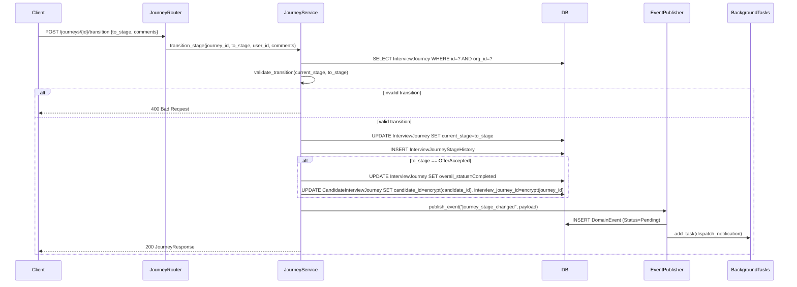
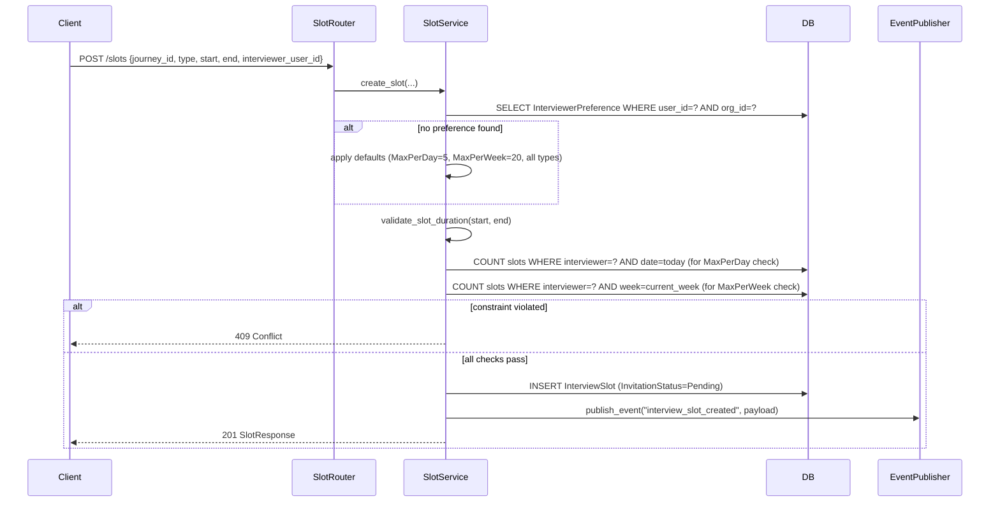
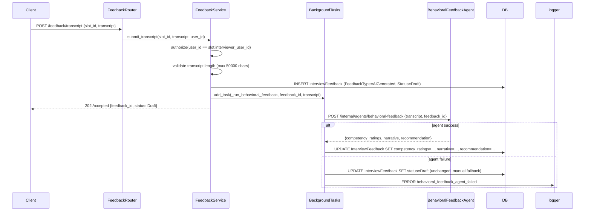
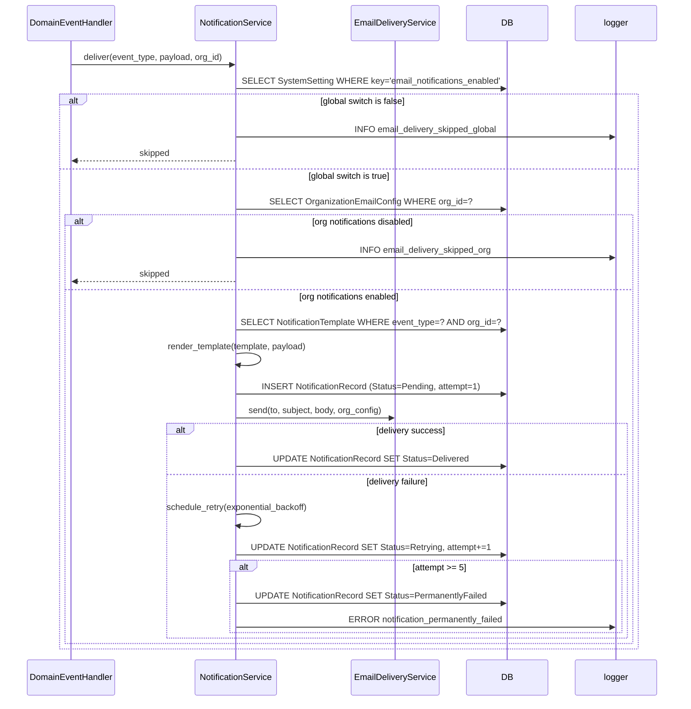
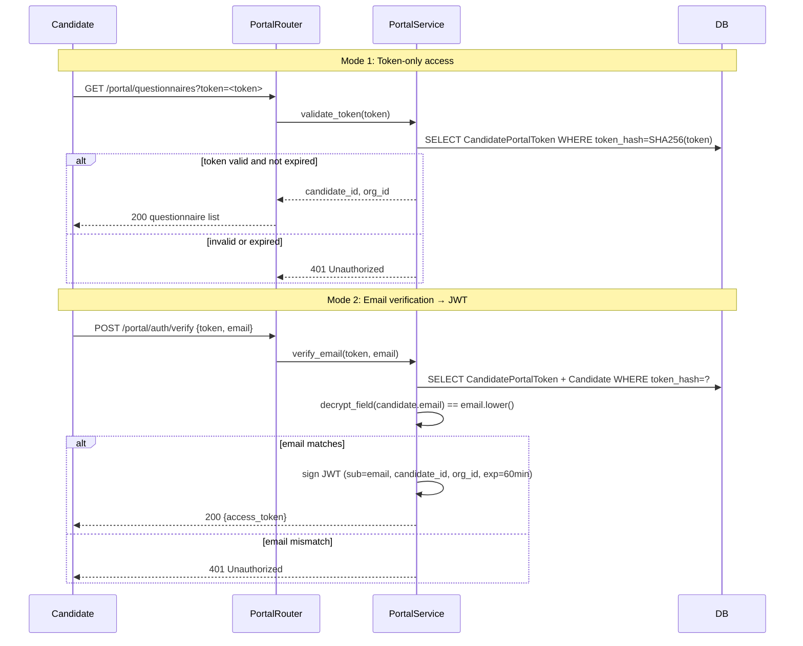

# Design Document: Interview Workflow

## Overview

The Interview Workflow module is the orchestration layer of the TalentKru.ai FastAPI backend. It governs the end-to-end interview process: journey lifecycle management, slot scheduling with interviewer preference enforcement, structured feedback collection with AI-assisted behavioral analysis, questionnaire management and candidate self-service portal, email notification configuration, candidate availability, and the notification agent with retry logic.

All design decisions follow the conventions established in the Platform Foundation and Identity and Access modules:
- Async-first SQLAlchemy sessions via `get_db_session()`
- Soft delete only; queries filter `WHERE deleted_at IS NULL`
- Field-level PII encryption via `encrypt_field`/`decrypt_field` (AES-256-GCM) in `app/crypto.py`
- Structured JSON logging via structlog with correlation ID from `correlation_id_var`
- Domain events via `publish_event()` with persist-first pattern
- FastAPI `BackgroundTasks` for async AI feedback generation and notification delivery
- `require_role()` and `require_privilege()` dependency factories from `app/modules/auth/dependencies.py`
- All entities inherit `AuditMixin`; mutable entities also inherit `VersionMixin`
- Multi-tenancy: every query scoped to `OrganizationID` from authenticated principal

### Key Architectural Decisions

- **FSM-enforced journey stages**: Stage transitions are validated against an explicit allowed-transitions map. Invalid transitions return 400 before any DB write occurs.
- **Encryption on OfferAccepted**: `CandidateInterviewJourney.candidate_id` and `interview_journey_id` are encrypted at the moment of the `OfferAccepted` transition, making hired candidate data unlinkable after onboarding.
- **JourneyPublicID**: A URL-safe random string (≥22 chars) generated via `secrets.token_urlsafe(16)` at journey creation, used in portal URLs and external references without exposing internal UUIDs.
- **BehavioralFeedbackAgent as background task**: Transcript processing is decoupled from the HTTP response. The agent is invoked via `BackgroundTasks`; failures are logged and the interviewer is notified to submit manually.
- **Two-level notification switch**: Global `email_notifications_enabled` system setting is checked first; org-level `OrganizationEmailConfig.EmailNotificationsEnabled` is checked second. Both must be true for delivery to proceed.
- **Exponential backoff retry**: Notification delivery failures are retried up to 5 times with exponential backoff. A `NotificationRecord` entity tracks delivery state and retry count.
- **Cascade availability cancellation**: Cancelling a `CandidateAvailabilitySlot` that overlaps a `Scheduled` `InterviewSlot` automatically cancels the slot, requiring manual rescheduling.
- **Dual portal auth**: Candidates can authenticate with a token-only flow (no email verification) or an email-verification flow that issues a 60-minute JWT. Both grant identical scoped access.

---

## Architecture

### Module Structure

```
app/modules/
├── journeys/
│   ├── router.py          # GET/POST /journeys, POST /journeys/{id}/transition, GET /journeys/{id}/history
│   ├── service.py         # InterviewJourneyService: FSM, encryption on OfferAccepted, stage history
│   ├── schemas.py         # JourneyCreate, JourneyTransitionRequest, JourneyResponse, StageHistoryResponse
│   └── models.py          # InterviewJourney, InterviewJourneyStageHistory, CandidateInterviewJourney
├── slots/
│   ├── router.py          # GET/POST/PATCH /slots, PATCH /slots/{id}/attendance, PATCH /slots/{id}/invitation
│   ├── service.py         # InterviewSlotService: preference validation, invitation event
│   ├── schemas.py         # SlotCreate, SlotUpdate, SlotResponse, InterviewerPreferenceCreate
│   └── models.py          # InterviewSlot, InterviewerPreference
├── feedback/
│   ├── router.py          # GET/POST/PATCH /feedback, POST /feedback/transcript
│   ├── service.py         # InterviewFeedbackService: authorization, BehavioralFeedbackAgent task
│   ├── schemas.py         # FeedbackCreate, FeedbackUpdate, FeedbackResponse, TranscriptRequest
│   └── models.py          # InterviewFeedback
├── questionnaires/
│   ├── router.py          # GET/POST/PATCH /questionnaires, POST /questionnaires/{id}/link
│   ├── service.py         # QuestionnaireService: YAML validation, response lifecycle
│   ├── schemas.py         # QuestionnaireCreate, QuestionnaireResponse, ResponseCreate
│   └── models.py          # Questionnaire, JobRequisitionQuestionnaire, CandidateQuestionnaireResponse, CandidateQuestionnaireAnswer
├── portal/
│   ├── router.py          # POST /portal/auth/token, POST /portal/auth/verify, GET /portal/questionnaires, etc.
│   ├── service.py         # CandidatePortalService: token generation, dual auth modes
│   ├── schemas.py         # PortalTokenResponse, PortalJWTResponse, PortalQuestionnaireResponse
│   └── models.py          # CandidatePortalToken
├── email_config/
│   ├── router.py          # GET/POST/PATCH /email-config, GET/PATCH /system-settings/email
│   ├── service.py         # EmailConfigService: credential encryption, validation
│   ├── schemas.py         # EmailConfigCreate, EmailConfigUpdate, EmailConfigResponse
│   └── models.py          # OrganizationEmailConfig, SystemSetting
├── availability/
│   ├── router.py          # GET/POST/PATCH /availability
│   ├── service.py         # CandidateAvailabilityService: validation, cascade cancellation
│   ├── schemas.py         # AvailabilityCreate, AvailabilityResponse
│   └── models.py          # CandidateAvailabilitySlot
└── notifications/
    ├── router.py          # (internal) POST /internal/agents/notification
    ├── service.py         # NotificationService: two-level switch, template resolution, retry
    ├── schemas.py         # NotificationRequest, NotificationRecord
    ├── models.py          # NotificationTemplate, NotificationRecord
    └── email_delivery.py  # EmailDeliveryService: provider dispatch, credential decryption, fallback
```

### Journey Lifecycle Flow



### Slot Scheduling and Invitation Flow



### Behavioral Feedback Agent Flow



### Notification Delivery Flow



### Portal Authentication Flow



---

## Components and Interfaces

### 1. Interview Journey Service (`app/modules/journeys/service.py`)

The `InterviewJourneyService` enforces the stage FSM, writes stage history on every transition, and triggers PII encryption on `OfferAccepted`.

```python
import enum
import secrets
from uuid import UUID, uuid4
from datetime import datetime, timezone
from sqlalchemy.ext.asyncio import AsyncSession
from sqlalchemy import select
from fastapi import HTTPException
from app.crypto import encrypt_field
from app.modules.journeys.models import (
    InterviewJourney, InterviewJourneyStageHistory,
    CandidateInterviewJourney, JourneyStage, JourneyOverallStatus,
)
from app.domain_events.publisher import publish_event
from app.observability.logging import get_logger

logger = get_logger(__name__)

TERMINAL_STAGES = {
    JourneyStage.REJECTED,
    JourneyStage.OFFER_DECLINED,
    JourneyStage.OFFER_ACCEPTED,
    JourneyStage.WITHDRAWN,
}

# Forward progression + lateral exits to Rejected/Withdrawn from any non-terminal stage
VALID_TRANSITIONS: dict[JourneyStage, set[JourneyStage]] = {
    JourneyStage.SOURCED:          {JourneyStage.RECRUITER_SCREEN, JourneyStage.REJECTED, JourneyStage.WITHDRAWN},
    JourneyStage.RECRUITER_SCREEN: {JourneyStage.MANAGER_SCREEN, JourneyStage.REJECTED, JourneyStage.WITHDRAWN},
    JourneyStage.MANAGER_SCREEN:   {JourneyStage.LOOP_INTERVIEW, JourneyStage.REJECTED, JourneyStage.WITHDRAWN},
    JourneyStage.LOOP_INTERVIEW:   {JourneyStage.PANEL_REVIEW, JourneyStage.REJECTED, JourneyStage.WITHDRAWN},
    JourneyStage.PANEL_REVIEW:     {JourneyStage.OFFER_PENDING, JourneyStage.REJECTED, JourneyStage.WITHDRAWN},
    JourneyStage.OFFER_PENDING:    {JourneyStage.OFFER_EXTENDED, JourneyStage.REJECTED, JourneyStage.WITHDRAWN},
    JourneyStage.OFFER_EXTENDED:   {JourneyStage.OFFER_ACCEPTED, JourneyStage.OFFER_DECLINED, JourneyStage.WITHDRAWN},
    JourneyStage.REJECTED:         set(),
    JourneyStage.OFFER_DECLINED:   set(),
    JourneyStage.OFFER_ACCEPTED:   set(),
    JourneyStage.WITHDRAWN:        set(),
}

NON_TERMINAL_SUB_STATUSES = {"Scheduled", "InProgress", "Complete"}


class InterviewJourneyService:
    def __init__(self, db: AsyncSession):
        self.db = db

    async def create_journey(
        self,
        org_id: UUID,
        candidate_id: UUID,
        job_requisition_id: UUID,
        created_by: UUID,
    ) -> InterviewJourney:
        journey = InterviewJourney(
            interview_journey_id=uuid4(),
            organization_id=org_id,
            journey_public_id=secrets.token_urlsafe(16),  # ≥22 URL-safe chars
            candidate_id=candidate_id,
            job_requisition_id=job_requisition_id,
            current_stage=JourneyStage.SOURCED,
            current_stage_status=None,
            overall_status=JourneyOverallStatus.ACTIVE,
            start_date=datetime.now(timezone.utc).date(),
        )
        self.db.add(journey)
        # Create CandidateInterviewJourney join record
        join_record = CandidateInterviewJourney(
            candidate_interview_journey_id=uuid4(),
            candidate_id=candidate_id,
            interview_journey_id=journey.interview_journey_id,
            associated_at=datetime.now(timezone.utc),
        )
        self.db.add(join_record)
        await self.db.flush()
        await publish_event(
            "journey_created",
            {"journey_id": str(journey.interview_journey_id), "org_id": str(org_id)},
            self.db,
        )
        return journey

    async def transition_stage(
        self,
        journey: InterviewJourney,
        to_stage: JourneyStage,
        changed_by: UUID,
        comments: str | None = None,
        background_tasks=None,
    ) -> InterviewJourney:
        if to_stage not in VALID_TRANSITIONS.get(journey.current_stage, set()):
            raise HTTPException(
                status_code=400,
                detail=f"Transition from {journey.current_stage} to {to_stage} is not permitted",
            )
        if comments and len(comments) > 2000:
            raise HTTPException(status_code=422, detail="Comments must not exceed 2000 characters")

        from_stage = journey.current_stage
        journey.current_stage = to_stage
        # Terminal stages have no sub-status
        if to_stage in TERMINAL_STAGES:
            journey.current_stage_status = None

        # OfferAccepted: set OverallStatus=Completed and encrypt join table
        if to_stage == JourneyStage.OFFER_ACCEPTED:
            journey.overall_status = JourneyOverallStatus.COMPLETED
            journey.offer_responded_at = datetime.now(timezone.utc)
            await self._encrypt_join_record(journey.interview_journey_id, journey.candidate_id)

        if to_stage == JourneyStage.OFFER_EXTENDED:
            journey.offer_extended_at = datetime.now(timezone.utc)

        # Write stage history
        history = InterviewJourneyStageHistory(
            interview_journey_stage_history_id=uuid4(),
            interview_journey_id=journey.interview_journey_id,
            organization_id=journey.organization_id,
            from_stage=from_stage,
            to_stage=to_stage,
            changed_by_user_id=changed_by,
            changed_at=datetime.now(timezone.utc),
            comments=comments,
        )
        self.db.add(history)
        await self.db.flush()

        await publish_event(
            "journey_stage_changed",
            {
                "journey_id": str(journey.interview_journey_id),
                "org_id": str(journey.organization_id),
                "from_stage": from_stage.value,
                "to_stage": to_stage.value,
            },
            self.db,
            background_tasks=background_tasks,
        )
        return journey

    async def _encrypt_join_record(self, journey_id: UUID, candidate_id: UUID) -> None:
        result = await self.db.execute(
            select(CandidateInterviewJourney).where(
                CandidateInterviewJourney.interview_journey_id == journey_id,
                CandidateInterviewJourney.deleted_at.is_(None),
            )
        )
        join_record = result.scalar_one_or_none()
        if join_record:
            join_record.candidate_id_encrypted = encrypt_field(str(candidate_id))
            join_record.interview_journey_id_encrypted = encrypt_field(str(journey_id))
            join_record.is_encrypted = True
        await self.db.flush()
        logger.info(
            "join_record_encrypted",
            journey_id=str(journey_id),
            candidate_id=str(candidate_id),
        )
```

### 2. Interview Slot Service (`app/modules/slots/service.py`)

```python
from uuid import UUID, uuid4
from datetime import datetime, timezone, timedelta
from sqlalchemy.ext.asyncio import AsyncSession
from sqlalchemy import select, func, and_
from fastapi import HTTPException
from app.modules.slots.models import InterviewSlot, InterviewerPreference, SlotStatus, InvitationStatus
from app.domain_events.publisher import publish_event
from app.observability.logging import get_logger

logger = get_logger(__name__)

DEFAULT_MAX_PER_DAY = 5
DEFAULT_MAX_PER_WEEK = 20
ALL_INTERVIEW_TYPES = {"Manager", "Technical", "Behavioral", "Panel"}
MIN_SLOT_MINUTES = 15
MAX_SLOT_MINUTES = 480


class InterviewSlotService:
    def __init__(self, db: AsyncSession):
        self.db = db

    async def create_slot(
        self,
        org_id: UUID,
        journey_id: UUID,
        slot_type: str,
        scheduled_start: datetime,
        scheduled_end: datetime,
        timezone_str: str,
        interviewer_user_id: UUID | None,
        created_by: UUID,
        background_tasks=None,
    ) -> InterviewSlot:
        # Validate duration
        duration_minutes = (scheduled_end - scheduled_start).total_seconds() / 60
        if scheduled_start >= scheduled_end:
            raise HTTPException(status_code=422, detail="ScheduledStart must be before ScheduledEnd")
        if duration_minutes < MIN_SLOT_MINUTES or duration_minutes > MAX_SLOT_MINUTES:
            raise HTTPException(
                status_code=422,
                detail=f"Slot duration must be between {MIN_SLOT_MINUTES} and {MAX_SLOT_MINUTES} minutes",
            )

        invitation_status = None
        if interviewer_user_id:
            await self._validate_interviewer_assignment(org_id, interviewer_user_id, slot_type, scheduled_start)
            invitation_status = InvitationStatus.PENDING

        slot = InterviewSlot(
            interview_slot_id=uuid4(),
            organization_id=org_id,
            interview_journey_id=journey_id,
            type=slot_type,
            scheduled_start=scheduled_start,
            scheduled_end=scheduled_end,
            timezone=timezone_str,
            status=SlotStatus.SCHEDULED,
            invitation_status=invitation_status,
            attendance_status="Unknown",
            interviewer_user_id=interviewer_user_id,
        )
        self.db.add(slot)
        await self.db.flush()

        if interviewer_user_id:
            await publish_event(
                "interview_slot_created",
                {
                    "slot_id": str(slot.interview_slot_id),
                    "org_id": str(org_id),
                    "interviewer_user_id": str(interviewer_user_id),
                    "scheduled_start": scheduled_start.isoformat(),
                },
                self.db,
                background_tasks=background_tasks,
            )
        return slot

    async def _validate_interviewer_assignment(
        self,
        org_id: UUID,
        interviewer_user_id: UUID,
        slot_type: str,
        scheduled_start: datetime,
    ) -> None:
        pref_result = await self.db.execute(
            select(InterviewerPreference).where(
                InterviewerPreference.interviewer_user_id == interviewer_user_id,
                InterviewerPreference.organization_id == org_id,
                InterviewerPreference.deleted_at.is_(None),
            )
        )
        pref = pref_result.scalar_one_or_none()

        max_per_day = pref.max_interviews_per_day if pref else DEFAULT_MAX_PER_DAY
        max_per_week = pref.max_interviews_per_week if pref else DEFAULT_MAX_PER_WEEK
        allowed_types = set(pref.allowed_interview_types) if pref else ALL_INTERVIEW_TYPES

        if slot_type not in allowed_types:
            raise HTTPException(
                status_code=409,
                detail=f"Interviewer does not allow interview type: {slot_type}",
            )

        # Count slots on the same day
        day_start = scheduled_start.replace(hour=0, minute=0, second=0, microsecond=0)
        day_end = day_start + timedelta(days=1)
        day_count_result = await self.db.execute(
            select(func.count()).where(
                InterviewSlot.interviewer_user_id == interviewer_user_id,
                InterviewSlot.organization_id == org_id,
                InterviewSlot.scheduled_start >= day_start,
                InterviewSlot.scheduled_start < day_end,
                InterviewSlot.status != SlotStatus.CANCELLED,
                InterviewSlot.deleted_at.is_(None),
            )
        )
        if day_count_result.scalar() >= max_per_day:
            raise HTTPException(
                status_code=409,
                detail=f"Interviewer has reached MaxInterviewsPerDay limit of {max_per_day}",
            )

        # Count slots in the same ISO week
        week_start = scheduled_start - timedelta(days=scheduled_start.weekday())
        week_start = week_start.replace(hour=0, minute=0, second=0, microsecond=0)
        week_end = week_start + timedelta(weeks=1)
        week_count_result = await self.db.execute(
            select(func.count()).where(
                InterviewSlot.interviewer_user_id == interviewer_user_id,
                InterviewSlot.organization_id == org_id,
                InterviewSlot.scheduled_start >= week_start,
                InterviewSlot.scheduled_start < week_end,
                InterviewSlot.status != SlotStatus.CANCELLED,
                InterviewSlot.deleted_at.is_(None),
            )
        )
        if week_count_result.scalar() >= max_per_week:
            raise HTTPException(
                status_code=409,
                detail=f"Interviewer has reached MaxInterviewsPerWeek limit of {max_per_week}",
            )

    async def update_attendance_status(
        self,
        slot: InterviewSlot,
        attendance_status: str,
        updated_by: UUID,
    ) -> InterviewSlot:
        now = datetime.now(timezone.utc)
        if slot.scheduled_end > now:
            raise HTTPException(
                status_code=409,
                detail="AttendanceStatus can only be updated after the slot's ScheduledEnd time has passed",
            )
        slot.attendance_status = attendance_status
        await self.db.flush()
        return slot
```

### 3. Interview Feedback Service (`app/modules/feedback/service.py`)

```python
from uuid import UUID, uuid4
from sqlalchemy.ext.asyncio import AsyncSession
from sqlalchemy import select
from fastapi import HTTPException, BackgroundTasks
import httpx
from app.config import settings
from app.modules.feedback.models import InterviewFeedback, FeedbackType, FeedbackStatus
from app.modules.slots.models import InterviewSlot
from app.observability.logging import get_logger
from app.observability.middleware import correlation_id_var

logger = get_logger(__name__)

MAX_TRANSCRIPT_CHARS = 50000
MAX_NARRATIVE_CHARS = 5000
VALID_RATINGS = range(1, 6)  # 1-5 inclusive


class InterviewFeedbackService:
    def __init__(self, db: AsyncSession):
        self.db = db

    async def create_feedback(
        self,
        org_id: UUID,
        slot_id: UUID,
        requesting_user_id: UUID,
        competency_ratings: dict,
        narrative: str,
        hiring_recommendation: str,
    ) -> InterviewFeedback:
        slot = await self._get_slot_and_authorize_write(slot_id, org_id, requesting_user_id)
        self._validate_feedback_fields(competency_ratings, narrative)

        feedback = InterviewFeedback(
            interview_feedback_id=uuid4(),
            interview_slot_id=slot_id,
            organization_id=org_id,
            feedback_type=FeedbackType.MANUAL,
            status=FeedbackStatus.DRAFT,
            competency_ratings=competency_ratings,
            narrative=narrative,
            hiring_recommendation=hiring_recommendation,
        )
        self.db.add(feedback)
        slot.feedback_id = feedback.interview_feedback_id
        await self.db.flush()
        return feedback

    async def submit_feedback(
        self,
        feedback: InterviewFeedback,
        requesting_user_id: UUID,
    ) -> InterviewFeedback:
        slot = await self.db.get(InterviewSlot, feedback.interview_slot_id)
        if slot.interviewer_user_id != requesting_user_id:
            raise HTTPException(status_code=403, detail="Only the assigned interviewer can submit feedback")
        if feedback.status == FeedbackStatus.SUBMITTED:
            raise HTTPException(status_code=409, detail="Feedback has already been submitted and cannot be modified")
        feedback.status = FeedbackStatus.SUBMITTED
        await self.db.flush()
        return feedback

    async def submit_transcript(
        self,
        org_id: UUID,
        slot_id: UUID,
        transcript: str,
        requesting_user_id: UUID,
        background_tasks: BackgroundTasks,
    ) -> InterviewFeedback:
        await self._get_slot_and_authorize_write(slot_id, org_id, requesting_user_id)
        if len(transcript) > MAX_TRANSCRIPT_CHARS:
            raise HTTPException(
                status_code=422,
                detail=f"Transcript must not exceed {MAX_TRANSCRIPT_CHARS} characters",
            )
        feedback = InterviewFeedback(
            interview_feedback_id=uuid4(),
            interview_slot_id=slot_id,
            organization_id=org_id,
            feedback_type=FeedbackType.AI_GENERATED,
            status=FeedbackStatus.DRAFT,
        )
        self.db.add(feedback)
        await self.db.flush()
        background_tasks.add_task(
            _run_behavioral_feedback,
            feedback_id=feedback.interview_feedback_id,
            transcript=transcript,
            correlation_id=correlation_id_var.get(""),
        )
        return feedback

    async def get_feedback(
        self,
        feedback: InterviewFeedback,
        requesting_user_id: UUID,
        requesting_roles: list[str],
    ) -> InterviewFeedback:
        slot = await self.db.get(InterviewSlot, feedback.interview_slot_id)
        from app.modules.requisitions.models import JobRequisition
        journey_result = await self.db.execute(
            select(JobRequisition).where(
                JobRequisition.job_requisition_id == slot.interview_journey.job_requisition_id
            )
        )
        requisition = journey_result.scalar_one_or_none()
        is_assigned_interviewer = slot.interviewer_user_id == requesting_user_id
        is_hiring_manager = requisition and requisition.hiring_manager_user_id == requesting_user_id
        is_admin = any(r in requesting_roles for r in ("Administrator", "SuperAdministrator"))
        if not (is_assigned_interviewer or is_hiring_manager or is_admin):
            raise HTTPException(status_code=403, detail="Access to this feedback is forbidden")
        return feedback

    async def _get_slot_and_authorize_write(
        self, slot_id: UUID, org_id: UUID, requesting_user_id: UUID
    ) -> InterviewSlot:
        slot = await self.db.get(InterviewSlot, slot_id)
        if not slot or slot.organization_id != org_id or slot.deleted_at is not None:
            raise HTTPException(status_code=404, detail="Interview slot not found")
        if slot.interviewer_user_id != requesting_user_id:
            raise HTTPException(status_code=403, detail="Only the assigned interviewer can create or edit feedback")
        return slot

    def _validate_feedback_fields(self, competency_ratings: dict, narrative: str) -> None:
        for competency, rating in competency_ratings.items():
            if not isinstance(rating, int) or rating not in VALID_RATINGS:
                raise HTTPException(
                    status_code=422,
                    detail=f"Competency rating for '{competency}' must be an integer between 1 and 5",
                )
        if len(narrative) > MAX_NARRATIVE_CHARS:
            raise HTTPException(
                status_code=422,
                detail=f"Narrative must not exceed {MAX_NARRATIVE_CHARS} characters",
            )


async def _run_behavioral_feedback(feedback_id: UUID, transcript: str, correlation_id: str) -> None:
    from app.database import AsyncSessionFactory
    async with AsyncSessionFactory() as db:
        feedback = await db.get(InterviewFeedback, feedback_id)
        try:
            async with httpx.AsyncClient() as client:
                response = await client.post(
                    "http://localhost:8000/internal/agents/behavioral-feedback",
                    json={"transcript": transcript, "feedback_id": str(feedback_id)},
                    headers={
                        "X-Agent-API-Key": settings.AGENT_API_KEY,
                        "X-Correlation-ID": correlation_id,
                    },
                    timeout=120.0,
                )
                response.raise_for_status()
                result = response.json()
            feedback.competency_ratings = result.get("competency_ratings", {})
            feedback.narrative = result.get("narrative", "")
            feedback.hiring_recommendation = result.get("hiring_recommendation")
        except Exception as exc:
            logger.error(
                "behavioral_feedback_agent_failed",
                feedback_id=str(feedback_id),
                correlation_id=correlation_id,
                error=str(exc),
            )
        finally:
            await db.commit()
```

### 4. Questionnaire Service (`app/modules/questionnaires/service.py`)

```python
import yaml
from uuid import UUID, uuid4
from sqlalchemy.ext.asyncio import AsyncSession
from sqlalchemy import select
from fastapi import HTTPException
from app.modules.questionnaires.models import (
    Questionnaire, JobRequisitionQuestionnaire,
    CandidateQuestionnaireResponse, CandidateQuestionnaireAnswer,
    ResponseStatus,
)
from app.observability.logging import get_logger

logger = get_logger(__name__)

VALID_QUESTION_TYPES = {"text", "multipleChoice", "singleChoice", "rating", "date"}


class QuestionnaireService:
    def __init__(self, db: AsyncSession):
        self.db = db

    async def create_questionnaire(
        self,
        org_id: UUID,
        title: str,
        questions_yaml: str,
        created_by: UUID,
    ) -> Questionnaire:
        self._validate_questions_yaml(questions_yaml)
        questionnaire = Questionnaire(
            questionnaire_id=uuid4(),
            organization_id=org_id,
            title=title,
            questions_yaml=questions_yaml,
        )
        self.db.add(questionnaire)
        await self.db.flush()
        return questionnaire

    def _validate_questions_yaml(self, questions_yaml: str) -> list[dict]:
        try:
            questions = yaml.safe_load(questions_yaml)
        except yaml.YAMLError as exc:
            raise HTTPException(status_code=422, detail=f"Invalid YAML: {exc}")
        if not isinstance(questions, list):
            raise HTTPException(status_code=422, detail="Questions YAML must be a list of question objects")
        errors = []
        for i, q in enumerate(questions):
            if not isinstance(q, dict):
                errors.append(f"Question {i}: must be an object")
                continue
            if "id" not in q or not isinstance(q["id"], str):
                errors.append(f"Question {i}: 'id' (string) is required")
            if "text" not in q or not isinstance(q["text"], str):
                errors.append(f"Question {i}: 'text' (string) is required")
            elif len(q["text"]) > 500:
                errors.append(f"Question {i}: 'text' must not exceed 500 characters")
            if "type" not in q or q["type"] not in VALID_QUESTION_TYPES:
                errors.append(f"Question {i}: 'type' must be one of {VALID_QUESTION_TYPES}")
            if "required" not in q or not isinstance(q["required"], bool):
                errors.append(f"Question {i}: 'required' (boolean) is required")
            q_type = q.get("type")
            if q_type in ("multipleChoice", "singleChoice"):
                if "options" not in q or not isinstance(q.get("options"), list):
                    errors.append(f"Question {i}: 'options' (list) is required for {q_type}")
            if q_type == "rating":
                if "minRating" not in q or "maxRating" not in q:
                    errors.append(f"Question {i}: 'minRating' and 'maxRating' are required for rating type")
        if errors:
            raise HTTPException(status_code=422, detail={"message": "YAML schema validation failed", "fields": errors})
        return questions

    async def auto_create_responses(
        self,
        candidate_id: UUID,
        job_requisition_id: UUID,
        org_id: UUID,
    ) -> list[CandidateQuestionnaireResponse]:
        """Called when a candidate is associated with a requisition."""
        links_result = await self.db.execute(
            select(JobRequisitionQuestionnaire).where(
                JobRequisitionQuestionnaire.job_requisition_id == job_requisition_id,
                JobRequisitionQuestionnaire.deleted_at.is_(None),
            )
        )
        links = links_result.scalars().all()
        created = []
        for link in links:
            existing = await self.db.execute(
                select(CandidateQuestionnaireResponse).where(
                    CandidateQuestionnaireResponse.candidate_id == candidate_id,
                    CandidateQuestionnaireResponse.questionnaire_id == link.questionnaire_id,
                    CandidateQuestionnaireResponse.deleted_at.is_(None),
                )
            )
            if existing.scalar_one_or_none():
                continue
            response = CandidateQuestionnaireResponse(
                candidate_questionnaire_response_id=uuid4(),
                candidate_id=candidate_id,
                questionnaire_id=link.questionnaire_id,
                organization_id=org_id,
                status=ResponseStatus.DRAFT,
            )
            self.db.add(response)
            created.append(response)
        await self.db.flush()
        return created

    async def save_answers(
        self,
        response: CandidateQuestionnaireResponse,
        answers: dict,
        is_final_submit: bool,
    ) -> CandidateQuestionnaireResponse:
        if response.status == ResponseStatus.SUBMITTED:
            raise HTTPException(status_code=403, detail="Cannot modify a submitted questionnaire response")

        questionnaire = await self.db.get(Questionnaire, response.questionnaire_id)
        questions = yaml.safe_load(questionnaire.questions_yaml)
        required_ids = {q["id"] for q in questions if q.get("required")}
        answered_ids = set(answers.keys())

        if is_final_submit:
            missing = required_ids - answered_ids
            if missing:
                raise HTTPException(
                    status_code=422,
                    detail={"message": "Required questions are unanswered", "fields": list(missing)},
                )
            response.status = ResponseStatus.SUBMITTED
        else:
            unanswered_required = required_ids - answered_ids
            response.status = ResponseStatus.INCOMPLETE if unanswered_required else ResponseStatus.DRAFT

        # Upsert answers
        existing_answer = await self.db.execute(
            select(CandidateQuestionnaireAnswer).where(
                CandidateQuestionnaireAnswer.candidate_questionnaire_response_id
                == response.candidate_questionnaire_response_id
            )
        )
        answer_record = existing_answer.scalar_one_or_none()
        if answer_record:
            answer_record.answers = answers
        else:
            self.db.add(CandidateQuestionnaireAnswer(
                candidate_questionnaire_answer_id=uuid4(),
                candidate_questionnaire_response_id=response.candidate_questionnaire_response_id,
                answers=answers,
            ))
        await self.db.flush()
        return response
```

### 5. Candidate Portal Service (`app/modules/portal/service.py`)

```python
import hashlib
import secrets
from uuid import UUID, uuid4
from datetime import datetime, timezone, timedelta
import jwt
from sqlalchemy.ext.asyncio import AsyncSession
from sqlalchemy import select
from fastapi import HTTPException
from app.config import settings
from app.crypto import decrypt_field
from app.modules.portal.models import CandidatePortalToken
from app.observability.logging import get_logger

logger = get_logger(__name__)

PORTAL_JWT_ALGORITHM = "HS256"
PORTAL_JWT_TTL_MINUTES = 60
PORTAL_TOKEN_MIN_BYTES = 32


class CandidatePortalService:
    def __init__(self, db: AsyncSession):
        self.db = db

    async def get_or_create_token(
        self,
        candidate_id: UUID,
        org_id: UUID,
    ) -> CandidatePortalToken:
        """Auto-generate a portal token on first CandidateQuestionnaireResponse creation."""
        now = datetime.now(timezone.utc)
        existing_result = await self.db.execute(
            select(CandidatePortalToken).where(
                CandidatePortalToken.candidate_id == candidate_id,
                CandidatePortalToken.organization_id == org_id,
                CandidatePortalToken.expires_at > now,
                CandidatePortalToken.deleted_at.is_(None),
            )
        )
        existing = existing_result.scalar_one_or_none()
        if existing:
            return existing

        raw_token = secrets.token_urlsafe(PORTAL_TOKEN_MIN_BYTES)  # ≥32 bytes → ≥43 URL-safe chars
        token_hash = hashlib.sha256(raw_token.encode()).hexdigest()
        ttl_days = settings.PORTAL_TOKEN_TTL_DAYS
        token = CandidatePortalToken(
            candidate_portal_token_id=uuid4(),
            candidate_id=candidate_id,
            organization_id=org_id,
            token_hash=token_hash,
            raw_token=raw_token,  # returned once; not stored in plaintext after response
            expires_at=now + timedelta(days=ttl_days),
            is_active=True,
        )
        self.db.add(token)
        await self.db.flush()
        return token

    async def validate_token(self, raw_token: str, org_id: UUID) -> CandidatePortalToken:
        token_hash = hashlib.sha256(raw_token.encode()).hexdigest()
        now = datetime.now(timezone.utc)
        result = await self.db.execute(
            select(CandidatePortalToken).where(
                CandidatePortalToken.token_hash == token_hash,
                CandidatePortalToken.organization_id == org_id,
                CandidatePortalToken.is_active.is_(True),
                CandidatePortalToken.expires_at > now,
                CandidatePortalToken.deleted_at.is_(None),
            )
        )
        token = result.scalar_one_or_none()
        if not token:
            # Do not distinguish between invalid, inactive, or expired — always 401
            raise HTTPException(status_code=401, detail="Invalid or expired portal token")
        return token

    async def verify_email_and_issue_jwt(
        self,
        raw_token: str,
        email: str,
        org_id: UUID,
    ) -> str:
        token = await self.validate_token(raw_token, org_id)
        from app.modules.candidates.models import Candidate
        candidate = await self.db.get(Candidate, token.candidate_id)
        if not candidate:
            raise HTTPException(status_code=401, detail="Invalid or expired portal token")
        candidate_email = decrypt_field(candidate.email)
        if candidate_email.lower() != email.lower().strip():
            raise HTTPException(status_code=401, detail="Email does not match the token's associated candidate")
        now = datetime.now(timezone.utc)
        payload = {
            "sub": email.lower(),
            "candidate_id": str(token.candidate_id),
            "org_id": str(org_id),
            "exp": now + timedelta(minutes=PORTAL_JWT_TTL_MINUTES),
            "iat": now,
        }
        return jwt.encode(payload, settings.JWT_SIGNING_KEY, algorithm=PORTAL_JWT_ALGORITHM)
```

### 6. Notification Service (`app/modules/notifications/service.py`)

```python
import asyncio
from uuid import UUID, uuid4
from datetime import datetime, timezone, timedelta
from sqlalchemy.ext.asyncio import AsyncSession
from sqlalchemy import select
from app.modules.notifications.models import NotificationTemplate, NotificationRecord, NotificationStatus
from app.modules.email_config.models import OrganizationEmailConfig, SystemSetting
from app.modules.notifications.email_delivery import EmailDeliveryService
from app.observability.logging import get_logger

logger = get_logger(__name__)

MAX_RETRY_ATTEMPTS = 5
BACKOFF_BASE_SECONDS = 60  # 1 min, 2 min, 4 min, 8 min, 16 min


class NotificationService:
    def __init__(self, db: AsyncSession):
        self.db = db

    async def deliver(
        self,
        event_type: str,
        payload: dict,
        org_id: UUID,
        recipient_email: str,
        locale: str = "en-US",
    ) -> NotificationRecord:
        # Two-level switch check
        if not await self._is_delivery_enabled(org_id):
            return None  # skipped; already logged inside _is_delivery_enabled

        template = await self._resolve_template(event_type, org_id, locale)
        if not template or not template.is_enabled:
            logger.info("notification_template_disabled", event_type=event_type, org_id=str(org_id))
            return None

        subject = self._render(template.subject, payload)
        body = self._render(template.body_template, payload)

        record = NotificationRecord(
            notification_record_id=uuid4(),
            organization_id=org_id,
            event_type=event_type,
            recipient_email=recipient_email,
            subject=subject,
            body=body,
            status=NotificationStatus.PENDING,
            attempt_count=0,
        )
        self.db.add(record)
        await self.db.flush()

        await self._attempt_delivery(record, org_id)
        return record

    async def _is_delivery_enabled(self, org_id: UUID) -> bool:
        global_setting = await self.db.execute(
            select(SystemSetting).where(SystemSetting.setting_key == "email_notifications_enabled")
        )
        setting = global_setting.scalar_one_or_none()
        if setting and setting.setting_value.lower() == "false":
            logger.info("email_delivery_skipped_global_switch_off")
            return False

        org_config_result = await self.db.execute(
            select(OrganizationEmailConfig).where(
                OrganizationEmailConfig.organization_id == org_id,
                OrganizationEmailConfig.deleted_at.is_(None),
            )
        )
        org_config = org_config_result.scalar_one_or_none()
        if org_config and not org_config.email_notifications_enabled:
            logger.info("email_delivery_skipped_org_disabled", org_id=str(org_id))
            return False
        return True

    async def _attempt_delivery(self, record: NotificationRecord, org_id: UUID) -> None:
        org_config_result = await self.db.execute(
            select(OrganizationEmailConfig).where(
                OrganizationEmailConfig.organization_id == org_id,
                OrganizationEmailConfig.deleted_at.is_(None),
            )
        )
        org_config = org_config_result.scalar_one_or_none()
        delivery_service = EmailDeliveryService(org_config)

        for attempt in range(1, MAX_RETRY_ATTEMPTS + 1):
            record.attempt_count = attempt
            try:
                await delivery_service.send(
                    to=record.recipient_email,
                    subject=record.subject,
                    body=record.body,
                )
                record.status = NotificationStatus.DELIVERED
                record.delivered_at = datetime.now(timezone.utc)
                await self.db.flush()
                return
            except Exception as exc:
                logger.warning(
                    "notification_delivery_failed",
                    record_id=str(record.notification_record_id),
                    attempt=attempt,
                    error=str(exc),
                )
                if attempt < MAX_RETRY_ATTEMPTS:
                    record.status = NotificationStatus.RETRYING
                    await self.db.flush()
                    backoff = BACKOFF_BASE_SECONDS * (2 ** (attempt - 1))
                    await asyncio.sleep(backoff)
                else:
                    record.status = NotificationStatus.PERMANENTLY_FAILED
                    await self.db.flush()
                    logger.error(
                        "notification_permanently_failed",
                        record_id=str(record.notification_record_id),
                        event_type=record.event_type,
                        org_id=str(org_id),
                    )

    async def _resolve_template(
        self, event_type: str, org_id: UUID, locale: str
    ) -> NotificationTemplate | None:
        result = await self.db.execute(
            select(NotificationTemplate).where(
                NotificationTemplate.event_type == event_type,
                NotificationTemplate.organization_id == org_id,
                NotificationTemplate.locale == locale,
                NotificationTemplate.deleted_at.is_(None),
            )
        )
        template = result.scalar_one_or_none()
        if not template:
            # Fall back to org default (no locale)
            result = await self.db.execute(
                select(NotificationTemplate).where(
                    NotificationTemplate.event_type == event_type,
                    NotificationTemplate.organization_id == org_id,
                    NotificationTemplate.locale.is_(None),
                    NotificationTemplate.deleted_at.is_(None),
                )
            )
            template = result.scalar_one_or_none()
        return template

    def _render(self, template_str: str, payload: dict) -> str:
        """Replace {{variable}} placeholders with payload values."""
        import re
        def replacer(match):
            key = match.group(1).strip()
            return str(payload.get(key, f"{{{{{key}}}}}"))
        return re.sub(r"\{\{(\w+)\}\}", replacer, template_str)

    async def send_24h_reminder(self, slot_id: UUID, org_id: UUID) -> None:
        """Called by the reminder scheduler when the check window falls within 24h of ScheduledStart."""
        from app.modules.slots.models import InterviewSlot, SlotStatus, InvitationStatus
        slot = await self.db.get(InterviewSlot, slot_id)
        if not slot:
            return
        if slot.status != SlotStatus.SCHEDULED:
            return
        if slot.invitation_status not in (InvitationStatus.PENDING, InvitationStatus.ACCEPTED):
            return
        now = datetime.now(timezone.utc)
        window_start = slot.scheduled_start - timedelta(hours=24)
        if now < window_start:
            return  # Not yet within the 24h window
        from app.modules.users.models import User
        interviewer = await self.db.get(User, slot.interviewer_user_id)
        if interviewer:
            from app.crypto import decrypt_field
            interviewer_email = decrypt_field(interviewer.email)
            await self.deliver(
                event_type="interview_reminder",
                payload={
                    "slot_id": str(slot_id),
                    "scheduled_start": slot.scheduled_start.isoformat(),
                },
                org_id=org_id,
                recipient_email=interviewer_email,
            )
```

### 7. Candidate Availability Service (`app/modules/availability/service.py`)

```python
from uuid import UUID, uuid4
from datetime import datetime, timezone, timedelta
from sqlalchemy.ext.asyncio import AsyncSession
from sqlalchemy import select, func, and_
from fastapi import HTTPException
from app.modules.availability.models import CandidateAvailabilitySlot, AvailabilityStatus
from app.modules.slots.models import InterviewSlot, SlotStatus
from app.observability.logging import get_logger

logger = get_logger(__name__)

MIN_DURATION_MINUTES = 30
MAX_DURATION_MINUTES = 480
MIN_FUTURE_HOURS = 1
MAX_ACTIVE_SLOTS = 50


class CandidateAvailabilityService:
    def __init__(self, db: AsyncSession):
        self.db = db

    async def create_availability(
        self,
        candidate_id: UUID,
        org_id: UUID,
        interview_type: str,
        start_time: datetime,
        end_time: datetime,
        timezone_str: str,
    ) -> CandidateAvailabilitySlot:
        now = datetime.now(timezone.utc)
        self._validate_slot(start_time, end_time, now)
        await self._check_active_slot_limit(candidate_id, org_id)

        slot = CandidateAvailabilitySlot(
            candidate_availability_slot_id=uuid4(),
            candidate_id=candidate_id,
            organization_id=org_id,
            interview_type=interview_type,
            start_time=start_time,
            end_time=end_time,
            timezone=timezone_str,
            status=AvailabilityStatus.ACTIVE,
        )
        self.db.add(slot)
        await self.db.flush()
        return slot

    def _validate_slot(self, start_time: datetime, end_time: datetime, now: datetime) -> None:
        if start_time >= end_time:
            raise HTTPException(status_code=422, detail="StartTime must be before EndTime")
        duration_minutes = (end_time - start_time).total_seconds() / 60
        if duration_minutes < MIN_DURATION_MINUTES:
            raise HTTPException(
                status_code=422,
                detail=f"Slot duration must be at least {MIN_DURATION_MINUTES} minutes",
            )
        if duration_minutes > MAX_DURATION_MINUTES:
            raise HTTPException(
                status_code=422,
                detail=f"Slot duration must not exceed {MAX_DURATION_MINUTES} minutes",
            )
        min_start = now + timedelta(hours=MIN_FUTURE_HOURS)
        if start_time < min_start:
            raise HTTPException(
                status_code=422,
                detail=f"StartTime must be at least {MIN_FUTURE_HOURS} hour(s) in the future",
            )

    async def _check_active_slot_limit(self, candidate_id: UUID, org_id: UUID) -> None:
        count_result = await self.db.execute(
            select(func.count()).where(
                CandidateAvailabilitySlot.candidate_id == candidate_id,
                CandidateAvailabilitySlot.organization_id == org_id,
                CandidateAvailabilitySlot.status == AvailabilityStatus.ACTIVE,
                CandidateAvailabilitySlot.deleted_at.is_(None),
            )
        )
        if count_result.scalar() >= MAX_ACTIVE_SLOTS:
            raise HTTPException(
                status_code=409,
                detail=f"Maximum of {MAX_ACTIVE_SLOTS} active availability slots per organization reached",
            )

    async def cancel_availability(
        self,
        availability_slot: CandidateAvailabilitySlot,
    ) -> CandidateAvailabilitySlot:
        availability_slot.status = AvailabilityStatus.CANCELLED
        # Cascade: cancel any Scheduled InterviewSlots within this time range
        overlapping_result = await self.db.execute(
            select(InterviewSlot).where(
                and_(
                    InterviewSlot.organization_id == availability_slot.organization_id,
                    InterviewSlot.status == SlotStatus.SCHEDULED,
                    InterviewSlot.scheduled_start >= availability_slot.start_time,
                    InterviewSlot.scheduled_end <= availability_slot.end_time,
                    InterviewSlot.deleted_at.is_(None),
                )
            )
        )
        overlapping_slots = overlapping_result.scalars().all()
        for interview_slot in overlapping_slots:
            interview_slot.status = SlotStatus.CANCELLED
            logger.info(
                "interview_slot_cascade_cancelled",
                interview_slot_id=str(interview_slot.interview_slot_id),
                availability_slot_id=str(availability_slot.candidate_availability_slot_id),
            )
        await self.db.flush()
        return availability_slot
```

### 8. Email Delivery Service (`app/modules/notifications/email_delivery.py`)

```python
import smtplib
import ssl
from email.mime.text import MIMEText
from email.mime.multipart import MIMEMultipart
from app.config import settings
from app.crypto import decrypt_field
from app.modules.email_config.models import OrganizationEmailConfig, ProviderType
from app.observability.logging import get_logger

logger = get_logger(__name__)


class EmailDeliveryService:
    def __init__(self, org_config: OrganizationEmailConfig | None):
        self.org_config = org_config

    async def send(self, to: str, subject: str, body: str) -> None:
        if self.org_config:
            provider = self.org_config.provider_type
            if provider == ProviderType.SMTP:
                await self._send_smtp(
                    host=self.org_config.smtp_host,
                    port=self.org_config.smtp_port,
                    username=self.org_config.smtp_username,
                    password=decrypt_field(self.org_config.smtp_password),
                    use_tls=self.org_config.smtp_use_tls,
                    from_address=self.org_config.from_address,
                    from_name=self.org_config.from_name,
                    to=to,
                    subject=subject,
                    body=body,
                )
            elif provider == ProviderType.SENDGRID:
                await self._send_sendgrid(
                    api_key=decrypt_field(self.org_config.third_party_api_key),
                    from_address=self.org_config.from_address,
                    from_name=self.org_config.from_name,
                    to=to,
                    subject=subject,
                    body=body,
                )
            elif provider == ProviderType.SES:
                await self._send_ses(
                    api_key=decrypt_field(self.org_config.third_party_api_key),
                    region=self.org_config.third_party_provider_region,
                    from_address=self.org_config.from_address,
                    to=to,
                    subject=subject,
                    body=body,
                )
        else:
            # Fallback to environment variable SMTP config
            await self._send_smtp(
                host=settings.SMTP_HOST,
                port=settings.SMTP_PORT,
                username=settings.SMTP_USERNAME,
                password=settings.SMTP_PASSWORD,
                use_tls=settings.SMTP_USE_TLS,
                from_address=settings.EMAIL_FROM_ADDRESS,
                from_name=settings.EMAIL_FROM_NAME,
                to=to,
                subject=subject,
                body=body,
            )

    async def _send_smtp(
        self, host: str, port: int, username: str, password: str,
        use_tls: bool, from_address: str, from_name: str,
        to: str, subject: str, body: str,
    ) -> None:
        msg = MIMEMultipart("alternative")
        msg["Subject"] = subject
        msg["From"] = f"{from_name} <{from_address}>"
        msg["To"] = to
        msg.attach(MIMEText(body, "html"))
        context = ssl.create_default_context() if use_tls else None
        with smtplib.SMTP(host, port) as server:
            if use_tls:
                server.starttls(context=context)
            server.login(username, password)
            server.sendmail(from_address, to, msg.as_string())

    async def _send_sendgrid(self, api_key: str, from_address: str, from_name: str,
                              to: str, subject: str, body: str) -> None:
        import httpx
        async with httpx.AsyncClient() as client:
            response = await client.post(
                "https://api.sendgrid.com/v3/mail/send",
                headers={"Authorization": f"Bearer {api_key}", "Content-Type": "application/json"},
                json={
                    "personalizations": [{"to": [{"email": to}]}],
                    "from": {"email": from_address, "name": from_name},
                    "subject": subject,
                    "content": [{"type": "text/html", "value": body}],
                },
                timeout=30.0,
            )
            response.raise_for_status()

    async def _send_ses(self, api_key: str, region: str, from_address: str,
                         to: str, subject: str, body: str) -> None:
        import boto3
        client = boto3.client("ses", region_name=region)
        client.send_email(
            Source=from_address,
            Destination={"ToAddresses": [to]},
            Message={
                "Subject": {"Data": subject},
                "Body": {"Html": {"Data": body}},
            },
        )
```


---

## Data Models

### InterviewJourney, InterviewJourneyStageHistory, CandidateInterviewJourney (`app/modules/journeys/models.py`)

```python
import enum
from sqlalchemy import Column, String, Date, DateTime, Boolean, Text, ForeignKey, Enum as SQLEnum
from sqlalchemy.dialects.postgresql import UUID
from app.base_model import Base, AuditMixin, VersionMixin
import uuid

class JourneyStage(str, enum.Enum):
    SOURCED          = "Sourced"
    RECRUITER_SCREEN = "RecruiterScreen"
    MANAGER_SCREEN   = "ManagerScreen"
    LOOP_INTERVIEW   = "LoopInterview"
    PANEL_REVIEW     = "PanelReview"
    REJECTED         = "Rejected"
    OFFER_PENDING    = "OfferPending"
    OFFER_EXTENDED   = "OfferExtended"
    OFFER_DECLINED   = "OfferDeclined"
    OFFER_ACCEPTED   = "OfferAccepted"
    WITHDRAWN        = "Withdrawn"

class JourneyStageStatus(str, enum.Enum):
    SCHEDULED   = "Scheduled"
    IN_PROGRESS = "InProgress"
    COMPLETE    = "Complete"

class JourneyOverallStatus(str, enum.Enum):
    ACTIVE    = "Active"
    ON_HOLD   = "OnHold"
    COMPLETED = "Completed"
    CANCELLED = "Cancelled"

class InterviewJourney(Base, AuditMixin, VersionMixin):
    __tablename__ = "interview_journeys"

    interview_journey_id  = Column(UUID(as_uuid=True), primary_key=True, default=uuid.uuid4)
    organization_id       = Column(UUID(as_uuid=True), ForeignKey("organizations.organization_id"), nullable=False)
    journey_public_id     = Column(String(64), nullable=False, unique=True)   # URL-safe, ≥22 chars
    candidate_id          = Column(UUID(as_uuid=True), ForeignKey("candidates.candidate_id"), nullable=False)
    job_requisition_id    = Column(UUID(as_uuid=True), ForeignKey("job_requisitions.job_requisition_id"), nullable=False)
    current_stage         = Column(SQLEnum(JourneyStage), nullable=False, default=JourneyStage.SOURCED)
    current_stage_status  = Column(SQLEnum(JourneyStageStatus), nullable=True)
    overall_status        = Column(SQLEnum(JourneyOverallStatus), nullable=False, default=JourneyOverallStatus.ACTIVE)
    offer_extended_at     = Column(DateTime(timezone=True), nullable=True)
    offer_responded_at    = Column(DateTime(timezone=True), nullable=True)
    start_date            = Column(Date, nullable=False)

class InterviewJourneyStageHistory(Base, AuditMixin):
    __tablename__ = "interview_journey_stage_history"

    interview_journey_stage_history_id = Column(UUID(as_uuid=True), primary_key=True, default=uuid.uuid4)
    interview_journey_id = Column(UUID(as_uuid=True), ForeignKey("interview_journeys.interview_journey_id"), nullable=False)
    organization_id      = Column(UUID(as_uuid=True), ForeignKey("organizations.organization_id"), nullable=False)
    from_stage           = Column(SQLEnum(JourneyStage), nullable=False)
    to_stage             = Column(SQLEnum(JourneyStage), nullable=False)
    changed_by_user_id   = Column(UUID(as_uuid=True), ForeignKey("users.user_id"), nullable=False)
    changed_at           = Column(DateTime(timezone=True), nullable=False)
    comments             = Column(String(2000), nullable=True)

class CandidateInterviewJourney(Base, AuditMixin):
    __tablename__ = "candidate_interview_journeys"

    candidate_interview_journey_id    = Column(UUID(as_uuid=True), primary_key=True, default=uuid.uuid4)
    candidate_id                      = Column(String(512), nullable=False)   # plaintext UUID or AES-256-GCM ciphertext
    interview_journey_id              = Column(String(512), nullable=False)   # plaintext UUID or AES-256-GCM ciphertext
    candidate_id_encrypted            = Column(String(512), nullable=True)    # set on OfferAccepted
    interview_journey_id_encrypted    = Column(String(512), nullable=True)    # set on OfferAccepted
    is_encrypted                      = Column(Boolean, nullable=False, default=False)
    associated_at                     = Column(DateTime(timezone=True), nullable=False)
```

### InterviewSlot, InterviewerPreference (`app/modules/slots/models.py`)

```python
class SlotType(str, enum.Enum):
    MANAGER    = "Manager"
    TECHNICAL  = "Technical"
    BEHAVIORAL = "Behavioral"
    PANEL      = "Panel"

class SlotStatus(str, enum.Enum):
    SCHEDULED  = "Scheduled"
    IN_PROGRESS = "InProgress"
    COMPLETE   = "Complete"
    CANCELLED  = "Cancelled"

class InvitationStatus(str, enum.Enum):
    PENDING  = "Pending"
    ACCEPTED = "Accepted"
    DECLINED = "Declined"

class AttendanceStatus(str, enum.Enum):
    UNKNOWN  = "Unknown"
    ATTENDED = "Attended"
    NO_SHOW  = "NoShow"

class InterviewSlot(Base, AuditMixin, VersionMixin):
    __tablename__ = "interview_slots"

    interview_slot_id    = Column(UUID(as_uuid=True), primary_key=True, default=uuid.uuid4)
    organization_id      = Column(UUID(as_uuid=True), ForeignKey("organizations.organization_id"), nullable=False)
    interview_journey_id = Column(UUID(as_uuid=True), ForeignKey("interview_journeys.interview_journey_id"), nullable=False)
    type                 = Column(SQLEnum(SlotType), nullable=False)
    scheduled_start      = Column(DateTime(timezone=True), nullable=False)
    scheduled_end        = Column(DateTime(timezone=True), nullable=False)
    timezone             = Column(String(64), nullable=False)
    status               = Column(SQLEnum(SlotStatus), nullable=False, default=SlotStatus.SCHEDULED)
    invitation_status    = Column(SQLEnum(InvitationStatus), nullable=True)
    attendance_status    = Column(SQLEnum(AttendanceStatus), nullable=False, default=AttendanceStatus.UNKNOWN)
    interviewer_user_id  = Column(UUID(as_uuid=True), ForeignKey("users.user_id"), nullable=True)
    feedback_id          = Column(UUID(as_uuid=True), ForeignKey("interview_feedback.interview_feedback_id"), nullable=True)

class InterviewerPreference(Base, AuditMixin, VersionMixin):
    __tablename__ = "interviewer_preferences"

    interviewer_preference_id  = Column(UUID(as_uuid=True), primary_key=True, default=uuid.uuid4)
    interviewer_user_id        = Column(UUID(as_uuid=True), ForeignKey("users.user_id"), nullable=False)
    organization_id            = Column(UUID(as_uuid=True), ForeignKey("organizations.organization_id"), nullable=False)
    allowed_interview_types    = Column(ARRAY(String(20)), nullable=False, server_default="{Manager,Technical,Behavioral,Panel}")
    max_interviews_per_day     = Column(Integer, nullable=False, default=5)   # 1-20
    max_interviews_per_week    = Column(Integer, nullable=False, default=20)  # 1-100
    working_hours              = Column(JSONB, nullable=True)  # {monday: {start: "09:00", end: "17:00"}, ...}

    __table_args__ = (UniqueConstraint("interviewer_user_id", "organization_id", name="uq_interviewer_preferences"),)
```

### InterviewFeedback (`app/modules/feedback/models.py`)

```python
class FeedbackType(str, enum.Enum):
    MANUAL       = "Manual"
    AI_GENERATED = "AIGenerated"

class FeedbackStatus(str, enum.Enum):
    DRAFT     = "Draft"
    SUBMITTED = "Submitted"

class HiringRecommendation(str, enum.Enum):
    STRONG_YES = "StrongYes"
    YES        = "Yes"
    NEUTRAL    = "Neutral"
    NO         = "No"
    STRONG_NO  = "StrongNo"

class InterviewFeedback(Base, AuditMixin, VersionMixin):
    __tablename__ = "interview_feedback"

    interview_feedback_id  = Column(UUID(as_uuid=True), primary_key=True, default=uuid.uuid4)
    interview_slot_id      = Column(UUID(as_uuid=True), ForeignKey("interview_slots.interview_slot_id"), nullable=False)
    organization_id        = Column(UUID(as_uuid=True), ForeignKey("organizations.organization_id"), nullable=False)
    feedback_type          = Column(SQLEnum(FeedbackType), nullable=False)
    status                 = Column(SQLEnum(FeedbackStatus), nullable=False, default=FeedbackStatus.DRAFT)
    competency_ratings     = Column(JSONB, nullable=True)   # {competency_name: int 1-5}
    narrative              = Column(String(5000), nullable=True)
    hiring_recommendation  = Column(SQLEnum(HiringRecommendation), nullable=True)
```

### Questionnaire, JobRequisitionQuestionnaire, CandidateQuestionnaireResponse, CandidateQuestionnaireAnswer (`app/modules/questionnaires/models.py`)

```python
class ResponseStatus(str, enum.Enum):
    DRAFT      = "Draft"
    INCOMPLETE = "Incomplete"
    SUBMITTED  = "Submitted"

class Questionnaire(Base, AuditMixin, VersionMixin):
    __tablename__ = "questionnaires"

    questionnaire_id = Column(UUID(as_uuid=True), primary_key=True, default=uuid.uuid4)
    organization_id  = Column(UUID(as_uuid=True), ForeignKey("organizations.organization_id"), nullable=False)
    title            = Column(String(200), nullable=False)
    questions_yaml   = Column(Text, nullable=False)

class JobRequisitionQuestionnaire(Base, AuditMixin):
    __tablename__ = "job_requisition_questionnaires"

    job_requisition_questionnaire_id = Column(UUID(as_uuid=True), primary_key=True, default=uuid.uuid4)
    job_requisition_id               = Column(UUID(as_uuid=True), ForeignKey("job_requisitions.job_requisition_id"), nullable=False)
    questionnaire_id                 = Column(UUID(as_uuid=True), ForeignKey("questionnaires.questionnaire_id"), nullable=False)

    __table_args__ = (UniqueConstraint("job_requisition_id", "questionnaire_id", name="uq_req_questionnaires"),)

class CandidateQuestionnaireResponse(Base, AuditMixin, VersionMixin):
    __tablename__ = "candidate_questionnaire_responses"

    candidate_questionnaire_response_id = Column(UUID(as_uuid=True), primary_key=True, default=uuid.uuid4)
    candidate_id                        = Column(UUID(as_uuid=True), ForeignKey("candidates.candidate_id"), nullable=False)
    questionnaire_id                    = Column(UUID(as_uuid=True), ForeignKey("questionnaires.questionnaire_id"), nullable=False)
    organization_id                     = Column(UUID(as_uuid=True), ForeignKey("organizations.organization_id"), nullable=False)
    status                              = Column(SQLEnum(ResponseStatus), nullable=False, default=ResponseStatus.DRAFT)

    __table_args__ = (UniqueConstraint("candidate_id", "questionnaire_id", name="uq_candidate_questionnaire_responses"),)

class CandidateQuestionnaireAnswer(Base, AuditMixin):
    __tablename__ = "candidate_questionnaire_answers"

    candidate_questionnaire_answer_id   = Column(UUID(as_uuid=True), primary_key=True, default=uuid.uuid4)
    candidate_questionnaire_response_id = Column(UUID(as_uuid=True), ForeignKey("candidate_questionnaire_responses.candidate_questionnaire_response_id"), nullable=False, unique=True)
    answers                             = Column(JSONB, nullable=False)  # {question_id: answer_value}
```

### CandidatePortalToken (`app/modules/portal/models.py`)

```python
class CandidatePortalToken(Base, AuditMixin):
    __tablename__ = "candidate_portal_tokens"

    candidate_portal_token_id = Column(UUID(as_uuid=True), primary_key=True, default=uuid.uuid4)
    candidate_id              = Column(UUID(as_uuid=True), ForeignKey("candidates.candidate_id"), nullable=False)
    organization_id           = Column(UUID(as_uuid=True), ForeignKey("organizations.organization_id"), nullable=False)
    token_hash                = Column(String(64), nullable=False, unique=True)  # SHA-256 hex
    expires_at                = Column(DateTime(timezone=True), nullable=False)
    is_active                 = Column(Boolean, nullable=False, default=True)
```

### OrganizationEmailConfig, SystemSetting (`app/modules/email_config/models.py`)

```python
class ProviderType(str, enum.Enum):
    SMTP      = "smtp"
    SENDGRID  = "sendgrid"
    SES       = "ses"

class OrganizationEmailConfig(Base, AuditMixin, VersionMixin):
    __tablename__ = "organization_email_configs"

    organization_email_config_id  = Column(UUID(as_uuid=True), primary_key=True, default=uuid.uuid4)
    organization_id               = Column(UUID(as_uuid=True), ForeignKey("organizations.organization_id"), nullable=False, unique=True)
    email_notifications_enabled   = Column(Boolean, nullable=False, default=True)
    provider_type                 = Column(SQLEnum(ProviderType), nullable=False)
    smtp_host                     = Column(String(253), nullable=True)
    smtp_port                     = Column(Integer, nullable=True)
    smtp_username                 = Column(String(254), nullable=True)
    smtp_password                 = Column(String(512), nullable=True)   # AES-256-GCM encrypted
    smtp_use_tls                  = Column(Boolean, nullable=True)
    third_party_api_key           = Column(String(512), nullable=True)   # AES-256-GCM encrypted
    third_party_provider_region   = Column(String(100), nullable=True)
    from_address                  = Column(String(254), nullable=False)
    from_name                     = Column(String(100), nullable=False)

class SystemSetting(Base, AuditMixin):
    __tablename__ = "system_settings"

    setting_key   = Column(String(100), primary_key=True)
    setting_value = Column(String(500), nullable=False)
    description   = Column(String(500), nullable=True)
```

### CandidateAvailabilitySlot (`app/modules/availability/models.py`)

```python
class AvailabilityInterviewType(str, enum.Enum):
    RECRUITER_SCREEN = "RecruiterScreen"
    MANAGER_SCREEN   = "ManagerScreen"
    LOOP_INTERVIEW   = "LoopInterview"

class AvailabilityStatus(str, enum.Enum):
    ACTIVE    = "Active"
    CANCELLED = "Cancelled"

class CandidateAvailabilitySlot(Base, AuditMixin):
    __tablename__ = "candidate_availability_slots"

    candidate_availability_slot_id = Column(UUID(as_uuid=True), primary_key=True, default=uuid.uuid4)
    candidate_id                   = Column(UUID(as_uuid=True), ForeignKey("candidates.candidate_id"), nullable=False)
    organization_id                = Column(UUID(as_uuid=True), ForeignKey("organizations.organization_id"), nullable=False)
    interview_type                 = Column(SQLEnum(AvailabilityInterviewType), nullable=False)
    start_time                     = Column(DateTime(timezone=True), nullable=False)
    end_time                       = Column(DateTime(timezone=True), nullable=False)
    timezone                       = Column(String(64), nullable=False)
    status                         = Column(SQLEnum(AvailabilityStatus), nullable=False, default=AvailabilityStatus.ACTIVE)
```

### NotificationTemplate, NotificationRecord (`app/modules/notifications/models.py`)

```python
class NotificationStatus(str, enum.Enum):
    PENDING            = "Pending"
    DELIVERED          = "Delivered"
    RETRYING           = "Retrying"
    PERMANENTLY_FAILED = "PermanentlyFailed"

class NotificationTemplate(Base, AuditMixin, VersionMixin):
    __tablename__ = "notification_templates"

    notification_template_id = Column(UUID(as_uuid=True), primary_key=True, default=uuid.uuid4)
    organization_id          = Column(UUID(as_uuid=True), ForeignKey("organizations.organization_id"), nullable=False)
    event_type               = Column(String(100), nullable=False)
    subject                  = Column(String(200), nullable=False)
    body_template            = Column(Text, nullable=False)   # {{variable}} placeholders
    is_enabled               = Column(Boolean, nullable=False, default=True)
    locale                   = Column(String(10), nullable=True)  # e.g. "en-US"; NULL = default

    __table_args__ = (UniqueConstraint("organization_id", "event_type", "locale", name="uq_notification_templates"),)

class NotificationRecord(Base, AuditMixin):
    __tablename__ = "notification_records"

    notification_record_id = Column(UUID(as_uuid=True), primary_key=True, default=uuid.uuid4)
    organization_id        = Column(UUID(as_uuid=True), ForeignKey("organizations.organization_id"), nullable=False)
    event_type             = Column(String(100), nullable=False)
    recipient_email        = Column(String(512), nullable=False)
    subject                = Column(String(200), nullable=False)
    body                   = Column(Text, nullable=False)
    status                 = Column(SQLEnum(NotificationStatus), nullable=False, default=NotificationStatus.PENDING)
    attempt_count          = Column(Integer, nullable=False, default=0)
    delivered_at           = Column(DateTime(timezone=True), nullable=True)
```


---

## Database Schema (DDL Summary)

```sql
CREATE TABLE interview_journeys (
    interview_journey_id  UUID PRIMARY KEY DEFAULT uuid_generate_v4(),
    organization_id       UUID NOT NULL REFERENCES organizations(organization_id),
    journey_public_id     VARCHAR(64) NOT NULL UNIQUE,
    candidate_id          UUID NOT NULL REFERENCES candidates(candidate_id),
    job_requisition_id    UUID NOT NULL REFERENCES job_requisitions(job_requisition_id),
    current_stage         VARCHAR(20) NOT NULL DEFAULT 'Sourced',
    current_stage_status  VARCHAR(20),
    overall_status        VARCHAR(16) NOT NULL DEFAULT 'Active',
    offer_extended_at     TIMESTAMPTZ,
    offer_responded_at    TIMESTAMPTZ,
    start_date            DATE NOT NULL,
    version               INTEGER NOT NULL DEFAULT 1,
    created_at            TIMESTAMPTZ NOT NULL DEFAULT NOW(),
    updated_at            TIMESTAMPTZ NOT NULL DEFAULT NOW(),
    deleted_at            TIMESTAMPTZ,
    created_by            UUID,
    updated_by            UUID,
    deleted_by            UUID
);
CREATE INDEX idx_journeys_org_stage ON interview_journeys(organization_id, current_stage) WHERE deleted_at IS NULL;
CREATE INDEX idx_journeys_candidate ON interview_journeys(candidate_id) WHERE deleted_at IS NULL;

CREATE TABLE interview_journey_stage_history (
    interview_journey_stage_history_id UUID PRIMARY KEY DEFAULT uuid_generate_v4(),
    interview_journey_id UUID NOT NULL REFERENCES interview_journeys(interview_journey_id),
    organization_id      UUID NOT NULL REFERENCES organizations(organization_id),
    from_stage           VARCHAR(20) NOT NULL,
    to_stage             VARCHAR(20) NOT NULL,
    changed_by_user_id   UUID NOT NULL REFERENCES users(user_id),
    changed_at           TIMESTAMPTZ NOT NULL,
    comments             VARCHAR(2000),
    created_at           TIMESTAMPTZ NOT NULL DEFAULT NOW(),
    updated_at           TIMESTAMPTZ NOT NULL DEFAULT NOW(),
    deleted_at           TIMESTAMPTZ,
    created_by           UUID,
    updated_by           UUID,
    deleted_by           UUID
);
CREATE INDEX idx_stage_history_journey ON interview_journey_stage_history(interview_journey_id);

CREATE TABLE candidate_interview_journeys (
    candidate_interview_journey_id    UUID PRIMARY KEY DEFAULT uuid_generate_v4(),
    candidate_id                      VARCHAR(512) NOT NULL,
    interview_journey_id              VARCHAR(512) NOT NULL,
    candidate_id_encrypted            VARCHAR(512),
    interview_journey_id_encrypted    VARCHAR(512),
    is_encrypted                      BOOLEAN NOT NULL DEFAULT FALSE,
    associated_at                     TIMESTAMPTZ NOT NULL,
    created_at                        TIMESTAMPTZ NOT NULL DEFAULT NOW(),
    updated_at                        TIMESTAMPTZ NOT NULL DEFAULT NOW(),
    deleted_at                        TIMESTAMPTZ,
    created_by                        UUID,
    updated_by                        UUID,
    deleted_by                        UUID
);

CREATE TABLE interview_slots (
    interview_slot_id    UUID PRIMARY KEY DEFAULT uuid_generate_v4(),
    organization_id      UUID NOT NULL REFERENCES organizations(organization_id),
    interview_journey_id UUID NOT NULL REFERENCES interview_journeys(interview_journey_id),
    type                 VARCHAR(16) NOT NULL,
    scheduled_start      TIMESTAMPTZ NOT NULL,
    scheduled_end        TIMESTAMPTZ NOT NULL,
    timezone             VARCHAR(64) NOT NULL,
    status               VARCHAR(16) NOT NULL DEFAULT 'Scheduled',
    invitation_status    VARCHAR(16),
    attendance_status    VARCHAR(16) NOT NULL DEFAULT 'Unknown',
    interviewer_user_id  UUID REFERENCES users(user_id),
    feedback_id          UUID,
    version              INTEGER NOT NULL DEFAULT 1,
    created_at           TIMESTAMPTZ NOT NULL DEFAULT NOW(),
    updated_at           TIMESTAMPTZ NOT NULL DEFAULT NOW(),
    deleted_at           TIMESTAMPTZ,
    created_by           UUID,
    updated_by           UUID,
    deleted_by           UUID
);
CREATE INDEX idx_slots_journey ON interview_slots(interview_journey_id) WHERE deleted_at IS NULL;
CREATE INDEX idx_slots_interviewer_start ON interview_slots(interviewer_user_id, scheduled_start) WHERE deleted_at IS NULL AND status != 'Cancelled';

CREATE TABLE interviewer_preferences (
    interviewer_preference_id  UUID PRIMARY KEY DEFAULT uuid_generate_v4(),
    interviewer_user_id        UUID NOT NULL REFERENCES users(user_id),
    organization_id            UUID NOT NULL REFERENCES organizations(organization_id),
    allowed_interview_types    VARCHAR(20)[] NOT NULL DEFAULT '{Manager,Technical,Behavioral,Panel}',
    max_interviews_per_day     INTEGER NOT NULL DEFAULT 5 CHECK (max_interviews_per_day BETWEEN 1 AND 20),
    max_interviews_per_week    INTEGER NOT NULL DEFAULT 20 CHECK (max_interviews_per_week BETWEEN 1 AND 100),
    working_hours              JSONB,
    version                    INTEGER NOT NULL DEFAULT 1,
    created_at                 TIMESTAMPTZ NOT NULL DEFAULT NOW(),
    updated_at                 TIMESTAMPTZ NOT NULL DEFAULT NOW(),
    deleted_at                 TIMESTAMPTZ,
    created_by                 UUID,
    updated_by                 UUID,
    deleted_by                 UUID,
    CONSTRAINT uq_interviewer_preferences UNIQUE (interviewer_user_id, organization_id)
);

CREATE TABLE interview_feedback (
    interview_feedback_id  UUID PRIMARY KEY DEFAULT uuid_generate_v4(),
    interview_slot_id      UUID NOT NULL REFERENCES interview_slots(interview_slot_id),
    organization_id        UUID NOT NULL REFERENCES organizations(organization_id),
    feedback_type          VARCHAR(16) NOT NULL,
    status                 VARCHAR(16) NOT NULL DEFAULT 'Draft',
    competency_ratings     JSONB,
    narrative              VARCHAR(5000),
    hiring_recommendation  VARCHAR(16),
    version                INTEGER NOT NULL DEFAULT 1,
    created_at             TIMESTAMPTZ NOT NULL DEFAULT NOW(),
    updated_at             TIMESTAMPTZ NOT NULL DEFAULT NOW(),
    deleted_at             TIMESTAMPTZ,
    created_by             UUID,
    updated_by             UUID,
    deleted_by             UUID
);
CREATE INDEX idx_feedback_slot ON interview_feedback(interview_slot_id) WHERE deleted_at IS NULL;
```

```sql
CREATE TABLE questionnaires (
    questionnaire_id UUID PRIMARY KEY DEFAULT uuid_generate_v4(),
    organization_id  UUID NOT NULL REFERENCES organizations(organization_id),
    title            VARCHAR(200) NOT NULL,
    questions_yaml   TEXT NOT NULL,
    version          INTEGER NOT NULL DEFAULT 1,
    created_at       TIMESTAMPTZ NOT NULL DEFAULT NOW(),
    updated_at       TIMESTAMPTZ NOT NULL DEFAULT NOW(),
    deleted_at       TIMESTAMPTZ,
    created_by       UUID,
    updated_by       UUID,
    deleted_by       UUID
);

CREATE TABLE job_requisition_questionnaires (
    job_requisition_questionnaire_id UUID PRIMARY KEY DEFAULT uuid_generate_v4(),
    job_requisition_id               UUID NOT NULL REFERENCES job_requisitions(job_requisition_id),
    questionnaire_id                 UUID NOT NULL REFERENCES questionnaires(questionnaire_id),
    created_at                       TIMESTAMPTZ NOT NULL DEFAULT NOW(),
    updated_at                       TIMESTAMPTZ NOT NULL DEFAULT NOW(),
    deleted_at                       TIMESTAMPTZ,
    created_by                       UUID,
    updated_by                       UUID,
    deleted_by                       UUID,
    CONSTRAINT uq_req_questionnaires UNIQUE (job_requisition_id, questionnaire_id)
);

CREATE TABLE candidate_questionnaire_responses (
    candidate_questionnaire_response_id UUID PRIMARY KEY DEFAULT uuid_generate_v4(),
    candidate_id                        UUID NOT NULL REFERENCES candidates(candidate_id),
    questionnaire_id                    UUID NOT NULL REFERENCES questionnaires(questionnaire_id),
    organization_id                     UUID NOT NULL REFERENCES organizations(organization_id),
    status                              VARCHAR(16) NOT NULL DEFAULT 'Draft',
    version                             INTEGER NOT NULL DEFAULT 1,
    created_at                          TIMESTAMPTZ NOT NULL DEFAULT NOW(),
    updated_at                          TIMESTAMPTZ NOT NULL DEFAULT NOW(),
    deleted_at                          TIMESTAMPTZ,
    created_by                          UUID,
    updated_by                          UUID,
    deleted_by                          UUID,
    CONSTRAINT uq_candidate_questionnaire_responses UNIQUE (candidate_id, questionnaire_id)
);

CREATE TABLE candidate_questionnaire_answers (
    candidate_questionnaire_answer_id   UUID PRIMARY KEY DEFAULT uuid_generate_v4(),
    candidate_questionnaire_response_id UUID NOT NULL UNIQUE REFERENCES candidate_questionnaire_responses(candidate_questionnaire_response_id),
    answers                             JSONB NOT NULL,
    created_at                          TIMESTAMPTZ NOT NULL DEFAULT NOW(),
    updated_at                          TIMESTAMPTZ NOT NULL DEFAULT NOW(),
    deleted_at                          TIMESTAMPTZ,
    created_by                          UUID,
    updated_by                          UUID,
    deleted_by                          UUID
);

CREATE TABLE candidate_portal_tokens (
    candidate_portal_token_id UUID PRIMARY KEY DEFAULT uuid_generate_v4(),
    candidate_id              UUID NOT NULL REFERENCES candidates(candidate_id),
    organization_id           UUID NOT NULL REFERENCES organizations(organization_id),
    token_hash                VARCHAR(64) NOT NULL UNIQUE,
    expires_at                TIMESTAMPTZ NOT NULL,
    is_active                 BOOLEAN NOT NULL DEFAULT TRUE,
    created_at                TIMESTAMPTZ NOT NULL DEFAULT NOW(),
    updated_at                TIMESTAMPTZ NOT NULL DEFAULT NOW(),
    deleted_at                TIMESTAMPTZ,
    created_by                UUID,
    updated_by                UUID,
    deleted_by                UUID
);
CREATE INDEX idx_portal_tokens_candidate ON candidate_portal_tokens(candidate_id, organization_id) WHERE deleted_at IS NULL AND is_active = TRUE;

CREATE TABLE organization_email_configs (
    organization_email_config_id  UUID PRIMARY KEY DEFAULT uuid_generate_v4(),
    organization_id               UUID NOT NULL UNIQUE REFERENCES organizations(organization_id),
    email_notifications_enabled   BOOLEAN NOT NULL DEFAULT TRUE,
    provider_type                 VARCHAR(16) NOT NULL,
    smtp_host                     VARCHAR(253),
    smtp_port                     INTEGER,
    smtp_username                 VARCHAR(254),
    smtp_password                 VARCHAR(512),   -- AES-256-GCM encrypted
    smtp_use_tls                  BOOLEAN,
    third_party_api_key           VARCHAR(512),   -- AES-256-GCM encrypted
    third_party_provider_region   VARCHAR(100),
    from_address                  VARCHAR(254) NOT NULL,
    from_name                     VARCHAR(100) NOT NULL,
    version                       INTEGER NOT NULL DEFAULT 1,
    created_at                    TIMESTAMPTZ NOT NULL DEFAULT NOW(),
    updated_at                    TIMESTAMPTZ NOT NULL DEFAULT NOW(),
    deleted_at                    TIMESTAMPTZ,
    created_by                    UUID,
    updated_by                    UUID,
    deleted_by                    UUID
);

CREATE TABLE system_settings (
    setting_key   VARCHAR(100) PRIMARY KEY,
    setting_value VARCHAR(500) NOT NULL,
    description   VARCHAR(500),
    created_at    TIMESTAMPTZ NOT NULL DEFAULT NOW(),
    updated_at    TIMESTAMPTZ NOT NULL DEFAULT NOW(),
    deleted_at    TIMESTAMPTZ,
    created_by    UUID,
    updated_by    UUID,
    deleted_by    UUID
);
INSERT INTO system_settings (setting_key, setting_value, description)
VALUES ('email_notifications_enabled', 'true', 'Global master switch for all outbound email delivery');

CREATE TABLE candidate_availability_slots (
    candidate_availability_slot_id UUID PRIMARY KEY DEFAULT uuid_generate_v4(),
    candidate_id                   UUID NOT NULL REFERENCES candidates(candidate_id),
    organization_id                UUID NOT NULL REFERENCES organizations(organization_id),
    interview_type                 VARCHAR(20) NOT NULL,
    start_time                     TIMESTAMPTZ NOT NULL,
    end_time                       TIMESTAMPTZ NOT NULL,
    timezone                       VARCHAR(64) NOT NULL,
    status                         VARCHAR(16) NOT NULL DEFAULT 'Active',
    created_at                     TIMESTAMPTZ NOT NULL DEFAULT NOW(),
    updated_at                     TIMESTAMPTZ NOT NULL DEFAULT NOW(),
    deleted_at                     TIMESTAMPTZ,
    created_by                     UUID,
    updated_by                     UUID,
    deleted_by                     UUID
);
CREATE INDEX idx_availability_candidate ON candidate_availability_slots(candidate_id, organization_id, status) WHERE deleted_at IS NULL;

CREATE TABLE notification_templates (
    notification_template_id UUID PRIMARY KEY DEFAULT uuid_generate_v4(),
    organization_id          UUID NOT NULL REFERENCES organizations(organization_id),
    event_type               VARCHAR(100) NOT NULL,
    subject                  VARCHAR(200) NOT NULL,
    body_template            TEXT NOT NULL,
    is_enabled               BOOLEAN NOT NULL DEFAULT TRUE,
    locale                   VARCHAR(10),
    version                  INTEGER NOT NULL DEFAULT 1,
    created_at               TIMESTAMPTZ NOT NULL DEFAULT NOW(),
    updated_at               TIMESTAMPTZ NOT NULL DEFAULT NOW(),
    deleted_at               TIMESTAMPTZ,
    created_by               UUID,
    updated_by               UUID,
    deleted_by               UUID,
    CONSTRAINT uq_notification_templates UNIQUE (organization_id, event_type, locale)
);

CREATE TABLE notification_records (
    notification_record_id UUID PRIMARY KEY DEFAULT uuid_generate_v4(),
    organization_id        UUID NOT NULL REFERENCES organizations(organization_id),
    event_type             VARCHAR(100) NOT NULL,
    recipient_email        VARCHAR(512) NOT NULL,
    subject                VARCHAR(200) NOT NULL,
    body                   TEXT NOT NULL,
    status                 VARCHAR(20) NOT NULL DEFAULT 'Pending',
    attempt_count          INTEGER NOT NULL DEFAULT 0,
    delivered_at           TIMESTAMPTZ,
    created_at             TIMESTAMPTZ NOT NULL DEFAULT NOW(),
    updated_at             TIMESTAMPTZ NOT NULL DEFAULT NOW(),
    deleted_at             TIMESTAMPTZ,
    created_by             UUID,
    updated_by             UUID,
    deleted_by             UUID
);
CREATE INDEX idx_notification_records_status ON notification_records(status) WHERE deleted_at IS NULL;
```


---

## Correctness Properties

*A property is a characteristic or behavior that should hold true across all valid executions of a system — essentially, a formal statement about what the system should do. Properties serve as the bridge between human-readable specifications and machine-verifiable correctness guarantees.*

### Property 1: Journey stage FSM — only valid transitions permitted

*For any* InterviewJourney in a given stage, a request to transition to a stage not in the permitted set must be rejected with a 400 Bad Request response and the journey's `current_stage` must remain unchanged. *For any* valid transition, the request must succeed, `current_stage` must be updated, and an `InterviewJourneyStageHistory` record must be created.

**Validates: Requirements 1.2, 1.8**

### Property 2: Terminal stages have no sub-status

*For any* stage transition that results in a terminal stage (Rejected, OfferDeclined, OfferAccepted, Withdrawn), the journey's `current_stage_status` must be set to null. *For any* transition to a non-terminal stage, `current_stage_status` must remain a valid value from {Scheduled, InProgress, Complete} or null.

**Validates: Requirements 1.3**

### Property 3: OfferAccepted triggers immediate encryption and status completion

*For any* InterviewJourney whose `current_stage` transitions to OfferAccepted, the `overall_status` must be set to Completed and the `CandidateInterviewJourney` record's `candidate_id_encrypted` and `interview_journey_id_encrypted` columns must be populated with AES-256-GCM ciphertext, and `is_encrypted` must be set to true — all within the same database transaction as the stage transition.

**Validates: Requirements 1.7**

### Property 4: JourneyPublicID uniqueness and minimum length

*For any* two InterviewJourney creation requests, the generated `journey_public_id` values must be distinct. *For any* created journey, `journey_public_id` must be a URL-safe string of at least 22 characters.

**Validates: Requirements 1.1**

### Property 5: Slot duration validation

*For any* InterviewSlot creation request where `ScheduledStart >= ScheduledEnd`, or where the duration in minutes is less than 15 or greater than 480, the request must be rejected with a 422 response. *For any* slot with a valid duration (15–480 minutes, start before end), the slot must be created successfully.

**Validates: Requirements 2.4**

### Property 6: Interviewer preference enforcement on slot assignment

*For any* slot assignment where the interviewer's `MaxInterviewsPerDay` or `MaxInterviewsPerWeek` limit would be exceeded, or where the slot type is not in the interviewer's `allowed_interview_types`, the assignment must be rejected with a 409 Conflict response indicating the specific constraint violated. *For any* assignment that satisfies all constraints, the slot must be created with `InvitationStatus=Pending`.

**Validates: Requirements 2.2, 2.3**

### Property 7: Default interviewer limits applied when no preference exists

*For any* slot assignment attempt where the interviewer has no `InterviewerPreference` record, the system must apply `MaxInterviewsPerDay=5`, `MaxInterviewsPerWeek=20`, and allow all four interview types (Manager, Technical, Behavioral, Panel) as if those were the interviewer's configured preferences.

**Validates: Requirements 2.10**

### Property 8: AttendanceStatus update only after ScheduledEnd

*For any* request to update `AttendanceStatus` on an InterviewSlot whose `ScheduledEnd` is in the future (relative to server UTC time), the request must be rejected with a 409 Conflict response. *For any* slot whose `ScheduledEnd` has passed, the update must succeed.

**Validates: Requirements 2.7**

### Property 9: Feedback write authorization — assigned interviewer only

*For any* request to create or edit InterviewFeedback for a slot where the requesting user's ID does not match `InterviewSlot.interviewer_user_id`, the request must be rejected with a 403 Forbidden response. *For any* request from the assigned interviewer, the create or edit must proceed.

**Validates: Requirements 3.6**

### Property 10: Submitted feedback is immutable

*For any* InterviewFeedback record with `status=Submitted`, any subsequent create or edit request targeting that record must be rejected with a 409 Conflict response. The feedback record must remain unchanged.

**Validates: Requirements 3.8, 3.9**

### Property 11: Questionnaire YAML schema validation

*For any* questionnaire creation request where the `questions_yaml` field contains invalid YAML, is not a list, or contains question objects missing required fields (`id`, `text`, `type`, `required`) or using invalid enum values for `type`, the request must be rejected with a 422 response identifying which fields failed validation. *For any* valid YAML conforming to the schema, the questionnaire must be stored.

**Validates: Requirements 4.2, 4.3**

### Property 12: Questionnaire response auto-creation is idempotent

*For any* candidate associated with a requisition that has N linked questionnaires, exactly N `CandidateQuestionnaireResponse` records must be created with `status=Draft`, and no duplicate records must be created if the association is processed more than once for the same candidate-questionnaire pair.

**Validates: Requirements 4.5**

### Property 13: Submitted questionnaire response is immutable

*For any* `CandidateQuestionnaireResponse` with `status=Submitted`, any attempt to save answers (draft or final) must be rejected with a 403 Forbidden response. The response record and its answers must remain unchanged.

**Validates: Requirements 4.9, 4.10, 5.7**

### Property 14: Portal token minimum entropy and TTL

*For any* generated `CandidatePortalToken`, the raw token must be produced from at least 32 bytes of cryptographic randomness, and `expires_at` must equal the creation time plus `PORTAL_TOKEN_TTL_DAYS` days. *For any* token validation request where the token does not exist, is inactive, or has expired, the response must be 401 without revealing which condition applies.

**Validates: Requirements 5.1, 5.2, 5.3**

### Property 15: Portal email verification non-disclosure

*For any* email verification request where the submitted email does not match the decrypted email of the candidate associated with the token, the response must be 401. The response must not distinguish between "wrong email", "invalid token", or "expired token".

**Validates: Requirements 5.4, 5.5**

### Property 16: Two-level notification switch — global takes precedence

*For any* notification delivery attempt where the global `email_notifications_enabled` system setting is "false", delivery must be skipped and an informational log entry must be written, regardless of the org-level `EmailNotificationsEnabled` value. *For any* delivery attempt where the global switch is "true" but the org-level switch is false, delivery must be skipped for that organization only.

**Validates: Requirements 6.3, 6.4**

### Property 17: OrganizationEmailConfig validation always runs

*For any* OrganizationEmailConfig update request, full provider-specific field validation must be performed regardless of whether `EmailNotificationsEnabled` is true or false. Missing required fields for the selected provider must result in a 422 response.

**Validates: Requirements 6.4, 6.8**

### Property 18: Availability slot validation

*For any* availability slot creation request where `StartTime >= EndTime`, duration is less than 30 minutes or greater than 480 minutes, or `StartTime` is less than 1 hour in the future (UTC), the request must be rejected with a 422 response identifying the violated rule. *For any* valid slot, it must be created with `status=Active`.

**Validates: Requirements 7.2, 7.3**

### Property 19: Active availability slot limit per candidate per org

*For any* candidate who already has 50 Active `CandidateAvailabilitySlot` records within an organization, any attempt to create an additional Active slot must be rejected with a 409 Conflict response. The count must not include Cancelled slots.

**Validates: Requirements 7.6**

### Property 20: Availability cancellation cascades to scheduled interview slots

*For any* `CandidateAvailabilitySlot` cancellation where one or more `InterviewSlot` records with `status=Scheduled` have their time range fully contained within the availability slot's time range, all such InterviewSlots must have their `status` set to Cancelled in the same transaction as the availability slot cancellation.

**Validates: Requirements 7.5**

### Property 21: Notification retry with exponential backoff and permanent failure

*For any* notification delivery that fails on the first attempt, the system must retry with exponential backoff (base 60 seconds: 1 min, 2 min, 4 min, 8 min, 16 min) up to a maximum of 5 total attempts. After 5 failed attempts, the `NotificationRecord.status` must be set to `PermanentlyFailed` and the failure must be logged at ERROR level.

**Validates: Requirements 8.9, 8.10**

### Property 22: 24-hour reminder fires only within the correct window

*For any* InterviewSlot with `status=Scheduled` and `InvitationStatus` in {Pending, Accepted}, the reminder notification must be sent only when the current server UTC time is within the 24-hour window before `ScheduledStart`. If the scheduler check occurs before the window opens, no reminder must be sent.

**Validates: Requirements 8.5**

---

## Error Handling

### HTTP Error Response Conventions

All error responses follow the platform-standard JSON envelope:

```json
{
  "detail": "Human-readable error message",
  "code": "machine_readable_error_code",
  "fields": ["field_name"]
}
```

### Journey Errors

| Scenario | Status | Detail |
|---|---|---|
| Invalid stage transition | 400 | `"Transition from {current} to {requested} is not permitted"` |
| Comments exceed 2000 characters | 422 | `"Comments must not exceed 2000 characters"` |
| Journey not found | 404 | `"Interview journey not found"` |
| Cross-org journey access | 403 | `"Access to this resource is forbidden"` |

### Slot Errors

| Scenario | Status | Detail |
|---|---|---|
| ScheduledStart not before ScheduledEnd | 422 | `"ScheduledStart must be before ScheduledEnd"` |
| Slot duration out of range | 422 | `"Slot duration must be between 15 and 480 minutes"` |
| MaxInterviewsPerDay exceeded | 409 | `"Interviewer has reached MaxInterviewsPerDay limit of {N}"` |
| MaxInterviewsPerWeek exceeded | 409 | `"Interviewer has reached MaxInterviewsPerWeek limit of {N}"` |
| Slot type not in allowed types | 409 | `"Interviewer does not allow interview type: {type}"` |
| AttendanceStatus update before ScheduledEnd | 409 | `"AttendanceStatus can only be updated after the slot's ScheduledEnd time has passed"` |
| Slot not found | 404 | `"Interview slot not found"` |

### Feedback Errors

| Scenario | Status | Detail |
|---|---|---|
| Non-assigned interviewer creates/edits feedback | 403 | `"Only the assigned interviewer can create or edit feedback"` |
| Non-authorized user reads feedback | 403 | `"Access to this feedback is forbidden"` |
| Edit on Submitted feedback | 409 | `"Feedback has already been submitted and cannot be modified"` |
| Transcript exceeds 50000 characters | 422 | `"Transcript must not exceed 50000 characters"` |
| Competency rating out of range | 422 | `"Competency rating for '{name}' must be an integer between 1 and 5"` |
| Narrative exceeds 5000 characters | 422 | `"Narrative must not exceed 5000 characters"` |
| BehavioralFeedbackAgent failure | — | Logged at ERROR; feedback remains Draft for manual submission |

### Questionnaire Errors

| Scenario | Status | Detail |
|---|---|---|
| Invalid YAML schema | 422 | `{"message": "YAML schema validation failed", "fields": [...]}` |
| Modify Submitted response | 403 | `"Cannot modify a submitted questionnaire response"` |
| Submit with missing required answers | 422 | `{"message": "Required questions are unanswered", "fields": [question_ids]}` |
| Questionnaire not found | 404 | `"Questionnaire not found"` |

### Portal Errors

| Scenario | Status | Detail |
|---|---|---|
| Invalid, inactive, or expired token | 401 | `"Invalid or expired portal token"` |
| Email mismatch on verification | 401 | `"Invalid or expired portal token"` (same message — no disclosure) |
| Portal endpoint cross-candidate access | 403 | `"Access to this resource is forbidden"` |

### Email Config Errors

| Scenario | Status | Detail |
|---|---|---|
| Missing required SMTP fields | 422 | `"SmtpHost, SmtpPort, SmtpUsername, SmtpPassword are required for smtp provider"` |
| Missing ThirdPartyApiKey for sendgrid/ses | 422 | `"ThirdPartyApiKey is required for {provider} provider"` |
| Invalid ProviderType | 422 | `"ProviderType must be one of: smtp, sendgrid, ses"` |
| Non-Administrator/SuperAdministrator accesses email config | 403 | `"Insufficient role"` |
| Non-SuperAdministrator accesses global system setting | 403 | `"Insufficient role"` |

### Availability Errors

| Scenario | Status | Detail |
|---|---|---|
| StartTime not before EndTime | 422 | `"StartTime must be before EndTime"` |
| Duration too short | 422 | `"Slot duration must be at least 30 minutes"` |
| Duration too long | 422 | `"Slot duration must not exceed 480 minutes"` |
| StartTime not 1 hour in future | 422 | `"StartTime must be at least 1 hour(s) in the future"` |
| Active slot limit reached | 409 | `"Maximum of 50 active availability slots per organization reached"` |

### Notification Errors

| Scenario | Status | Detail |
|---|---|---|
| Delivery skipped — global switch off | — | Logged at INFO `email_delivery_skipped_global_switch_off` |
| Delivery skipped — org switch off | — | Logged at INFO `email_delivery_skipped_org_disabled` |
| Delivery failed (retrying) | — | Logged at WARNING `notification_delivery_failed` with attempt count |
| Permanently failed after 5 attempts | — | Logged at ERROR `notification_permanently_failed`; `NotificationRecord.status=PermanentlyFailed` |


---

## Testing Strategy

### Dual Testing Approach

The Interview Workflow module uses both unit/example-based tests and property-based tests:

- **Unit tests**: Verify specific examples, edge cases, error conditions, and integration points between components.
- **Property-based tests**: Verify universal properties across a wide range of generated inputs, catching edge cases that example-based tests miss.

### Property-Based Testing Library

Use **[Hypothesis](https://hypothesis.readthedocs.io/)** (Python) for all property-based tests.

Each property test must run a minimum of **100 iterations**. Tag each test with a comment referencing the design property:

```python
# Feature: interview-workflow, Property N: <property_text>
@given(...)
@settings(max_examples=100)
async def test_...: ...
```

### Property Test Implementations

#### Property 1: Journey stage FSM enforcement
```python
# Feature: interview-workflow, Property 1: Journey stage FSM — only valid transitions permitted
VALID_TRANSITIONS = {
    JourneyStage.SOURCED:          {JourneyStage.RECRUITER_SCREEN, JourneyStage.REJECTED, JourneyStage.WITHDRAWN},
    JourneyStage.RECRUITER_SCREEN: {JourneyStage.MANAGER_SCREEN, JourneyStage.REJECTED, JourneyStage.WITHDRAWN},
    JourneyStage.MANAGER_SCREEN:   {JourneyStage.LOOP_INTERVIEW, JourneyStage.REJECTED, JourneyStage.WITHDRAWN},
    JourneyStage.LOOP_INTERVIEW:   {JourneyStage.PANEL_REVIEW, JourneyStage.REJECTED, JourneyStage.WITHDRAWN},
    JourneyStage.PANEL_REVIEW:     {JourneyStage.OFFER_PENDING, JourneyStage.REJECTED, JourneyStage.WITHDRAWN},
    JourneyStage.OFFER_PENDING:    {JourneyStage.OFFER_EXTENDED, JourneyStage.REJECTED, JourneyStage.WITHDRAWN},
    JourneyStage.OFFER_EXTENDED:   {JourneyStage.OFFER_ACCEPTED, JourneyStage.OFFER_DECLINED, JourneyStage.WITHDRAWN},
    JourneyStage.REJECTED:         set(),
    JourneyStage.OFFER_DECLINED:   set(),
    JourneyStage.OFFER_ACCEPTED:   set(),
    JourneyStage.WITHDRAWN:        set(),
}

@given(
    from_stage=st.sampled_from(list(JourneyStage)),
    to_stage=st.sampled_from(list(JourneyStage)),
)
@settings(max_examples=100)
async def test_journey_stage_fsm(from_stage, to_stage, db_session):
    journey = await create_journey_at_stage(from_stage, db=db_session)
    if to_stage in VALID_TRANSITIONS.get(from_stage, set()):
        result = await journey_service.transition_stage(journey, to_stage, changed_by=uuid4())
        assert result.current_stage == to_stage
        history = await get_latest_stage_history(journey.interview_journey_id, db=db_session)
        assert history.from_stage == from_stage
        assert history.to_stage == to_stage
    else:
        with pytest.raises(HTTPException) as exc:
            await journey_service.transition_stage(journey, to_stage, changed_by=uuid4())
        assert exc.value.status_code == 400
        await db_session.refresh(journey)
        assert journey.current_stage == from_stage
```

#### Property 3: OfferAccepted triggers encryption
```python
# Feature: interview-workflow, Property 3: OfferAccepted triggers immediate encryption
@given(candidate_id=st.uuids(), journey_id=st.uuids())
@settings(max_examples=100)
async def test_offer_accepted_encrypts_join_record(candidate_id, journey_id, db_session):
    journey = await create_journey_at_stage(JourneyStage.OFFER_EXTENDED, db=db_session,
                                             candidate_id=candidate_id)
    await journey_service.transition_stage(journey, JourneyStage.OFFER_ACCEPTED, changed_by=uuid4())
    await db_session.refresh(journey)
    assert journey.overall_status == JourneyOverallStatus.COMPLETED
    join = await get_candidate_interview_journey(journey.interview_journey_id, db=db_session)
    assert join.is_encrypted is True
    assert join.candidate_id_encrypted is not None
    assert join.interview_journey_id_encrypted is not None
    # Encrypted values must differ from plaintext UUIDs
    assert join.candidate_id_encrypted != str(journey.candidate_id)
```

#### Property 5: Slot duration validation
```python
# Feature: interview-workflow, Property 5: Slot duration validation
@given(
    duration_minutes=st.integers(min_value=-60, max_value=600),
)
@settings(max_examples=200)
async def test_slot_duration_validation(duration_minutes, db_session):
    now = datetime.now(timezone.utc)
    start = now + timedelta(hours=1)
    end = start + timedelta(minutes=duration_minutes)
    service = InterviewSlotService(db=db_session)
    if duration_minutes < 15 or duration_minutes > 480 or duration_minutes <= 0:
        with pytest.raises(HTTPException) as exc:
            await service.create_slot(org_id=uuid4(), journey_id=uuid4(), slot_type="Technical",
                                       scheduled_start=start, scheduled_end=end,
                                       timezone_str="UTC", interviewer_user_id=None, created_by=uuid4())
        assert exc.value.status_code == 422
    else:
        slot = await service.create_slot(org_id=uuid4(), journey_id=uuid4(), slot_type="Technical",
                                          scheduled_start=start, scheduled_end=end,
                                          timezone_str="UTC", interviewer_user_id=None, created_by=uuid4())
        assert slot.interview_slot_id is not None
```

#### Property 9: Feedback write authorization
```python
# Feature: interview-workflow, Property 9: Feedback write authorization — assigned interviewer only
@given(
    assigned_interviewer_id=st.uuids(),
    requesting_user_id=st.uuids(),
)
@settings(max_examples=100)
async def test_feedback_write_authorization(assigned_interviewer_id, requesting_user_id, db_session):
    assume(assigned_interviewer_id != requesting_user_id)
    slot = await create_slot_with_interviewer(assigned_interviewer_id, db=db_session)
    service = InterviewFeedbackService(db=db_session)
    with pytest.raises(HTTPException) as exc:
        await service.create_feedback(
            org_id=slot.organization_id, slot_id=slot.interview_slot_id,
            requesting_user_id=requesting_user_id,
            competency_ratings={"communication": 3}, narrative="test", hiring_recommendation="Yes",
        )
    assert exc.value.status_code == 403
```

#### Property 16: Two-level notification switch
```python
# Feature: interview-workflow, Property 16: Two-level notification switch — global takes precedence
@given(
    global_enabled=st.booleans(),
    org_enabled=st.booleans(),
)
@settings(max_examples=100)
async def test_notification_two_level_switch(global_enabled, org_enabled, db_session):
    await set_global_notification_switch(global_enabled, db=db_session)
    org_id = uuid4()
    await set_org_notification_switch(org_id, org_enabled, db=db_session)
    service = NotificationService(db=db_session)
    result = await service.deliver(
        event_type="journey_stage_changed", payload={}, org_id=org_id,
        recipient_email="test@example.com",
    )
    if not global_enabled:
        assert result is None  # skipped at global level
    elif not org_enabled:
        assert result is None  # skipped at org level
    # If both enabled, delivery proceeds (may fail due to no real SMTP in test)
```

#### Property 18: Availability slot validation
```python
# Feature: interview-workflow, Property 18: Availability slot validation
@given(
    duration_minutes=st.integers(min_value=-60, max_value=600),
    hours_in_future=st.floats(min_value=-2.0, max_value=5.0),
)
@settings(max_examples=200)
async def test_availability_slot_validation(duration_minutes, hours_in_future, db_session):
    now = datetime.now(timezone.utc)
    start = now + timedelta(hours=hours_in_future)
    end = start + timedelta(minutes=duration_minutes)
    service = CandidateAvailabilityService(db=db_session)
    should_fail = (
        duration_minutes <= 0 or
        duration_minutes < 30 or
        duration_minutes > 480 or
        hours_in_future < 1.0
    )
    if should_fail:
        with pytest.raises(HTTPException) as exc:
            await service.create_availability(
                candidate_id=uuid4(), org_id=uuid4(), interview_type="RecruiterScreen",
                start_time=start, end_time=end, timezone_str="UTC",
            )
        assert exc.value.status_code == 422
    else:
        slot = await service.create_availability(
            candidate_id=uuid4(), org_id=uuid4(), interview_type="RecruiterScreen",
            start_time=start, end_time=end, timezone_str="UTC",
        )
        assert slot.status == AvailabilityStatus.ACTIVE
```

### Unit Test Coverage

Unit tests cover:

- **Journey creation**: JourneyPublicID is URL-safe and ≥22 chars; CandidateInterviewJourney join record created
- **Stage history**: Every transition creates an InterviewJourneyStageHistory record with correct FromStage, ToStage, ChangedByUserID
- **Terminal stage sub-status**: Transitioning to any terminal stage sets `current_stage_status=None`
- **OfferAccepted encryption**: `is_encrypted=True`, both encrypted columns populated, `overall_status=Completed`
- **Slot preference defaults**: No preference record → MaxPerDay=5, MaxPerWeek=20, all types allowed
- **Slot invitation event**: Slot with interviewer → `InvitationStatus=Pending`, domain event published
- **Feedback authorization**: Non-assigned user → 403; assigned user → success
- **Submitted feedback immutability**: Edit on Submitted → 409; status remains Submitted
- **BehavioralFeedbackAgent failure**: Agent raises → feedback remains Draft; error logged with correlation_id
- **YAML validation**: Missing `id` field → 422; invalid `type` enum → 422; valid schema → stored
- **Questionnaire response idempotency**: Associate candidate twice → only one response per questionnaire
- **Submitted response immutability**: Save answers to Submitted → 403
- **Portal token entropy**: `secrets.token_urlsafe(32)` produces ≥43 chars; SHA-256 hash stored
- **Portal email non-disclosure**: Wrong email → 401 with same message as invalid token
- **Email config validation**: SMTP missing SmtpHost → 422; sendgrid missing ThirdPartyApiKey → 422
- **Notification switch**: Global false → skip; org false → skip; both true → attempt delivery
- **Availability limit**: 50 active slots → 409 on 51st; Cancelled slots not counted
- **Cascade cancellation**: Cancel availability → all overlapping Scheduled slots set to Cancelled

### Integration Tests

Integration tests (using `httpx.AsyncClient` against a test database) cover:

- Full journey lifecycle: create → transition through all stages → verify stage history at each step → OfferAccepted → verify encryption
- Slot scheduling: create slot with interviewer → verify InvitationStatus=Pending → respond to invitation → verify InvitationStatus updated → update attendance after ScheduledEnd
- Feedback flow: create slot → submit transcript → mock BehavioralFeedbackAgent → verify Draft feedback → edit → submit → verify Submitted → attempt edit → verify 409
- Questionnaire flow: create questionnaire → link to requisition → associate candidate → verify response created → save partial answers → verify Incomplete → submit all → verify Submitted → attempt edit → verify 403
- Portal flow: create candidate → associate with requisition → verify portal token generated → access portal with token → verify questionnaire list → verify email verification issues JWT
- Email config: create OrganizationEmailConfig → disable org notifications → trigger notification → verify skipped; re-enable → trigger → verify attempted
- Availability flow: create availability slots → cancel one with overlapping scheduled interview → verify both cancelled → verify recruiter must reschedule
- Notification retry: mock SMTP to fail → trigger notification → verify retry attempts → exhaust retries → verify PermanentlyFailed status

### Smoke Tests

Run once at deployment time:

- All required enum values present: `JourneyStage`, `JourneyOverallStatus`, `SlotType`, `SlotStatus`, `FeedbackType`, `FeedbackStatus`, `ResponseStatus`, `NotificationStatus`, `ProviderType`
- `system_settings` table contains `email_notifications_enabled = 'true'` seed row
- Alembic migrations complete without error on all interview-workflow tables
- `PORTAL_TOKEN_TTL_DAYS` env var is set and parseable as a positive integer
- `AGENT_API_KEY` env var is set (required for BehavioralFeedbackAgent calls)
- All 14 mutable entities in this module have `version_id_col` configured: `InterviewJourney`, `InterviewSlot`, `InterviewFeedback`, `InterviewerPreference`, `Questionnaire`, `CandidateQuestionnaireResponse`, `OrganizationEmailConfig`, `NotificationTemplate`
