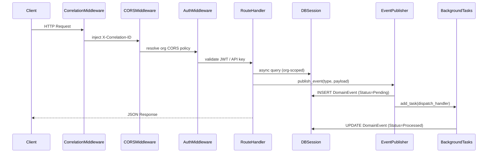

# Design Document: Platform Foundation

## Overview

The Platform Foundation module establishes the cross-cutting infrastructure for the TalentKru.ai FastAPI backend. It provides the shared scaffolding that every other module depends on: configuration management, multi-tenancy, domain event infrastructure, observability, API documentation conventions, CORS and versioning, and concurrency control.

All design decisions follow 12-factor principles, prioritize horizontal scalability at the organization level, and enforce strict data isolation between tenants. The system is deployed via Docker Compose with PostgreSQL (pgvector) as the sole data store.

### Key Design Principles

- **Tenant isolation by default**: Every query is scoped to an `OrganizationID` derived from the authenticated principal. Cross-org access is only permitted for the `SuperAdministrator` role on organization-management endpoints.
- **Soft delete only**: No hard deletes. All entities carry `DeletedAt`/`DeletedBy` audit fields; queries filter `WHERE deleted_at IS NULL` by default.
- **Async-first**: All database I/O uses SQLAlchemy async sessions. FastAPI route handlers are `async def`.
- **Event-driven resilience**: Domain events are persisted to the database before being dispatched, ensuring no event is lost even if `BackgroundTasks` is unavailable.
- **Observability as a first-class concern**: Structured JSON logging, Prometheus metrics, and distributed tracing are wired in at the middleware layer, not bolted on per-module.

---

## Architecture

### High-Level Structure

```
talentKru-server/
├── app/
│   ├── main.py                  # FastAPI app factory, middleware registration
│   ├── config.py                # Pydantic Settings, startup validation
│   ├── database.py              # SQLAlchemy async engine, session factory
│   ├── dependencies.py          # Shared FastAPI Depends (auth, org scope, db session)
│   ├── base_model.py            # Declarative base, AuditMixin, VersionMixin
│   ├── shard_router.py          # Thin shard routing placeholder
│   ├── domain_events/
│   │   ├── models.py            # DomainEvent ORM model
│   │   ├── publisher.py         # publish_event(), dispatch via BackgroundTasks
│   │   ├── handlers.py          # Handler registry and dispatcher
│   │   └── retry.py             # Scheduled retry for Failed events
│   ├── observability/
│   │   ├── logging.py           # Structlog JSON configuration
│   │   ├── metrics.py           # Prometheus metric definitions
│   │   ├── tracing.py           # OpenTelemetry tracer setup
│   │   └── middleware.py        # Correlation ID injection middleware
│   ├── middleware/
│   │   ├── cors.py              # Per-org dynamic CORS middleware
│   │   ├── versioning.py        # Sunset/Deprecation header injection
│   │   └── auth.py              # JWT validation, X-Agent-API-Key guard
│   └── modules/
│       ├── auth/
│       ├── rbac/
│       ├── users/
│       ├── organizations/
│       ├── candidates/
│       ├── resumes/
│       ├── requisitions/
│       ├── job_profile/
│       ├── job_posting/
│       ├── skills/
│       ├── matching/
│       ├── journeys/
│       ├── interviews/
│       ├── questionnaires/
│       ├── portal/
│       ├── agents/
│       ├── reporting/
│       └── observability/
├── alembic/
│   ├── env.py
│   └── versions/
├── tests/
├── .env
├── docker-compose.yml
└── pyproject.toml
```

### Request Lifecycle



### Middleware Stack (registration order)

1. `CorrelationIDMiddleware` — generates or forwards `X-Correlation-ID`; stores in `contextvars.ContextVar`
2. `StructuredLoggingMiddleware` — binds correlation ID to structlog context
3. `TracingMiddleware` — starts root OpenTelemetry span per request
4. `DynamicCORSMiddleware` — resolves per-org allowed origins
5. `MetricsMiddleware` — records request duration and status code
6. FastAPI built-in exception handlers
7. Route handlers with `Depends(get_current_principal)` and `Depends(get_db_session)`

---

## Components and Interfaces

### 1. Configuration Management (`app/config.py`)

Uses `pydantic-settings` (`BaseSettings`) to load all configuration from environment variables and `.env`. Startup validation is enforced by Pydantic's model validators — if any required field is missing or empty, the application raises a `ValidationError` before the ASGI server begins accepting connections.

```python
from pydantic_settings import BaseSettings, SettingsConfigDict
from pydantic import field_validator, model_validator
from typing import Literal

class Settings(BaseSettings):
    model_config = SettingsConfigDict(env_file=".env", env_file_encoding="utf-8")

    # Database
    DATABASE_HOST: str
    DATABASE_PORT: int = 5432
    DATABASE_NAME: str
    DATABASE_USER: str
    DATABASE_PASSWORD: str

    # Security
    JWT_SIGNING_KEY: str          # HMAC-SHA256 signing only
    ENCRYPTION_KEY: str           # Field-level PII encryption only

    # Storage
    STORAGE_BACKEND: Literal["local", "s3"]
    STORAGE_LOCAL_PATH: str = "/data/resumes"
    RESUME_BUCKET_NAME: str = ""

    # Agent security
    AGENT_API_KEY: str

    # Metrics auth
    METRICS_USERNAME: str
    METRICS_PASSWORD: str

    # Portal
    PORTAL_TOKEN_TTL_DAYS: int = 7

    # Reporting
    INTERVIEW_LEADERBOARD_DEFAULT_PERIOD_DAYS: int = 30

    # AI model identifiers (optional with defaults)
    AI_RESUME_MODEL: str = "gemini-1.5-pro"
    AI_MATCHING_MODEL: str = "gemini-1.5-pro"
    AI_FEEDBACK_MODEL: str = "gemini-1.5-pro"

    @field_validator("JWT_SIGNING_KEY", "ENCRYPTION_KEY", "AGENT_API_KEY",
                     "METRICS_USERNAME", "METRICS_PASSWORD", mode="before")
    @classmethod
    def must_not_be_empty(cls, v: str, info) -> str:
        if not v or not v.strip():
            raise ValueError(f"{info.field_name} must not be empty")
        return v

    @property
    def database_url(self) -> str:
        return (
            f"postgresql+asyncpg://{self.DATABASE_USER}:{self.DATABASE_PASSWORD}"
            f"@{self.DATABASE_HOST}:{self.DATABASE_PORT}/{self.DATABASE_NAME}"
        )

settings = Settings()
```

**Design rationale**: `JWT_SIGNING_KEY` and `ENCRYPTION_KEY` are intentionally separate secrets with distinct purposes. Mixing them would allow a compromised signing key to also decrypt PII, violating the principle of least privilege.

### 2. Database Layer (`app/database.py`)

```python
from sqlalchemy.ext.asyncio import create_async_engine, async_sessionmaker, AsyncSession
from app.config import settings

engine = create_async_engine(
    settings.database_url,
    pool_pre_ping=True,
    pool_size=10,
    max_overflow=20,
    echo=False,
)

AsyncSessionFactory = async_sessionmaker(
    engine, class_=AsyncSession, expire_on_commit=False
)

async def get_db_session() -> AsyncSession:
    """FastAPI dependency that yields an async database session."""
    async with AsyncSessionFactory() as session:
        try:
            yield session
            await session.commit()
        except Exception:
            await session.rollback()
            raise
```

### 3. Shard Router (`app/shard_router.py`)

A thin placeholder that always resolves to shard 0. The interface is defined now so future sharding logic can be dropped in without changing call sites.

```python
from uuid import UUID

def get_shard_id(organization_id: UUID) -> int:
    """
    Resolve the database shard for the given organization.
    Currently always returns 0 (single-shard deployment).
    Future: look up Organization.shard_id and return the appropriate
    connection pool / engine for that shard.
    """
    return 0

def get_engine_for_org(organization_id: UUID):
    """Return the SQLAlchemy engine for the shard that owns this org."""
    shard = get_shard_id(organization_id)
    # shard 0 is the only shard; extend this dict for horizontal scaling
    shard_engines = {0: engine}
    return shard_engines[shard]
```

### 4. Health Check Endpoint

```python
# app/main.py
@app.get("/health", tags=["platform"], operation_id="health_check",
         summary="Application health check",
         description="Returns application status and version. Status is 'healthy' when the app and database are operational.")
async def health_check(db: AsyncSession = Depends(get_db_session)) -> dict:
    try:
        await db.execute(text("SELECT 1"))
        db_ok = True
    except Exception:
        db_ok = False
    status = "healthy" if db_ok else "unhealthy"
    return {"status": status, "version": settings.APP_VERSION}
```

### 5. Domain Event Publisher (`app/domain_events/publisher.py`)

The publisher follows a **persist-first, dispatch-second** pattern. The event is written to the `domain_events` table inside the current request transaction before `BackgroundTasks.add_task` is called. If `BackgroundTasks` is unavailable or the dispatch fails, the event remains in `Pending` status and is eligible for the scheduled retry job.

```python
import uuid
from datetime import datetime, timezone
from fastapi import BackgroundTasks
from sqlalchemy.ext.asyncio import AsyncSession
from app.domain_events.models import DomainEvent, EventStatus
from app.domain_events.handlers import dispatch_event
from app.observability.logging import get_logger

logger = get_logger(__name__)

async def publish_event(
    event_type: str,
    payload: dict,
    db: AsyncSession,
    background_tasks: BackgroundTasks | None = None,
    correlation_id: str | None = None,
) -> DomainEvent:
    """
    Persist a domain event and schedule async dispatch.
    If background_tasks is None, the event is persisted as Pending for later retry.
    """
    event = DomainEvent(
        event_id=uuid.uuid4(),
        event_type=event_type,
        payload=payload,
        published_at=datetime.now(timezone.utc),
        status=EventStatus.PENDING,
        correlation_id=correlation_id,
    )
    db.add(event)
    await db.flush()  # persist within current transaction

    if background_tasks is not None:
        background_tasks.add_task(
            _dispatch_with_status_update, event.event_id, correlation_id
        )
    else:
        logger.warning(
            "background_tasks_unavailable",
            event_id=str(event.event_id),
            event_type=event_type,
        )
    return event

async def _dispatch_with_status_update(event_id: uuid.UUID, correlation_id: str | None):
    async with AsyncSessionFactory() as db:
        event = await db.get(DomainEvent, event_id)
        try:
            await dispatch_event(event, correlation_id)
            event.status = EventStatus.PROCESSED
            event.processed_at = datetime.now(timezone.utc)
        except Exception as exc:
            event.status = EventStatus.FAILED
            logger.error(
                "domain_event_handler_failed",
                event_id=str(event_id),
                correlation_id=correlation_id,
                error=str(exc),
            )
        finally:
            await db.commit()
```

### 6. Observability Components

#### 6.1 Correlation ID Middleware

```python
# app/observability/middleware.py
import uuid
from starlette.middleware.base import BaseHTTPMiddleware
from starlette.requests import Request
from contextvars import ContextVar

correlation_id_var: ContextVar[str] = ContextVar("correlation_id", default="")

class CorrelationIDMiddleware(BaseHTTPMiddleware):
    async def dispatch(self, request: Request, call_next):
        cid = request.headers.get("X-Correlation-ID") or str(uuid.uuid4())
        correlation_id_var.set(cid)
        response = await call_next(request)
        response.headers["X-Correlation-ID"] = cid
        return response
```

#### 6.2 Structured Logging

Uses `structlog` with JSON rendering. The correlation ID is bound to every log entry via a processor that reads from `correlation_id_var`.

```python
# app/observability/logging.py
import structlog
from app.observability.middleware import correlation_id_var

def add_correlation_id(logger, method, event_dict):
    event_dict["correlation_id"] = correlation_id_var.get("")
    return event_dict

structlog.configure(
    processors=[
        structlog.stdlib.add_log_level,
        structlog.stdlib.add_logger_name,
        structlog.processors.TimeStamper(fmt="iso"),
        add_correlation_id,
        structlog.processors.JSONRenderer(),
    ],
    wrapper_class=structlog.make_filtering_bound_logger(logging.INFO),
    context_class=dict,
    logger_factory=structlog.PrintLoggerFactory(),
)

def get_logger(name: str):
    return structlog.get_logger(name)
```

#### 6.3 Prometheus Metrics

```python
# app/observability/metrics.py
from prometheus_client import Counter, Histogram, Gauge

resumes_parsed_total = Counter(
    "talentkru_resumes_parsed_total",
    "Total number of resumes successfully parsed",
)
match_computation_duration_ms = Histogram(
    "talentkru_match_computation_duration_ms",
    "Match computation duration in milliseconds",
    buckets=[50, 100, 250, 500, 1000, 2500, 5000],
)
matches_per_requisition_total = Counter(
    "talentkru_matches_per_requisition_total",
    "Total match computations per requisition",
    labelnames=["requisition_id"],
)
questionnaire_completions_total = Counter(
    "talentkru_questionnaire_completions_total",
    "Total questionnaire submission events",
)
ai_agent_errors_total = Counter(
    "talentkru_ai_agent_errors_total",
    "Total AI agent errors by agent name",
    labelnames=["agent_name"],
)
interview_volume = Gauge(
    "talentkru_interview_volume",
    "Current interview volume by stage, type, and organization",
    labelnames=["stage", "interview_type", "organization_id"],
)
no_show_rate = Gauge(
    "talentkru_no_show_rate",
    "No-show rate per organization",
    labelnames=["organization_id"],
)
```

#### 6.4 Metrics Endpoint with HTTP Basic Auth

```python
# app/modules/observability/router.py
from fastapi import APIRouter, Depends, HTTPException, status
from fastapi.security import HTTPBasic, HTTPBasicCredentials
from prometheus_client import generate_latest, CONTENT_TYPE_LATEST
from fastapi.responses import Response
import secrets
from app.config import settings

router = APIRouter()
security = HTTPBasic()

def verify_metrics_credentials(credentials: HTTPBasicCredentials = Depends(security)):
    correct_user = secrets.compare_digest(credentials.username, settings.METRICS_USERNAME)
    correct_pass = secrets.compare_digest(credentials.password, settings.METRICS_PASSWORD)
    if not (correct_user and correct_pass):
        raise HTTPException(status_code=status.HTTP_401_UNAUTHORIZED,
                            headers={"WWW-Authenticate": "Basic"})

@router.get("/metrics", dependencies=[Depends(verify_metrics_credentials)],
            operation_id="get_prometheus_metrics",
            summary="Prometheus metrics scrape endpoint",
            description="Returns Prometheus-format metrics. Requires HTTP Basic Auth with METRICS_USERNAME/METRICS_PASSWORD credentials.")
async def get_metrics():
    return Response(generate_latest(), media_type=CONTENT_TYPE_LATEST)
```

### 7. Dynamic CORS Middleware (`app/middleware/cors.py`)

Standard `CORSMiddleware` does not support per-tenant origin lists. A custom Starlette middleware resolves the requesting organization from the request path or JWT, looks up its `allowed_origins`, and sets headers accordingly.

```python
from starlette.middleware.base import BaseHTTPMiddleware
from starlette.requests import Request
from app.observability.logging import get_logger

logger = get_logger(__name__)

class DynamicCORSMiddleware(BaseHTTPMiddleware):
    async def dispatch(self, request: Request, call_next):
        origin = request.headers.get("origin", "")
        response = await call_next(request)

        if not origin:
            return response

        org_id = _extract_org_id(request)
        allowed = await _get_allowed_origins(org_id) if org_id else []

        if origin in allowed:
            response.headers["Access-Control-Allow-Origin"] = origin
            response.headers["Access-Control-Allow-Credentials"] = "true"
            response.headers["Access-Control-Allow-Methods"] = "GET,POST,PUT,PATCH,DELETE,OPTIONS"
            response.headers["Access-Control-Allow-Headers"] = (
                "Authorization,Content-Type,X-Correlation-ID,X-Agent-API-Key"
            )
        else:
            logger.warning(
                "cors_unauthorized_origin",
                origin=origin,
                organization_id=str(org_id) if org_id else "unknown",
            )
            # No CORS headers — browser will block the request
        return response
```

**Design note**: The `_get_allowed_origins` function queries the `organizations` table. To avoid a DB hit on every preflight, allowed origins are cached in an in-process LRU cache with a 60-second TTL, invalidated on organization update events.

### 8. API Versioning and Deprecation (`app/middleware/versioning.py`)

All routers are mounted under the `/api/v1/` prefix in `main.py`:

```python
app.include_router(organizations_router, prefix="/api/v1")
app.include_router(candidates_router, prefix="/api/v1")
# ... all other module routers
```

Deprecated endpoints are decorated with a helper that injects `Sunset`, `Deprecation`, and `Link` headers:

```python
from functools import wraps
from fastapi import Response

def deprecated(sunset_date: str, replacement_link: str):
    """Decorator that adds deprecation headers to a route response."""
    def decorator(func):
        @wraps(func)
        async def wrapper(*args, response: Response, **kwargs):
            response.headers["Sunset"] = sunset_date          # ISO 8601
            response.headers["Deprecation"] = "true"
            response.headers["Link"] = f'<{replacement_link}>; rel="successor-version"'
            return await func(*args, response=response, **kwargs)
        return wrapper
    return decorator
```

### 9. Agent API Key Guard (`app/middleware/auth.py`)

```python
from fastapi import Request, HTTPException, status
from app.config import settings

async def require_agent_api_key(request: Request):
    """FastAPI dependency for /internal/agents/* endpoints."""
    key = request.headers.get("X-Agent-API-Key", "")
    if not settings.AGENT_API_KEY or key != settings.AGENT_API_KEY:
        raise HTTPException(
            status_code=status.HTTP_401_UNAUTHORIZED,
            detail="Invalid or missing X-Agent-API-Key",
        )
```

All routers under `/internal/agents/` include `dependencies=[Depends(require_agent_api_key)]`.

---

## Data Models

### Base Mixins (`app/base_model.py`)

```python
from sqlalchemy import Column, DateTime, String, Integer, func
from sqlalchemy.dialects.postgresql import UUID
from sqlalchemy.orm import DeclarativeBase, declared_attr
from contextvars import ContextVar
import uuid

current_user_id_var: ContextVar[str | None] = ContextVar("current_user_id", default=None)

class Base(DeclarativeBase):
    pass

class AuditMixin:
    """Provides CreatedAt, UpdatedAt, DeletedAt, CreatedBy, UpdatedBy, DeletedBy."""

    created_at = Column(DateTime(timezone=True), server_default=func.now(), nullable=False)
    updated_at = Column(DateTime(timezone=True), server_default=func.now(),
                        onupdate=func.now(), nullable=False)
    deleted_at = Column(DateTime(timezone=True), nullable=True)

    created_by = Column(UUID(as_uuid=True), nullable=True)
    updated_by = Column(UUID(as_uuid=True), nullable=True)
    deleted_by = Column(UUID(as_uuid=True), nullable=True)

class VersionMixin:
    """Provides optimistic locking via SQLAlchemy version_id_col."""
    version = Column(Integer, nullable=False, default=1)

    @declared_attr
    def __mapper_args__(cls):
        return {"version_id_col": cls.__table__.c.version}
```

**Audit field population**: A SQLAlchemy `SessionEvents.before_flush` listener reads `current_user_id_var` and sets `created_by`/`updated_by`/`deleted_by` on new, dirty, and soft-deleted instances respectively. This keeps audit logic centralized and out of individual service methods.

### Organization Model

```python
class Organization(Base, AuditMixin, VersionMixin):
    __tablename__ = "organizations"

    organization_id = Column(UUID(as_uuid=True), primary_key=True, default=uuid.uuid4)
    name = Column(String(128), nullable=False)
    slug = Column(String(64), nullable=False, unique=True, index=True)
    logo_url = Column(String(512), nullable=True)
    primary_color = Column(String(7), nullable=True)    # hex color
    secondary_color = Column(String(7), nullable=True)
    terms_url = Column(String(512), nullable=True)
    contact_name = Column(String(128), nullable=True)
    contact_email = Column(String(254), nullable=True)  # RFC 5321 max length
    contact_phone = Column(String(32), nullable=True)
    feature_flags = Column(JSONB, nullable=False, server_default="{}")
    shard_id = Column(Integer, nullable=False, default=0)
    allowed_origins = Column(ARRAY(String(253)), nullable=False, server_default="{}")
```

**Slug uniqueness**: Enforced at the database level with a `UNIQUE` constraint and at the application level with a pre-write check that returns a descriptive error (not a raw DB constraint violation).

### DomainEvent Model

```python
import enum

class EventStatus(str, enum.Enum):
    PENDING = "Pending"
    PROCESSED = "Processed"
    FAILED = "Failed"

class DomainEvent(Base):
    __tablename__ = "domain_events"

    event_id = Column(UUID(as_uuid=True), primary_key=True, default=uuid.uuid4)
    event_type = Column(String(128), nullable=False, index=True)
    payload = Column(JSONB, nullable=False)
    published_at = Column(DateTime(timezone=True), nullable=False)
    processed_at = Column(DateTime(timezone=True), nullable=True)
    status = Column(SQLEnum(EventStatus), nullable=False, default=EventStatus.PENDING, index=True)
    correlation_id = Column(String(64), nullable=True)
```

### Mutable Entities with Optimistic Locking

The following entities inherit both `AuditMixin` and `VersionMixin`:

| Entity | Table |
|---|---|
| `Candidate` | `candidates` |
| `User` | `users` |
| `InterviewJourney` | `interview_journeys` |
| `InterviewSlot` | `interview_slots` |
| `JobRequisition` | `job_requisitions` |
| `JobPosting` | `job_postings` |
| `JobProfile` | `job_profiles` |
| `Questionnaire` | `questionnaires` |
| `CandidateQuestionnaireResponse` | `candidate_questionnaire_responses` |
| `InterviewFeedback` | `interview_feedback` |
| `InterviewerPreference` | `interviewer_preferences` |
| `Organization` | `organizations` |
| `OrganizationEmailConfig` | `organization_email_configs` |
| `NotificationTemplate` | `notification_templates` |

All other entities (read-heavy or append-only, e.g., `DomainEvent`, `InterviewJourneyStageHistory`) do not carry a `version` column.

### Database Schema (PostgreSQL DDL summary)

```sql
-- pgvector extension (required before first migration)
CREATE EXTENSION IF NOT EXISTS vector;
CREATE EXTENSION IF NOT EXISTS "uuid-ossp";

-- organizations
CREATE TABLE organizations (
    organization_id UUID PRIMARY KEY DEFAULT uuid_generate_v4(),
    name            VARCHAR(128) NOT NULL,
    slug            VARCHAR(64)  NOT NULL UNIQUE,
    logo_url        VARCHAR(512),
    primary_color   VARCHAR(7),
    secondary_color VARCHAR(7),
    terms_url       VARCHAR(512),
    contact_name    VARCHAR(128),
    contact_email   VARCHAR(254),
    contact_phone   VARCHAR(32),
    feature_flags   JSONB        NOT NULL DEFAULT '{}',
    shard_id        INTEGER      NOT NULL DEFAULT 0,
    allowed_origins VARCHAR(253)[] NOT NULL DEFAULT '{}',
    version         INTEGER      NOT NULL DEFAULT 1,
    created_at      TIMESTAMPTZ  NOT NULL DEFAULT NOW(),
    updated_at      TIMESTAMPTZ  NOT NULL DEFAULT NOW(),
    deleted_at      TIMESTAMPTZ,
    created_by      UUID,
    updated_by      UUID,
    deleted_by      UUID
);

-- domain_events
CREATE TABLE domain_events (
    event_id       UUID PRIMARY KEY DEFAULT uuid_generate_v4(),
    event_type     VARCHAR(128) NOT NULL,
    payload        JSONB        NOT NULL,
    published_at   TIMESTAMPTZ  NOT NULL,
    processed_at   TIMESTAMPTZ,
    status         VARCHAR(16)  NOT NULL DEFAULT 'Pending',
    correlation_id VARCHAR(64)
);
CREATE INDEX idx_domain_events_status ON domain_events(status);
CREATE INDEX idx_domain_events_event_type ON domain_events(event_type);
```

### Alembic Configuration

`alembic/env.py` imports `Base.metadata` from `app/base_model.py` and all module models (via `app/modules/*/models.py`) to ensure all tables are tracked. The async engine is configured using `run_async_migrations()` with `asyncio.run()`.

```python
# alembic/env.py (key excerpt)
from app.base_model import Base
import app.modules.organizations.models  # noqa: F401 — registers ORM models
import app.modules.candidates.models     # noqa: F401
# ... all other modules

target_metadata = Base.metadata
```

Migrations are run at container startup via an entrypoint script:

```bash
#!/bin/sh
alembic upgrade head
exec uvicorn app.main:app --host 0.0.0.0 --port 8000
```

### Multi-Tenancy Query Scoping

Every service method that queries tenant-owned data accepts an `organization_id: UUID` parameter derived from the authenticated principal. A shared helper applies the filter:

```python
# app/dependencies.py
from uuid import UUID
from fastapi import Depends, HTTPException, status
from sqlalchemy import select
from sqlalchemy.ext.asyncio import AsyncSession

async def get_org_scoped_query(model_class, organization_id: UUID, db: AsyncSession):
    """
    Returns a SELECT statement pre-filtered by organization_id and soft-delete.
    SuperAdministrators bypass this filter for org-management endpoints only.
    """
    stmt = (
        select(model_class)
        .where(model_class.organization_id == organization_id)
        .where(model_class.deleted_at.is_(None))
    )
    return stmt
```

Cross-org access is blocked at the dependency layer. The `get_current_principal` dependency extracts `organization_id` from the JWT. If a route parameter references a resource belonging to a different org, the service layer raises `HTTPException(403)` before any data is returned.

**SuperAdministrator bypass**: Organization CRUD endpoints use a separate dependency `require_super_admin()` that does not apply the org-scope filter, allowing cross-tenant management.

---

## Correctness Properties

*A property is a characteristic or behavior that should hold true across all valid executions of a system — essentially, a formal statement about what the system should do. Properties serve as the bridge between human-readable specifications and machine-verifiable correctness guarantees.*

### Property 1: Startup fails on any missing required variable

*For any* subset of the required environment variables (JWT_SIGNING_KEY, ENCRYPTION_KEY, STORAGE_BACKEND, DATABASE_HOST, DATABASE_PORT, DATABASE_NAME, DATABASE_USER, DATABASE_PASSWORD, AGENT_API_KEY, METRICS_USERNAME, METRICS_PASSWORD), removing or emptying any single variable from that set should cause the Settings model to raise a validation error that identifies the missing variable by name.

**Validates: Requirements 1.2**

### Property 2: Audit fields invariant on create

*For any* entity that inherits `AuditMixin`, after a successful creation with an authenticated user, `created_at` must be a UTC timestamp, `created_by` must equal the authenticated user's ID, `updated_at` must equal `created_at`, and `deleted_at` must be null.

**Validates: Requirements 1.8**

### Property 3: Audit fields invariant on update

*For any* entity that inherits `AuditMixin`, after a successful update with an authenticated user, `updated_at` must be greater than or equal to `created_at`, `updated_by` must equal the current user's ID, and `created_at` and `created_by` must be unchanged from their values at creation time.

**Validates: Requirements 1.9**

### Property 4: Soft-delete preserves prior audit fields

*For any* entity that inherits `AuditMixin`, after a soft-delete operation, `deleted_at` must be set to a UTC timestamp, `deleted_by` must equal the current user's ID, and `created_at`, `created_by`, `updated_at`, `updated_by` must all be unchanged from their pre-delete values.

**Validates: Requirements 1.10**

### Property 5: Organization data isolation

*For any* two organizations A and B with data records, a query executed with `organization_id = A` must never return records whose `organization_id = B`, and vice versa.

**Validates: Requirements 2.4, 2.5**

### Property 6: Duplicate slug rejection

*For any* slug value already assigned to an existing organization, an attempt to create or update a different organization with that same slug must be rejected with an error response indicating the slug is already in use.

**Validates: Requirements 2.7**

### Property 7: Domain event persistence regardless of BackgroundTasks availability

*For any* domain event published via `publish_event()`, the event must be persisted to the `domain_events` table with `status = Pending` before the function returns, regardless of whether a `BackgroundTasks` instance is provided.

**Validates: Requirements 3.1, 3.3**

### Property 8: Successful handler transitions event to Processed

*For any* domain event in `Pending` status whose registered handler completes without raising an exception, the event's `status` must be updated to `Processed` and `processed_at` must be set to a UTC timestamp.

**Validates: Requirements 3.4**

### Property 9: Failed handler transitions event to Failed

*For any* domain event in `Pending` status whose registered handler raises any exception, the event's `status` must be updated to `Failed` and the failure must be logged with the `event_id` and `correlation_id`.

**Validates: Requirements 3.5**

### Property 10: Structured log entries contain required fields

*For any* log entry emitted by the observability layer for a tracked workflow (authentication, candidate operations, resume operations, matching, interview scheduling, questionnaire submissions, AI agent calls, portal access), the JSON log record must contain `correlation_id`, `timestamp`, `level`, `logger`, and `event` fields.

**Validates: Requirements 4.1**

### Property 11: Metrics endpoint rejects unauthenticated requests

*For any* HTTP request to `GET /metrics` that does not include a valid HTTP Basic Auth header matching `METRICS_USERNAME` and `METRICS_PASSWORD`, the response must be `401 Unauthorized`.

**Validates: Requirements 4.3**

### Property 12: Correlation ID propagation through background tasks

*For any* HTTP request carrying an `X-Correlation-ID` header, all log entries and trace spans produced by background tasks enqueued during that request must include the same correlation ID value.

**Validates: Requirements 4.4, 4.6**

### Property 13: AI agent failure log completeness

*For any* AI agent invocation that raises an exception, the resulting ERROR log entry must contain `correlation_id`, `agent_name`, `input_payload_size`, `error_type`, and `error_description` fields.

**Validates: Requirements 4.5**

### Property 14: Every registered route has required OpenAPI metadata

*For any* route registered in the FastAPI application, its OpenAPI operation object must contain an `operationId` (snake_case), a `summary` of at most 80 characters, and a `description` of at least 20 characters.

**Validates: Requirements 5.1**

### Property 15: Every Pydantic request/response field has a description

*For any* Pydantic model used as a request body or response schema, every field must have a `description` of at least 10 characters in its `Field()` definition.

**Validates: Requirements 5.2**

### Property 16: Internal agent endpoints reject requests without API key

*For any* HTTP request to a path under `/internal/agents/` that does not include a valid `X-Agent-API-Key` header matching the configured `AGENT_API_KEY`, the response must be `401 Unauthorized`.

**Validates: Requirements 5.4**

### Property 17: CORS headers present only for allowed origins

*For any* CORS request from an origin that is in the requesting organization's `allowed_origins` list, the response must include `Access-Control-Allow-Origin` set to that origin. *For any* CORS request from an origin not in the list, the response must not include `Access-Control-Allow-Origin`.

**Validates: Requirements 6.2, 6.3**

### Property 18: All API routes are prefixed with /api/v1/

*For any* route registered under a module router (excluding `/health`, `/metrics`, `/docs`, `/openapi.json`, `/internal/*`), its full path must begin with `/api/v1/`.

**Validates: Requirements 6.4**

### Property 19: All mutable entities have version_id_col configured

*For any* SQLAlchemy mapper for a mutable entity class (Candidate, User, InterviewJourney, InterviewSlot, JobRequisition, JobPosting, JobProfile, Questionnaire, CandidateQuestionnaireResponse, InterviewFeedback, InterviewerPreference, Organization, OrganizationEmailConfig, NotificationTemplate), the mapper must have `version_id_col` set to the entity's `version` column.

**Validates: Requirements 7.1, 7.5**

### Property 20: Optimistic lock increment on matching version

*For any* mutable entity at version N, submitting an update request with version N must result in the entity being persisted at version N+1.

**Validates: Requirements 7.3**

### Property 21: Optimistic lock conflict on mismatched version

*For any* mutable entity at version N, submitting an update request with any version value other than N must result in a `409 Conflict` response containing the current version value, and the entity must remain at version N in the database.

**Validates: Requirements 7.4**

---

## Error Handling

### HTTP Error Conventions

| Condition | Status Code | Response Body |
|---|---|---|
| Missing/invalid JWT | 401 | `{"detail": "Not authenticated"}` |
| Missing/invalid X-Agent-API-Key | 401 | `{"detail": "Invalid or missing X-Agent-API-Key"}` |
| Metrics Basic Auth failure | 401 | `{"detail": "Unauthorized"}` |
| Cross-org access attempt | 403 | `{"detail": "Access to this resource is forbidden"}` |
| Resource not found | 404 | `{"detail": "Resource not found"}` |
| Duplicate slug | 409 | `{"detail": "slug already in use", "field": "slug"}` |
| Optimistic lock conflict | 409 | `{"detail": "Resource modified by another request", "current_version": N, "hint": "Re-fetch and retry"}` |
| Pydantic validation error | 422 | FastAPI default validation error format |
| Unhandled server error | 500 | `{"detail": "Internal server error", "correlation_id": "..."}` |

### Global Exception Handler

A FastAPI exception handler catches unhandled exceptions, logs them at ERROR level with the correlation ID, and returns a sanitized 500 response. Stack traces are never exposed in API responses.

```python
@app.exception_handler(Exception)
async def global_exception_handler(request: Request, exc: Exception):
    cid = correlation_id_var.get("")
    logger.error("unhandled_exception", correlation_id=cid, error=str(exc), exc_info=True)
    return JSONResponse(
        status_code=500,
        content={"detail": "Internal server error", "correlation_id": cid},
    )
```

### Optimistic Lock Conflict Handling

SQLAlchemy raises `StaleDataError` when `version_id_col` detects a mismatch. A dedicated exception handler catches this and returns the structured 409 response:

```python
from sqlalchemy.orm.exc import StaleDataError

@app.exception_handler(StaleDataError)
async def stale_data_handler(request: Request, exc: StaleDataError):
    return JSONResponse(
        status_code=409,
        content={
            "detail": "Resource has been modified by another request",
            "hint": "Re-fetch the resource and retry your update",
        },
    )
```

### Domain Event Failure Isolation

The `_dispatch_with_status_update` background task wraps handler execution in a `try/except` with a `finally` block that always commits the status update. This ensures that even if the error logging step itself fails, the `Failed` status is persisted.

---

## Testing Strategy

### Dual Testing Approach

The testing strategy combines **unit/example-based tests** for specific behaviors and **property-based tests** for universal invariants. Both are necessary: unit tests catch concrete bugs in known scenarios; property tests verify correctness across the full input space.

### Property-Based Testing

**Library**: `hypothesis` (Python)  
**Minimum iterations**: 100 per property test (Hypothesis default `max_examples=100`)  
**Tag format**: `# Feature: platform-foundation, Property N: <property_text>`

Each correctness property defined above maps to a single Hypothesis test. Key strategies:

- `st.uuids()` for UUID fields
- `st.text(min_size=1, max_size=128)` for name/slug fields
- `st.fixed_dictionaries(...)` for structured payloads
- `st.sampled_from(EventStatus)` for enum fields
- Custom `st.composite` strategies for entity graphs (org + user + entity)

Example property test structure:

```python
from hypothesis import given, settings
import hypothesis.strategies as st

# Feature: platform-foundation, Property 7: Domain event persistence regardless of BackgroundTasks availability
@given(
    event_type=st.sampled_from(["journey_stage_changed", "candidate_created", "offer_accepted"]),
    payload=st.fixed_dictionaries({"id": st.uuids().map(str), "data": st.text(min_size=1)}),
)
@settings(max_examples=100)
async def test_event_persisted_without_background_tasks(event_type, payload, db_session):
    event = await publish_event(event_type, payload, db=db_session, background_tasks=None)
    await db_session.refresh(event)
    assert event.status == EventStatus.PENDING
    assert event.event_id is not None
```

### Unit and Integration Tests

- **Configuration**: Parametrized tests removing each required env var and asserting `ValidationError`
- **Health check**: Single test verifying `/health` response structure
- **CORS**: Example tests for allowed and blocked origins; property test for the universal rule
- **Metrics auth**: Property test for any invalid credential combination
- **Optimistic locking**: Property tests for version increment and conflict; integration test against real DB
- **Audit fields**: Property tests using Hypothesis entity generators
- **Org isolation**: Property test generating two orgs with overlapping data and verifying no cross-contamination

### Test Infrastructure

- **Database**: `pytest-asyncio` with a test PostgreSQL instance (Docker Compose `test` profile)
- **Fixtures**: `AsyncSession` scoped per test, rolled back after each test
- **Mocking**: `unittest.mock.AsyncMock` for `BackgroundTasks` in event publisher tests
- **Coverage target**: 90% line coverage on `app/` excluding migration files

### Smoke Tests

Run once at deployment time (not in CI property test suite):

- pgvector extension available
- Alembic migrations complete without error
- All required event type constants defined
- SQLAlchemy `version_id_col` configured on all mutable mappers
- `/health` returns `{"status": "healthy"}` against the live database
