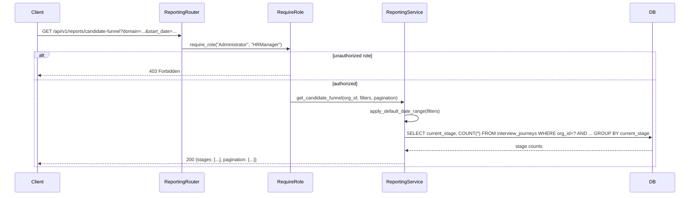
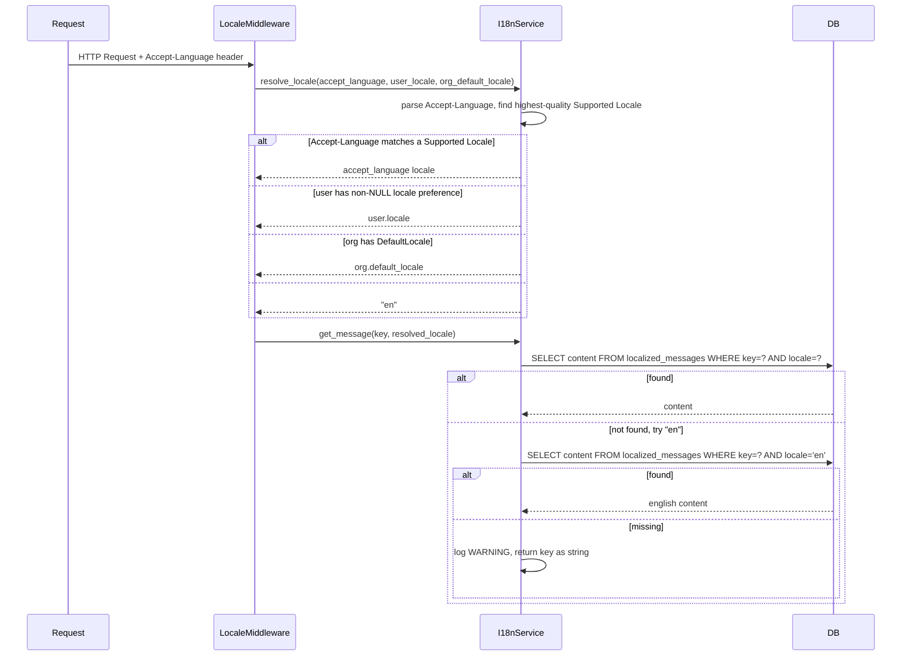
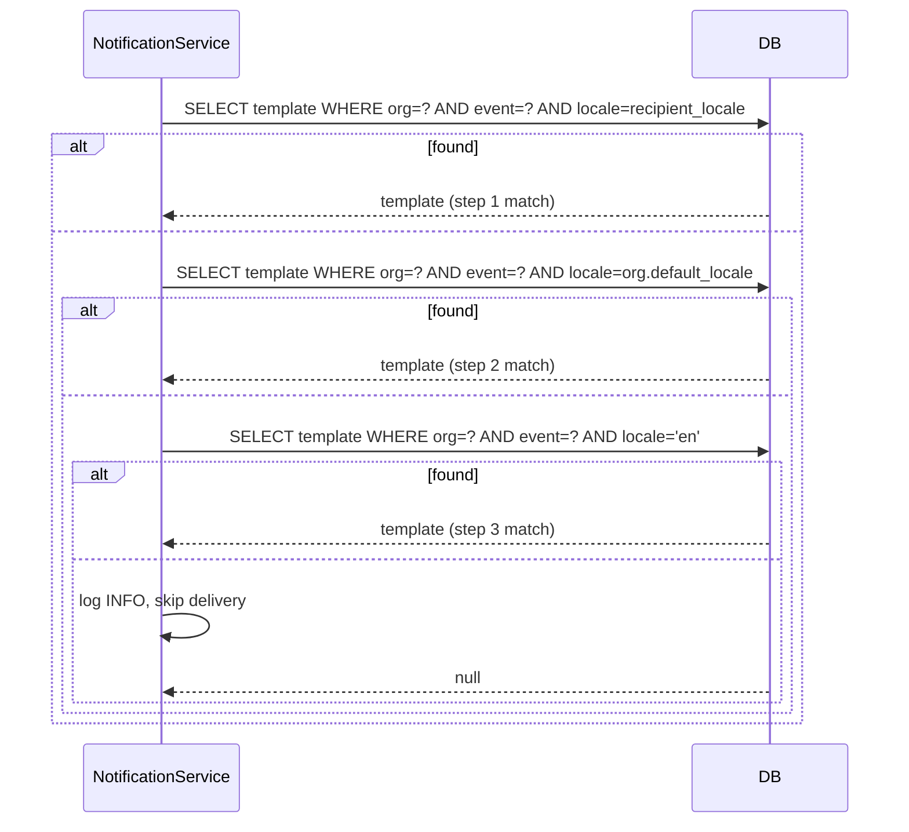

# Design Document: Reporting and Internationalization

## Overview

The Reporting and Internationalization (i18n) module adds analytics dashboards and multi-language support to the TalentKru.ai FastAPI backend. It exposes five reporting endpoints for pipeline health and interviewer performance, introduces a locale-aware message catalog, extends the notification template system with a three-step locale fallback, adds per-locale job posting content, and coordinates the Alembic migrations that touch the `organizations` and `users` tables owned by earlier modules.

All design decisions follow the conventions established in the Platform Foundation, Identity and Access, Candidate Lifecycle, and Interview Workflow modules:
- Async-first SQLAlchemy sessions via `get_db_session()`
- Soft delete only; queries filter `WHERE deleted_at IS NULL`
- Structured JSON logging via structlog with correlation ID
- FastAPI dependency injection with `require_role()` from `app/modules/auth/dependencies.py`
- All routes under `/api/v1/` prefix with full OpenAPI metadata
- `Field(description="...")` ≥ 10 chars on every Pydantic field
- Multi-tenancy: every query scoped to `OrganizationID` from the authenticated principal

### Key Architectural Decisions

- **Pure SQL aggregation for reports**: All five reporting endpoints execute a single aggregation query per request using SQLAlchemy Core expressions. No in-memory grouping. This keeps memory usage constant regardless of data volume.
- **Locale resolution as a pure function**: `resolve_locale()` is a stateless function that accepts the Accept-Language header, user locale, and org default locale and returns a single BCP 47 tag. It is easily unit-tested and property-tested without database access.
- **Three-step notification template fallback**: The existing `NotificationService._resolve_template` two-step fallback is replaced with a three-step chain: recipient locale → org default locale → "en". The updated method is backward-compatible; existing templates with `locale=NULL` are migrated to `locale='en'` in the seed migration.
- **`babel` for locale-aware formatting**: Date, time, and currency formatting in notification templates uses `babel.dates.format_datetime` and `babel.numbers.format_currency`. ISO 8601 is always used in JSON API responses.
- **`zoneinfo` for timezone conversion**: InterviewSlot UTC timestamps are converted to display timezone using `zoneinfo.ZoneInfo(slot.timezone)` before formatting.
- **Seed migration is idempotent**: The English `LocalizedMessage` seed uses `INSERT ... ON CONFLICT DO NOTHING` so it can be re-run safely.

---

## Architecture

### Module Structure

```
app/modules/
├── reporting/
│   ├── router.py          # GET /reports/candidate-funnel, /requisition-summary,
│   │                      #     /questionnaire-completion, /interviewer-stats, /interviewer-leaderboard
│   ├── service.py         # ReportingService: aggregation queries, date-range defaults
│   └── schemas.py         # CandidateFunnelResponse, RequisitionSummaryResponse,
│                          #   QuestionnaireCompletionResponse, InterviewerStatsResponse,
│                          #   InterviewerLeaderboardResponse, PaginationParams
└── i18n/
    ├── router.py          # GET/POST/PATCH/DELETE /localized-messages
    │                      # POST/GET/DELETE /job-postings/{id}/locale-content
    ├── service.py         # I18nService: locale resolution, message lookup, template rendering
    ├── schemas.py         # LocalizedMessageCreate, LocalizedMessageUpdate, LocalizedMessageResponse,
    │                      #   JobPostingLocaleContentCreate, JobPostingLocaleContentResponse
    └── models.py          # LocalizedMessage, JobPostingLocaleContent
```

Cross-module changes (no new files, only modifications):
- `app/modules/notifications/service.py` — `_resolve_template` updated to three-step fallback
- `app/modules/organizations/models.py` — `default_locale` column added
- `app/modules/users/models.py` — `locale` column changed to nullable
- `alembic/versions/` — three new migration files (schema, tables, seed)

### Reporting Request Flow



### Locale Resolution Flow



### Notification Template Three-Step Fallback



---

## Components and Interfaces

### 1. Reporting Service (`app/modules/reporting/service.py`)

The `ReportingService` executes aggregation queries against existing tables. All methods accept an `org_id` parameter derived from the authenticated principal and apply a default 90-day date range when no explicit range is provided.

```python
from datetime import date, timedelta, timezone, datetime
from uuid import UUID
from sqlalchemy.ext.asyncio import AsyncSession
from sqlalchemy import select, func, case, and_, or_
from app.modules.journeys.models import InterviewJourney, JourneyStage
from app.modules.requisitions.models import JobRequisition, RequisitionStatus
from app.modules.questionnaires.models import CandidateQuestionnaireResponse, ResponseStatus
from app.modules.slots.models import InterviewSlot, SlotStatus, AttendanceStatus, SlotType
from app.modules.skills.models import RequisitionRequiredSkill, Skill, Domain
from app.observability.logging import get_logger

logger = get_logger(__name__)

DEFAULT_DATE_RANGE_DAYS = 90
MAX_LEADERBOARD_N = 100
DEFAULT_LEADERBOARD_N = 10


def _apply_default_date_range(
    start_date: date | None, end_date: date | None
) -> tuple[date, date]:
    """Return (start_date, end_date), defaulting to the last 90 days if not provided."""
    today = datetime.now(timezone.utc).date()
    if start_date is None:
        start_date = today - timedelta(days=DEFAULT_DATE_RANGE_DAYS)
    if end_date is None:
        end_date = today
    return start_date, end_date


class ReportingService:
    def __init__(self, db: AsyncSession):
        self.db = db

    async def get_candidate_funnel(
        self,
        org_id: UUID,
        domain_id: UUID | None = None,
        skill_id: UUID | None = None,
        requisition_id: UUID | None = None,
        start_date: date | None = None,
        end_date: date | None = None,
        offset: int = 0,
        limit: int = 20,
    ) -> dict:
        start_date, end_date = _apply_default_date_range(start_date, end_date)
        stmt = (
            select(InterviewJourney.current_stage, func.count().label("count"))
            .where(
                InterviewJourney.organization_id == org_id,
                InterviewJourney.deleted_at.is_(None),
                InterviewJourney.start_date >= start_date,
                InterviewJourney.start_date <= end_date,
            )
        )
        if requisition_id:
            stmt = stmt.where(InterviewJourney.job_requisition_id == requisition_id)
        if skill_id:
            stmt = stmt.join(
                RequisitionRequiredSkill,
                RequisitionRequiredSkill.job_requisition_id == InterviewJourney.job_requisition_id,
            ).where(RequisitionRequiredSkill.skill_id == skill_id)
        if domain_id:
            stmt = stmt.join(
                RequisitionRequiredSkill,
                RequisitionRequiredSkill.job_requisition_id == InterviewJourney.job_requisition_id,
            ).join(Skill, Skill.skill_id == RequisitionRequiredSkill.skill_id).where(
                Skill.domain_id == domain_id
            )
        stmt = stmt.group_by(InterviewJourney.current_stage)
        result = await self.db.execute(stmt)
        rows = result.all()
        stage_counts = {stage.value: 0 for stage in JourneyStage}
        for row in rows:
            stage_counts[row.current_stage.value] = row.count
        return {
            "stages": [{"stage": k, "count": v} for k, v in stage_counts.items()],
            "filters": {
                "start_date": start_date.isoformat(),
                "end_date": end_date.isoformat(),
            },
        }
```

```python
    async def get_requisition_summary(
        self,
        org_id: UUID,
        department: str | None = None,
        hiring_manager_id: UUID | None = None,
        start_date: date | None = None,
        end_date: date | None = None,
        offset: int = 0,
        limit: int = 20,
    ) -> dict:
        start_date, end_date = _apply_default_date_range(start_date, end_date)
        stmt = (
            select(JobRequisition.status, func.count().label("count"))
            .where(
                JobRequisition.organization_id == org_id,
                JobRequisition.deleted_at.is_(None),
                JobRequisition.created_at >= datetime.combine(start_date, datetime.min.time()).replace(tzinfo=timezone.utc),
                JobRequisition.created_at <= datetime.combine(end_date, datetime.max.time()).replace(tzinfo=timezone.utc),
            )
        )
        if department:
            stmt = stmt.where(JobRequisition.department == department)
        if hiring_manager_id:
            stmt = stmt.where(JobRequisition.hiring_manager_user_id == hiring_manager_id)
        stmt = stmt.group_by(JobRequisition.status)
        result = await self.db.execute(stmt)
        rows = result.all()
        status_counts = {s.value: 0 for s in RequisitionStatus}
        for row in rows:
            status_counts[row.status.value] = row.count
        return {
            "statuses": [{"status": k, "count": v} for k, v in status_counts.items()],
            "filters": {"start_date": start_date.isoformat(), "end_date": end_date.isoformat()},
        }

    async def get_questionnaire_completion(
        self,
        org_id: UUID,
        requisition_id: UUID | None = None,
        start_date: date | None = None,
        end_date: date | None = None,
        offset: int = 0,
        limit: int = 20,
    ) -> dict:
        start_date, end_date = _apply_default_date_range(start_date, end_date)
        stmt = (
            select(
                CandidateQuestionnaireResponse.questionnaire_id,
                func.count().label("total"),
                func.sum(
                    case((CandidateQuestionnaireResponse.status == ResponseStatus.SUBMITTED, 1), else_=0)
                ).label("submitted"),
            )
            .where(
                CandidateQuestionnaireResponse.organization_id == org_id,
                CandidateQuestionnaireResponse.deleted_at.is_(None),
                or_(
                    CandidateQuestionnaireResponse.status != ResponseStatus.SUBMITTED,
                    and_(
                        CandidateQuestionnaireResponse.status == ResponseStatus.SUBMITTED,
                        CandidateQuestionnaireResponse.updated_at >= datetime.combine(start_date, datetime.min.time()).replace(tzinfo=timezone.utc),
                        CandidateQuestionnaireResponse.updated_at <= datetime.combine(end_date, datetime.max.time()).replace(tzinfo=timezone.utc),
                    ),
                ),
            )
            .group_by(CandidateQuestionnaireResponse.questionnaire_id)
            .offset(offset)
            .limit(limit)
        )
        if requisition_id:
            from app.modules.questionnaires.models import JobRequisitionQuestionnaire
            stmt = stmt.join(
                JobRequisitionQuestionnaire,
                JobRequisitionQuestionnaire.questionnaire_id == CandidateQuestionnaireResponse.questionnaire_id,
            ).where(JobRequisitionQuestionnaire.job_requisition_id == requisition_id)
        result = await self.db.execute(stmt)
        rows = result.all()
        return {
            "questionnaires": [
                {
                    "questionnaire_id": str(row.questionnaire_id),
                    "total": row.total,
                    "submitted": row.submitted,
                    "completion_rate": round(row.submitted / row.total, 4) if row.total > 0 else 0.0,
                }
                for row in rows
            ],
            "filters": {"start_date": start_date.isoformat(), "end_date": end_date.isoformat()},
        }
```

```python
    async def get_interviewer_stats(
        self,
        org_id: UUID,
        interviewer_id: UUID | None = None,
        start_date: date | None = None,
        end_date: date | None = None,
        offset: int = 0,
        limit: int = 20,
    ) -> dict:
        start_date, end_date = _apply_default_date_range(start_date, end_date)
        stmt = (
            select(
                InterviewSlot.interviewer_user_id,
                func.count().filter(
                    or_(
                        InterviewSlot.status == SlotStatus.COMPLETE,
                        InterviewSlot.attendance_status == AttendanceStatus.ATTENDED,
                    )
                ).label("total_interviews"),
                func.count().filter(
                    InterviewSlot.attendance_status == AttendanceStatus.NO_SHOW
                ).label("no_show_count"),
                func.count().filter(
                    or_(
                        InterviewSlot.attendance_status == AttendanceStatus.ATTENDED,
                        InterviewSlot.attendance_status == AttendanceStatus.NO_SHOW,
                    )
                ).label("attendance_denominator"),
                func.count().filter(InterviewSlot.slot_type == SlotType.MANAGER).label("manager_count"),
                func.count().filter(InterviewSlot.slot_type == SlotType.TECHNICAL).label("technical_count"),
                func.count().filter(InterviewSlot.slot_type == SlotType.BEHAVIORAL).label("behavioral_count"),
                func.count().filter(InterviewSlot.slot_type == SlotType.PANEL).label("panel_count"),
            )
            .where(
                InterviewSlot.organization_id == org_id,
                InterviewSlot.deleted_at.is_(None),
                InterviewSlot.scheduled_start >= datetime.combine(start_date, datetime.min.time()).replace(tzinfo=timezone.utc),
                InterviewSlot.scheduled_start <= datetime.combine(end_date, datetime.max.time()).replace(tzinfo=timezone.utc),
            )
            .group_by(InterviewSlot.interviewer_user_id)
            .offset(offset)
            .limit(limit)
        )
        if interviewer_id:
            stmt = stmt.where(InterviewSlot.interviewer_user_id == interviewer_id)
        result = await self.db.execute(stmt)
        rows = result.all()
        return {
            "interviewers": [
                {
                    "interviewer_user_id": str(row.interviewer_user_id),
                    "total_interviews": row.total_interviews,
                    "no_show_rate": round(row.no_show_count / row.attendance_denominator, 4)
                    if row.attendance_denominator > 0 else 0.0,
                    "by_type": {
                        "Manager": row.manager_count,
                        "Technical": row.technical_count,
                        "Behavioral": row.behavioral_count,
                        "Panel": row.panel_count,
                    },
                }
                for row in rows
            ],
            "filters": {"start_date": start_date.isoformat(), "end_date": end_date.isoformat()},
        }

    async def get_interviewer_leaderboard(
        self,
        org_id: UUID,
        top_n: int = DEFAULT_LEADERBOARD_N,
        period_days: int | None = None,
    ) -> dict:
        from app.config import settings
        if period_days is None:
            period_days = settings.INTERVIEW_LEADERBOARD_DEFAULT_PERIOD_DAYS
        top_n = min(top_n, MAX_LEADERBOARD_N)
        cutoff = datetime.now(timezone.utc) - timedelta(days=period_days)
        stmt = (
            select(
                InterviewSlot.interviewer_user_id,
                func.count().label("completed_count"),
            )
            .where(
                InterviewSlot.organization_id == org_id,
                InterviewSlot.status == SlotStatus.COMPLETE,
                InterviewSlot.scheduled_start >= cutoff,
                InterviewSlot.deleted_at.is_(None),
            )
            .group_by(InterviewSlot.interviewer_user_id)
            .order_by(func.count().desc())
            .limit(top_n)
        )
        result = await self.db.execute(stmt)
        rows = result.all()
        return {
            "leaderboard": [
                {
                    "rank": idx + 1,
                    "interviewer_user_id": str(row.interviewer_user_id),
                    "completed_count": row.completed_count,
                }
                for idx, row in enumerate(rows)
            ],
            "period_days": period_days,
            "top_n": top_n,
        }
```

### 2. Reporting Router (`app/modules/reporting/router.py`)

```python
from fastapi import APIRouter, Depends, Query
from uuid import UUID
from datetime import date
from sqlalchemy.ext.asyncio import AsyncSession
from app.database import get_db_session
from app.modules.auth.dependencies import require_role
from app.modules.reporting.service import ReportingService, DEFAULT_LEADERBOARD_N, MAX_LEADERBOARD_N
from app.modules.reporting.schemas import (
    CandidateFunnelResponse, RequisitionSummaryResponse,
    QuestionnaireCompletionResponse, InterviewerStatsResponse,
    InterviewerLeaderboardResponse,
)

router = APIRouter(prefix="/reports", tags=["reporting"])

_auth = require_role("Administrator", "HRManager")


@router.get(
    "/candidate-funnel",
    operation_id="get_candidate_funnel_report",
    summary="Candidate funnel report by journey stage",
    description="Returns the count of InterviewJourneys at each stage for the authenticated organization, with optional filters by domain, skill, requisition, and date range. Defaults to the last 90 days when no date range is provided.",
    response_model=CandidateFunnelResponse,
)
async def get_candidate_funnel(
    domain_id: UUID | None = Query(None, description="Filter by skill domain UUID"),
    skill_id: UUID | None = Query(None, description="Filter by specific skill UUID"),
    requisition_id: UUID | None = Query(None, description="Filter by job requisition UUID"),
    start_date: date | None = Query(None, description="Inclusive start date filter on InterviewJourney.StartDate"),
    end_date: date | None = Query(None, description="Inclusive end date filter on InterviewJourney.StartDate"),
    offset: int = Query(0, ge=0, description="Pagination offset, zero-indexed"),
    limit: int = Query(20, ge=1, le=100, description="Page size, maximum 100"),
    principal=Depends(_auth),
    db: AsyncSession = Depends(get_db_session),
) -> CandidateFunnelResponse:
    svc = ReportingService(db)
    return await svc.get_candidate_funnel(
        org_id=principal.org_id,
        domain_id=domain_id, skill_id=skill_id, requisition_id=requisition_id,
        start_date=start_date, end_date=end_date, offset=offset, limit=limit,
    )


@router.get(
    "/requisition-summary",
    operation_id="get_requisition_summary_report",
    summary="Requisition summary report by status",
    description="Returns the count of JobRequisitions in each status for the authenticated organization, with optional filters by department, hiring manager, and date range on CreatedAt. Defaults to the last 90 days.",
    response_model=RequisitionSummaryResponse,
)
async def get_requisition_summary(
    department: str | None = Query(None, description="Exact match filter on JobRequisition.Department"),
    hiring_manager_id: UUID | None = Query(None, description="Filter by HiringManagerUserID"),
    start_date: date | None = Query(None, description="Inclusive start date filter on JobRequisition.CreatedAt"),
    end_date: date | None = Query(None, description="Inclusive end date filter on JobRequisition.CreatedAt"),
    offset: int = Query(0, ge=0, description="Pagination offset, zero-indexed"),
    limit: int = Query(20, ge=1, le=100, description="Page size, maximum 100"),
    principal=Depends(_auth),
    db: AsyncSession = Depends(get_db_session),
) -> RequisitionSummaryResponse:
    svc = ReportingService(db)
    return await svc.get_requisition_summary(
        org_id=principal.org_id,
        department=department, hiring_manager_id=hiring_manager_id,
        start_date=start_date, end_date=end_date, offset=offset, limit=limit,
    )


@router.get(
    "/questionnaire-completion",
    operation_id="get_questionnaire_completion_report",
    summary="Questionnaire completion report per requisition",
    description="Returns submitted vs total CandidateQuestionnaireResponse counts per questionnaire for the authenticated organization. Date range filters on UpdatedAt for submitted responses. Defaults to the last 90 days.",
    response_model=QuestionnaireCompletionResponse,
)
async def get_questionnaire_completion(
    requisition_id: UUID | None = Query(None, description="Filter by job requisition UUID"),
    start_date: date | None = Query(None, description="Inclusive start date filter on submission UpdatedAt"),
    end_date: date | None = Query(None, description="Inclusive end date filter on submission UpdatedAt"),
    offset: int = Query(0, ge=0, description="Pagination offset, zero-indexed"),
    limit: int = Query(20, ge=1, le=100, description="Page size, maximum 100"),
    principal=Depends(_auth),
    db: AsyncSession = Depends(get_db_session),
) -> QuestionnaireCompletionResponse:
    svc = ReportingService(db)
    return await svc.get_questionnaire_completion(
        org_id=principal.org_id,
        requisition_id=requisition_id,
        start_date=start_date, end_date=end_date, offset=offset, limit=limit,
    )
```

```python
@router.get(
    "/interviewer-stats",
    operation_id="get_interviewer_stats_report",
    summary="Interviewer statistics: counts, no-show rate, type breakdown",
    description="Returns per-interviewer statistics including total interview count, no-show rate, and breakdown by slot type for the authenticated organization. Defaults to the last 90 days.",
    response_model=InterviewerStatsResponse,
)
async def get_interviewer_stats(
    interviewer_id: UUID | None = Query(None, description="Filter to a specific interviewer by UserID"),
    start_date: date | None = Query(None, description="Inclusive start date filter on InterviewSlot.ScheduledStart"),
    end_date: date | None = Query(None, description="Inclusive end date filter on InterviewSlot.ScheduledStart"),
    offset: int = Query(0, ge=0, description="Pagination offset, zero-indexed"),
    limit: int = Query(20, ge=1, le=100, description="Page size, maximum 100"),
    principal=Depends(_auth),
    db: AsyncSession = Depends(get_db_session),
) -> InterviewerStatsResponse:
    svc = ReportingService(db)
    return await svc.get_interviewer_stats(
        org_id=principal.org_id,
        interviewer_id=interviewer_id,
        start_date=start_date, end_date=end_date, offset=offset, limit=limit,
    )


@router.get(
    "/interviewer-leaderboard",
    operation_id="get_interviewer_leaderboard",
    summary="Interviewer leaderboard ranked by completed interview count",
    description="Returns the top N interviewers ranked by completed interview count within the authenticated organization over a configurable period. N defaults to 10 and is capped at 100.",
    response_model=InterviewerLeaderboardResponse,
)
async def get_interviewer_leaderboard(
    top_n: int = Query(DEFAULT_LEADERBOARD_N, ge=1, le=MAX_LEADERBOARD_N, description="Number of top interviewers to return, maximum 100"),
    period_days: int | None = Query(None, description="Lookback period in days; defaults to INTERVIEW_LEADERBOARD_DEFAULT_PERIOD_DAYS setting"),
    principal=Depends(_auth),
    db: AsyncSession = Depends(get_db_session),
) -> InterviewerLeaderboardResponse:
    svc = ReportingService(db)
    return await svc.get_interviewer_leaderboard(
        org_id=principal.org_id, top_n=top_n, period_days=period_days,
    )
```

### 3. I18n Service (`app/modules/i18n/service.py`)

The `I18nService` provides locale resolution, message catalog lookup, and locale-aware formatting. `resolve_locale` is a pure function with no database dependency, making it straightforward to test.

```python
from __future__ import annotations
import re
from datetime import datetime
from uuid import UUID
from zoneinfo import ZoneInfo, ZoneInfoNotFoundError
from babel import Locale as BabelLocale
from babel.dates import format_datetime as babel_format_datetime
from babel.numbers import format_currency as babel_format_currency
from sqlalchemy.ext.asyncio import AsyncSession
from sqlalchemy import select
from app.modules.i18n.models import LocalizedMessage
from app.observability.logging import get_logger

logger = get_logger(__name__)

FALLBACK_LOCALE = "en"
_ACCEPT_LANGUAGE_RE = re.compile(
    r"([a-zA-Z]{1,8}(?:-[a-zA-Z0-9]{1,8})*)"
    r"(?:\s*;\s*q=(\d+(?:\.\d+)?))?"
)


def parse_accept_language(header: str) -> list[str]:
    """
    Parse an Accept-Language header and return locale tags sorted by quality descending.
    Example: "fr-FR,fr;q=0.9,en-US;q=0.8,en;q=0.7" → ["fr-FR", "fr", "en-US", "en"]
    """
    tags: list[tuple[float, str]] = []
    for match in _ACCEPT_LANGUAGE_RE.finditer(header or ""):
        tag = match.group(1)
        quality = float(match.group(2)) if match.group(2) else 1.0
        tags.append((quality, tag))
    tags.sort(key=lambda x: x[0], reverse=True)
    return [tag for _, tag in tags]


def resolve_locale(
    accept_language: str | None,
    user_locale: str | None,
    org_default_locale: str | None,
    supported_locales: set[str],
) -> str:
    """
    Determine the effective locale using the priority chain:
      1. Accept-Language header (highest-quality tag that is a Supported Locale)
      2. User's locale preference (if non-NULL and Supported)
      3. Organization's DefaultLocale (if Supported)
      4. "en" (unconditional fallback)

    This is a pure function — no database access.
    """
    if accept_language:
        for tag in parse_accept_language(accept_language):
            if tag in supported_locales:
                return tag
    if user_locale and user_locale in supported_locales:
        return user_locale
    if org_default_locale and org_default_locale in supported_locales:
        return org_default_locale
    return FALLBACK_LOCALE


class I18nService:
    def __init__(self, db: AsyncSession):
        self.db = db

    async def get_supported_locales(self) -> set[str]:
        """Return the set of locales that have at least one LocalizedMessage entry."""
        result = await self.db.execute(
            select(LocalizedMessage.locale).distinct().where(
                LocalizedMessage.deleted_at.is_(None)
            )
        )
        return {row[0] for row in result.all()}

    async def get_message(self, key: str, locale: str) -> str:
        """
        Look up a MessageKey in the LocalizedMessage catalog.
        Falls back to "en" if the requested locale has no entry.
        Returns the key itself (and logs a WARNING) if no "en" entry exists.
        """
        result = await self.db.execute(
            select(LocalizedMessage.content).where(
                LocalizedMessage.message_key == key,
                LocalizedMessage.locale == locale,
                LocalizedMessage.deleted_at.is_(None),
            )
        )
        row = result.scalar_one_or_none()
        if row:
            return row
        if locale != FALLBACK_LOCALE:
            result = await self.db.execute(
                select(LocalizedMessage.content).where(
                    LocalizedMessage.message_key == key,
                    LocalizedMessage.locale == FALLBACK_LOCALE,
                    LocalizedMessage.deleted_at.is_(None),
                )
            )
            row = result.scalar_one_or_none()
            if row:
                return row
        logger.warning("missing_translation", message_key=key, locale=locale)
        return key

    @staticmethod
    def format_datetime_for_locale(
        dt: datetime, locale: str, timezone_str: str | None = None
    ) -> str:
        """
        Format a UTC datetime for display using babel locale-aware formatting.
        If timezone_str is provided (IANA identifier), converts from UTC first.
        JSON API responses always use ISO 8601; this method is for notification templates only.
        """
        if timezone_str:
            try:
                tz = ZoneInfo(timezone_str)
                dt = dt.astimezone(tz)
            except ZoneInfoNotFoundError:
                logger.warning("invalid_timezone", timezone=timezone_str)
        try:
            babel_locale = BabelLocale.parse(locale.replace("-", "_"))
            return babel_format_datetime(dt, locale=babel_locale, format="medium")
        except Exception:
            return dt.isoformat()

    @staticmethod
    def format_currency_for_locale(amount: float, currency: str, locale: str) -> str:
        """Format a currency amount using babel locale-aware formatting."""
        try:
            babel_locale = BabelLocale.parse(locale.replace("-", "_"))
            return babel_format_currency(amount, currency, locale=babel_locale)
        except Exception:
            return f"{currency} {amount:.2f}"
```

### 4. Updated NotificationService._resolve_template (three-step fallback)

The existing two-step fallback in `app/modules/notifications/service.py` is replaced with the three-step chain required by Requirement 2.6. The method signature is unchanged; only the query logic is extended.

```python
    async def _resolve_template(
        self, event_type: str, org_id: UUID, locale: str
    ) -> NotificationTemplate | None:
        """
        Three-step template resolution:
          Step 1: (org_id, event_type, recipient locale)
          Step 2: (org_id, event_type, org.default_locale)
          Step 3: (org_id, event_type, 'en')
        Returns the first match or None if no template exists at any step.
        """
        # Step 1: recipient locale
        result = await self.db.execute(
            select(NotificationTemplate).where(
                NotificationTemplate.event_type == event_type,
                NotificationTemplate.organization_id == org_id,
                NotificationTemplate.locale == locale,
                NotificationTemplate.deleted_at.is_(None),
            )
        )
        template = result.scalar_one_or_none()
        if template:
            return template

        # Step 2: org default locale
        from app.modules.organizations.models import Organization
        org = await self.db.get(Organization, org_id)
        org_default = org.default_locale if org else "en"
        if org_default and org_default != locale:
            result = await self.db.execute(
                select(NotificationTemplate).where(
                    NotificationTemplate.event_type == event_type,
                    NotificationTemplate.organization_id == org_id,
                    NotificationTemplate.locale == org_default,
                    NotificationTemplate.deleted_at.is_(None),
                )
            )
            template = result.scalar_one_or_none()
            if template:
                return template

        # Step 3: English fallback
        if locale != "en" and org_default != "en":
            result = await self.db.execute(
                select(NotificationTemplate).where(
                    NotificationTemplate.event_type == event_type,
                    NotificationTemplate.organization_id == org_id,
                    NotificationTemplate.locale == "en",
                    NotificationTemplate.deleted_at.is_(None),
                )
            )
            template = result.scalar_one_or_none()
            if template:
                return template

        logger.info(
            "notification_template_not_found",
            event_type=event_type,
            org_id=str(org_id),
            locale=locale,
        )
        return None
```

**Migration note**: Existing `NotificationTemplate` rows with `locale=NULL` (the old "org default" sentinel) are updated to `locale='en'` in the seed migration so they are found at step 3 of the new chain.

### 5. I18n Router (`app/modules/i18n/router.py`)

```python
from fastapi import APIRouter, Depends, Query, HTTPException, status
from uuid import UUID
from sqlalchemy.ext.asyncio import AsyncSession
from app.database import get_db_session
from app.modules.auth.dependencies import require_role
from app.modules.i18n.service import I18nService
from app.modules.i18n.schemas import (
    LocalizedMessageCreate, LocalizedMessageUpdate, LocalizedMessageResponse,
    JobPostingLocaleContentCreate, JobPostingLocaleContentResponse,
)

router = APIRouter(tags=["i18n"])

_super_admin = require_role("SuperAdministrator")
_recruiter = require_role("Recruiter")
_read_posting = require_role("Recruiter", "Administrator", "HiringManager")


@router.get(
    "/localized-messages",
    operation_id="list_localized_messages",
    summary="List localized message catalog entries",
    description="Returns all LocalizedMessage entries with optional filters by MessageKey prefix and Locale. Restricted to SuperAdministrator role.",
    response_model=list[LocalizedMessageResponse],
)
async def list_localized_messages(
    key_prefix: str | None = Query(None, description="Filter by MessageKey prefix, e.g. 'error.'"),
    locale: str | None = Query(None, description="Filter by exact locale code, e.g. 'fr-FR'"),
    offset: int = Query(0, ge=0, description="Pagination offset, zero-indexed"),
    limit: int = Query(20, ge=1, le=100, description="Page size, maximum 100"),
    principal=Depends(_super_admin),
    db: AsyncSession = Depends(get_db_session),
) -> list[LocalizedMessageResponse]:
    svc = I18nService(db)
    return await svc.list_messages(key_prefix=key_prefix, locale=locale, offset=offset, limit=limit)


@router.post(
    "/localized-messages",
    operation_id="create_localized_message",
    summary="Create a new localized message entry",
    description="Creates a new LocalizedMessage entry. Rejects duplicate (MessageKey, Locale) pairs with 409 Conflict. Restricted to SuperAdministrator role.",
    response_model=LocalizedMessageResponse,
    status_code=status.HTTP_201_CREATED,
)
async def create_localized_message(
    body: LocalizedMessageCreate,
    principal=Depends(_super_admin),
    db: AsyncSession = Depends(get_db_session),
) -> LocalizedMessageResponse:
    svc = I18nService(db)
    return await svc.create_message(body, created_by=principal.sub)


@router.patch(
    "/localized-messages/{localized_message_id}",
    operation_id="update_localized_message",
    summary="Update the content of a localized message entry",
    description="Updates the Content field of an existing LocalizedMessage entry. Restricted to SuperAdministrator role.",
    response_model=LocalizedMessageResponse,
)
async def update_localized_message(
    localized_message_id: UUID,
    body: LocalizedMessageUpdate,
    principal=Depends(_super_admin),
    db: AsyncSession = Depends(get_db_session),
) -> LocalizedMessageResponse:
    svc = I18nService(db)
    return await svc.update_message(localized_message_id, body, updated_by=principal.sub)


@router.delete(
    "/localized-messages/{localized_message_id}",
    operation_id="delete_localized_message",
    summary="Soft-delete a localized message entry",
    description="Soft-deletes a LocalizedMessage entry by setting deleted_at. Restricted to SuperAdministrator role.",
    status_code=status.HTTP_204_NO_CONTENT,
)
async def delete_localized_message(
    localized_message_id: UUID,
    principal=Depends(_super_admin),
    db: AsyncSession = Depends(get_db_session),
) -> None:
    svc = I18nService(db)
    await svc.delete_message(localized_message_id, deleted_by=principal.sub)
```

```python
@router.post(
    "/job-postings/{job_posting_id}/locale-content",
    operation_id="upsert_job_posting_locale_content",
    summary="Create or replace locale content for a job posting",
    description="Creates or replaces the localized description and title for a specific locale on a job posting. Restricted to Recruiter role.",
    response_model=JobPostingLocaleContentResponse,
    status_code=status.HTTP_201_CREATED,
)
async def upsert_job_posting_locale_content(
    job_posting_id: UUID,
    body: JobPostingLocaleContentCreate,
    principal=Depends(_recruiter),
    db: AsyncSession = Depends(get_db_session),
) -> JobPostingLocaleContentResponse:
    svc = I18nService(db)
    return await svc.upsert_locale_content(
        job_posting_id=job_posting_id,
        org_id=principal.org_id,
        body=body,
        created_by=principal.sub,
    )


@router.get(
    "/job-postings/{job_posting_id}/locale-content",
    operation_id="list_job_posting_locale_content",
    summary="List all locale variants for a job posting",
    description="Returns all JobPostingLocaleContent entries for the specified job posting. Restricted to Recruiter, Administrator, and HiringManager roles.",
    response_model=list[JobPostingLocaleContentResponse],
)
async def list_job_posting_locale_content(
    job_posting_id: UUID,
    principal=Depends(_read_posting),
    db: AsyncSession = Depends(get_db_session),
) -> list[JobPostingLocaleContentResponse]:
    svc = I18nService(db)
    return await svc.list_locale_content(job_posting_id=job_posting_id, org_id=principal.org_id)


@router.delete(
    "/job-postings/{job_posting_id}/locale-content/{locale}",
    operation_id="delete_job_posting_locale_content",
    summary="Remove a specific locale variant from a job posting",
    description="Soft-deletes the JobPostingLocaleContent entry for the specified locale. Restricted to Recruiter role.",
    status_code=status.HTTP_204_NO_CONTENT,
)
async def delete_job_posting_locale_content(
    job_posting_id: UUID,
    locale: str,
    principal=Depends(_recruiter),
    db: AsyncSession = Depends(get_db_session),
) -> None:
    svc = I18nService(db)
    await svc.delete_locale_content(
        job_posting_id=job_posting_id, locale=locale,
        org_id=principal.org_id, deleted_by=principal.sub,
    )
```

### 6. Pydantic Schemas (`app/modules/reporting/schemas.py` and `app/modules/i18n/schemas.py`)

```python
# app/modules/reporting/schemas.py
from pydantic import BaseModel, Field
from uuid import UUID
from datetime import date

class StageFunnelItem(BaseModel):
    stage: str = Field(description="Journey stage name, e.g. Sourced, RecruiterScreen")
    count: int = Field(description="Number of InterviewJourneys currently at this stage")

class DateRangeFilters(BaseModel):
    start_date: str = Field(description="Effective start date applied to the query (ISO 8601)")
    end_date: str = Field(description="Effective end date applied to the query (ISO 8601)")

class CandidateFunnelResponse(BaseModel):
    stages: list[StageFunnelItem] = Field(description="Count of journeys at each stage in the funnel")
    filters: DateRangeFilters = Field(description="Effective date range filters applied to this report")

class StatusSummaryItem(BaseModel):
    status: str = Field(description="Requisition status value, e.g. Open, OnHold, Closed, Cancelled")
    count: int = Field(description="Number of JobRequisitions in this status")

class RequisitionSummaryResponse(BaseModel):
    statuses: list[StatusSummaryItem] = Field(description="Count of requisitions in each status")
    filters: DateRangeFilters = Field(description="Effective date range filters applied to this report")

class QuestionnaireCompletionItem(BaseModel):
    questionnaire_id: UUID = Field(description="UUID of the questionnaire")
    total: int = Field(description="Total number of CandidateQuestionnaireResponse records assigned")
    submitted: int = Field(description="Count of responses with Status=Submitted")
    completion_rate: float = Field(description="Ratio of submitted to total, between 0.0 and 1.0")

class QuestionnaireCompletionResponse(BaseModel):
    questionnaires: list[QuestionnaireCompletionItem] = Field(description="Completion stats per questionnaire")
    filters: DateRangeFilters = Field(description="Effective date range filters applied to this report")

class InterviewTypeBreakdown(BaseModel):
    Manager: int = Field(description="Count of Manager-type interview slots")
    Technical: int = Field(description="Count of Technical-type interview slots")
    Behavioral: int = Field(description="Count of Behavioral-type interview slots")
    Panel: int = Field(description="Count of Panel-type interview slots")

class InterviewerStatItem(BaseModel):
    interviewer_user_id: UUID = Field(description="UUID of the interviewer user")
    total_interviews: int = Field(description="Total completed or attended interview slots")
    no_show_rate: float = Field(description="Ratio of no-shows to attended+no-show slots, between 0.0 and 1.0")
    by_type: InterviewTypeBreakdown = Field(description="Interview count broken down by slot type")

class InterviewerStatsResponse(BaseModel):
    interviewers: list[InterviewerStatItem] = Field(description="Per-interviewer statistics")
    filters: DateRangeFilters = Field(description="Effective date range filters applied to this report")

class LeaderboardEntry(BaseModel):
    rank: int = Field(description="Rank position, starting from 1 for the top interviewer")
    interviewer_user_id: UUID = Field(description="UUID of the interviewer user")
    completed_count: int = Field(description="Number of completed interview slots in the period")

class InterviewerLeaderboardResponse(BaseModel):
    leaderboard: list[LeaderboardEntry] = Field(description="Ranked list of interviewers by completed count")
    period_days: int = Field(description="Lookback period in days used for this leaderboard")
    top_n: int = Field(description="Maximum number of entries returned")
```

```python
# app/modules/i18n/schemas.py
from pydantic import BaseModel, Field
from uuid import UUID
from datetime import datetime

class LocalizedMessageCreate(BaseModel):
    message_key: str = Field(description="Dot-separated snake_case identifier, e.g. error.not_found", max_length=200)
    locale: str = Field(description="BCP 47 locale code, e.g. en, fr-FR, ja-JP", max_length=10)
    content: str = Field(description="Localized string content for this key and locale", max_length=5000)

class LocalizedMessageUpdate(BaseModel):
    content: str = Field(description="Updated localized string content for this message entry", max_length=5000)

class LocalizedMessageResponse(BaseModel):
    localized_message_id: UUID = Field(description="Unique identifier for this localized message entry")
    message_key: str = Field(description="Dot-separated snake_case message key identifier")
    locale: str = Field(description="BCP 47 locale code for this message entry")
    content: str = Field(description="Localized string content for this key and locale")
    created_at: datetime = Field(description="UTC timestamp when this entry was created")
    updated_at: datetime = Field(description="UTC timestamp when this entry was last updated")

class JobPostingLocaleContentCreate(BaseModel):
    locale: str = Field(description="BCP 47 locale code for this content variant, e.g. fr-FR", max_length=10)
    localized_title: str = Field(description="Localized job title for this locale variant", max_length=200)
    localized_description: str = Field(description="Localized job description for this locale variant", max_length=10000)

class JobPostingLocaleContentResponse(BaseModel):
    job_posting_locale_content_id: UUID = Field(description="Unique identifier for this locale content entry")
    job_posting_id: UUID = Field(description="UUID of the parent job posting")
    locale: str = Field(description="BCP 47 locale code for this content variant")
    localized_title: str = Field(description="Localized job title for this locale variant")
    localized_description: str = Field(description="Localized job description for this locale variant")
    created_at: datetime = Field(description="UTC timestamp when this locale content was created")
    updated_at: datetime = Field(description="UTC timestamp when this locale content was last updated")
```

---

## Data Models

### LocalizedMessage (`app/modules/i18n/models.py`)

```python
import uuid
from sqlalchemy import Column, String, Text, UniqueConstraint
from sqlalchemy.dialects.postgresql import UUID
from app.base_model import Base, AuditMixin

class LocalizedMessage(Base, AuditMixin):
    __tablename__ = "localized_messages"

    localized_message_id = Column(UUID(as_uuid=True), primary_key=True, default=uuid.uuid4)
    message_key = Column(String(200), nullable=False)   # dot-separated snake_case, e.g. error.not_found
    locale = Column(String(10), nullable=False)          # BCP 47 tag, e.g. en, fr-FR
    content = Column(Text, nullable=False)               # max 5000 chars enforced at application layer

    __table_args__ = (
        UniqueConstraint("message_key", "locale", name="uq_localized_messages_key_locale"),
    )
```

### JobPostingLocaleContent (`app/modules/i18n/models.py`)

```python
class JobPostingLocaleContent(Base, AuditMixin):
    __tablename__ = "job_posting_locale_content"

    job_posting_locale_content_id = Column(UUID(as_uuid=True), primary_key=True, default=uuid.uuid4)
    job_posting_id = Column(UUID(as_uuid=True), ForeignKey("job_postings.job_posting_id"), nullable=False)
    locale = Column(String(10), nullable=False)                  # BCP 47 tag
    localized_title = Column(String(200), nullable=False)
    localized_description = Column(Text, nullable=False)         # max 10000 chars enforced at application layer

    __table_args__ = (
        UniqueConstraint("job_posting_id", "locale", name="uq_job_posting_locale_content"),
    )
```

### Organization model update (`app/modules/organizations/models.py`)

The `default_locale` column is added to the existing `Organization` model:

```python
# Added to Organization class:
default_locale = Column(String(10), nullable=False, server_default="en")
```

The `OrganizationCreate`, `OrganizationUpdate`, and `OrganizationResponse` Pydantic schemas are updated to include:

```python
default_locale: str = Field(default="en", description="BCP 47 locale code used as the fallback for all users in this organization", max_length=10)
```

### User model update (`app/modules/users/models.py`)

The `locale` column is changed from `NOT NULL DEFAULT 'en-US'` to nullable with no database default:

```python
# Before:
locale = Column(String(10), nullable=False, default="en-US")

# After:
locale = Column(String(10), nullable=True, default=None)
```

The application layer reads `user.locale or org.default_locale` wherever the effective locale is needed.

### NotificationTemplate model update

The existing `NotificationTemplate.locale` column (already `VARCHAR(10)`) gains a `NOT NULL` constraint after the seed migration sets all `NULL` rows to `'en'`. The unique constraint is updated from `(organization_id, event_type)` to `(organization_id, event_type, locale)`:

```sql
-- Migration step: backfill NULL locale rows
UPDATE notification_templates SET locale = 'en' WHERE locale IS NULL;

-- Then alter column to NOT NULL
ALTER TABLE notification_templates ALTER COLUMN locale SET NOT NULL;

-- Drop old unique constraint and add new one
ALTER TABLE notification_templates DROP CONSTRAINT IF EXISTS uq_notification_templates_org_event;
ALTER TABLE notification_templates ADD CONSTRAINT uq_notification_templates_org_event_locale
    UNIQUE (organization_id, event_type, locale);
```

### Database Schema (DDL Summary)

```sql
-- Migration 1: Cross-module schema changes
ALTER TABLE organizations
    ADD COLUMN default_locale VARCHAR(10) NOT NULL DEFAULT 'en';

ALTER TABLE users
    ALTER COLUMN locale DROP NOT NULL,
    ALTER COLUMN locale DROP DEFAULT;

-- Migration 2: New tables
CREATE TABLE localized_messages (
    localized_message_id  UUID        PRIMARY KEY DEFAULT uuid_generate_v4(),
    message_key           VARCHAR(200) NOT NULL,
    locale                VARCHAR(10)  NOT NULL,
    content               TEXT         NOT NULL,
    created_at            TIMESTAMPTZ  NOT NULL DEFAULT NOW(),
    updated_at            TIMESTAMPTZ  NOT NULL DEFAULT NOW(),
    deleted_at            TIMESTAMPTZ,
    created_by            UUID,
    updated_by            UUID,
    deleted_by            UUID,
    CONSTRAINT uq_localized_messages_key_locale UNIQUE (message_key, locale)
);
CREATE INDEX idx_localized_messages_key ON localized_messages(message_key);
CREATE INDEX idx_localized_messages_locale ON localized_messages(locale);

CREATE TABLE job_posting_locale_content (
    job_posting_locale_content_id  UUID         PRIMARY KEY DEFAULT uuid_generate_v4(),
    job_posting_id                 UUID         NOT NULL REFERENCES job_postings(job_posting_id),
    locale                         VARCHAR(10)  NOT NULL,
    localized_title                VARCHAR(200) NOT NULL,
    localized_description          TEXT         NOT NULL,
    created_at                     TIMESTAMPTZ  NOT NULL DEFAULT NOW(),
    updated_at                     TIMESTAMPTZ  NOT NULL DEFAULT NOW(),
    deleted_at                     TIMESTAMPTZ,
    created_by                     UUID,
    updated_by                     UUID,
    deleted_by                     UUID,
    CONSTRAINT uq_job_posting_locale_content UNIQUE (job_posting_id, locale)
);
CREATE INDEX idx_job_posting_locale_content_posting ON job_posting_locale_content(job_posting_id);

-- Migration 3: Seed English LocalizedMessage entries (idempotent)
INSERT INTO localized_messages (localized_message_id, message_key, locale, content)
VALUES
    (uuid_generate_v4(), 'error.not_found',           'en', 'The requested resource was not found.'),
    (uuid_generate_v4(), 'error.forbidden',           'en', 'You do not have permission to perform this action.'),
    (uuid_generate_v4(), 'error.unauthorized',        'en', 'Authentication is required to access this resource.'),
    (uuid_generate_v4(), 'error.conflict',            'en', 'A resource with the same identifier already exists.'),
    (uuid_generate_v4(), 'error.validation_failed',   'en', 'One or more fields failed validation.'),
    (uuid_generate_v4(), 'error.internal',            'en', 'An unexpected error occurred. Please try again.'),
    (uuid_generate_v4(), 'validation.required_field', 'en', 'This field is required.'),
    (uuid_generate_v4(), 'validation.max_length',     'en', 'This field exceeds the maximum allowed length.'),
    (uuid_generate_v4(), 'validation.invalid_locale', 'en', 'The provided locale code is not supported.'),
    (uuid_generate_v4(), 'notification.interview_reminder', 'en', 'You have an interview scheduled for {{scheduled_start}}.'),
    (uuid_generate_v4(), 'notification.invitation_sent',    'en', 'You have been invited to join {{organization_name}}.'),
    (uuid_generate_v4(), 'notification.offer_extended',     'en', 'An offer has been extended for the {{job_title}} position.')
ON CONFLICT (message_key, locale) DO NOTHING;
```

### Alembic Migration Sequence

The three migrations must run in order, after all platform-foundation and identity-and-access migrations:

| Order | File | Description |
|---|---|---|
| 1 | `xxxx_ri_cross_module_schema.py` | Adds `organizations.default_locale`, makes `users.locale` nullable, backfills `notification_templates.locale`, updates unique constraint |
| 2 | `xxxx_ri_new_tables.py` | Creates `localized_messages` and `job_posting_locale_content` tables |
| 3 | `xxxx_ri_seed_en_messages.py` | Inserts English `LocalizedMessage` seed data (idempotent) |

Each migration file declares `down_revision` pointing to the previous migration in this module's chain, and the first migration's `down_revision` points to the last identity-and-access migration.

---

## Correctness Properties

*A property is a characteristic or behavior that should hold true across all valid executions of a system — essentially, a formal statement about what the system should do. Properties serve as the bridge between human-readable specifications and machine-verifiable correctness guarantees.*

### Property 1: Locale resolution priority order is always respected

*For any* combination of Accept-Language header value, user locale preference, and organization default locale, when the Accept-Language header contains a Supported Locale, the resolved locale must equal the highest-quality Supported Locale from the Accept-Language header, regardless of the user's locale preference or the organization's default locale.

**Validates: Requirements 2.3**

### Property 2: Locale resolution always produces a valid locale without error

*For any* combination of Accept-Language header (including null, empty, or malformed values), user locale (including null), and organization default locale (including null), the `resolve_locale` function must return a non-empty string and must never raise an exception. When no Supported Locale is found in any step, it must return "en".

**Validates: Requirements 2.3, 2.7**

### Property 3: English fallback is always available for any MessageKey

*For any* MessageKey defined in the system, a `LocalizedMessage` entry with `locale="en"` must exist in the database. *For any* locale resolution that produces a non-English locale, if no entry exists for that locale, the `get_message` function must return the English entry without raising an exception.

**Validates: Requirements 2.4, 2.9**

### Property 4: Notification template three-step fallback returns at most one result

*For any* combination of (OrganizationID, EventType, recipient locale), the three-step `_resolve_template` method must return exactly one template (the first match found in the chain) or `None` (if no match exists at any step). It must never return more than one template and must never raise an exception.

**Validates: Requirements 2.6**

### Property 5: Reporting endpoints are always org-scoped

*For any* reporting endpoint request authenticated with a principal belonging to organization A, all returned records must have `organization_id == A`. No records from any other organization must appear in any reporting response, regardless of filter parameters.

**Validates: Requirements 1.1, 1.2, 1.3, 1.4, 1.5**

### Property 6: Reporting endpoints reject non-authorized roles

*For any* user whose roles do not include "Administrator" or "HRManager", requests to any of the five reporting endpoints must return a 403 Forbidden response.

**Validates: Requirements 1.6**

### Property 7: Default date range is exactly 90 days

*For any* call to `_apply_default_date_range(None, None)`, the returned `start_date` must equal `today - 90 days` and the returned `end_date` must equal `today` (both in UTC), where `today` is the current UTC date at the time of the call.

**Validates: Requirements 1.8**

### Property 8: Funnel counts match the underlying data

*For any* collection of InterviewJourney records with varying stages, the candidate funnel report must return a count for each stage that exactly equals the number of records at that stage in the input collection. No stage must be omitted from the response even if its count is zero.

**Validates: Requirements 1.1**

### Property 9: No-show rate formula is correct for all inputs

*For any* collection of InterviewSlot records with varying AttendanceStatus values, the computed no-show rate for an interviewer must equal `no_show_count / (attended_count + no_show_count)` when the denominator is greater than zero, and must equal `0.0` when the denominator is zero.

**Validates: Requirements 1.4**

### Property 10: JobPostingLocaleContent uniqueness per posting and locale

*For any* two `JobPostingLocaleContent` creation requests with the same `JobPostingID` and the same `Locale` targeting the same organization, the second request must be rejected with a 409 Conflict response. The first request must succeed.

**Validates: Requirements 2.7**

---

## Error Handling

### Reporting Endpoints

| Condition | HTTP Status | Detail |
|---|---|---|
| User lacks Administrator or HRManager role | 403 | "Insufficient role" |
| `domain_id` references a Domain not in the org | 400 | "Domain not found in this organization" |
| `skill_id` references a Skill not in the org | 400 | "Skill not found in this organization" |
| `requisition_id` references a requisition not in the org | 400 | "Requisition not found in this organization" |
| `start_date` is after `end_date` | 422 | "start_date must be before or equal to end_date" |
| `limit` exceeds 100 | 422 | FastAPI validation error (ge=1, le=100 constraint) |
| `top_n` exceeds 100 | 422 | FastAPI validation error (ge=1, le=100 constraint) |

### I18n Endpoints

| Condition | HTTP Status | Detail |
|---|---|---|
| User lacks SuperAdministrator role (message catalog) | 403 | "Insufficient role" |
| User lacks Recruiter role (locale content write) | 403 | "Insufficient role" |
| Duplicate (MessageKey, Locale) on create | 409 | "A localized message with this key and locale already exists" |
| `localized_message_id` not found | 404 | "Localized message not found" |
| `job_posting_id` not found or not in org | 404 | "Job posting not found" |
| Duplicate (JobPostingID, Locale) on upsert | 409 | "Locale content for this locale already exists; use PUT to replace" |
| `locale` path param not found on delete | 404 | "Locale content not found for this posting and locale" |
| `content` exceeds 5000 chars | 422 | Pydantic validation error |
| `localized_description` exceeds 10000 chars | 422 | Pydantic validation error |

### Locale Resolution

- `resolve_locale` never raises. Malformed Accept-Language headers are silently ignored (the regex skips unparseable tags).
- `ZoneInfoNotFoundError` on an invalid IANA timezone in `format_datetime_for_locale` is caught; the method falls back to `dt.isoformat()` and logs a WARNING.
- Missing translation keys are logged at WARNING level and the key string itself is returned as the display value, ensuring the application never crashes due to a missing translation.

### Migration Errors

- If migration 1 is run before platform-foundation migrations, Alembic will fail with a `DependencyError` because `organizations` and `users` tables do not yet exist. The `down_revision` chain enforces correct ordering.
- The seed migration (migration 3) uses `ON CONFLICT DO NOTHING`, so re-running it on an already-seeded database is safe.

---

## Testing Strategy

### Dual Testing Approach

Unit tests cover specific examples, edge cases, and error conditions. Property-based tests (using [Hypothesis](https://hypothesis.readthedocs.io/)) verify universal properties across many generated inputs. Both are required for comprehensive coverage.

### Property-Based Tests (Hypothesis)

Each property test runs a minimum of 100 iterations. Tests are tagged with a comment referencing the design property they validate.

**Tag format**: `# Feature: reporting-and-i18n, Property {N}: {property_text}`

#### Property 1 & 2: Locale resolution

```python
# Feature: reporting-and-i18n, Property 1 & 2: Locale resolution priority and no-error guarantee
from hypothesis import given, settings
from hypothesis import strategies as st
from app.modules.i18n.service import resolve_locale

SUPPORTED = {"en", "fr-FR", "de-DE", "ja-JP", "es-ES"}

@given(
    accept_language=st.one_of(st.none(), st.text(max_size=100)),
    user_locale=st.one_of(st.none(), st.sampled_from(list(SUPPORTED) + ["xx-XX"])),
    org_default=st.one_of(st.none(), st.sampled_from(list(SUPPORTED) + ["xx-XX"])),
)
@settings(max_examples=200)
def test_locale_resolution_never_errors(accept_language, user_locale, org_default):
    result = resolve_locale(accept_language, user_locale, org_default, SUPPORTED)
    assert isinstance(result, str)
    assert len(result) > 0

@given(
    supported_locale=st.sampled_from(list(SUPPORTED)),
    user_locale=st.one_of(st.none(), st.sampled_from(list(SUPPORTED))),
    org_default=st.one_of(st.none(), st.sampled_from(list(SUPPORTED))),
)
@settings(max_examples=200)
def test_accept_language_takes_priority(supported_locale, user_locale, org_default):
    result = resolve_locale(supported_locale, user_locale, org_default, SUPPORTED)
    assert result == supported_locale
```

#### Property 3: English fallback for message lookup

```python
# Feature: reporting-and-i18n, Property 3: English fallback always available
@given(
    key=st.text(alphabet=st.characters(whitelist_categories=("Ll", "Lu", "Nd"), whitelist_characters="._"), min_size=1, max_size=50),
    locale=st.sampled_from(["fr-FR", "de-DE", "ja-JP", "xx-XX"]),
)
@settings(max_examples=100)
async def test_message_lookup_never_errors(key, locale, db_session_with_en_seed):
    svc = I18nService(db_session_with_en_seed)
    result = await svc.get_message(key, locale)
    assert isinstance(result, str)
    assert len(result) > 0
```

#### Property 4: Three-step template fallback returns at most one result

```python
# Feature: reporting-and-i18n, Property 4: Three-step template fallback returns at most one result
@given(
    recipient_locale=st.sampled_from(["fr-FR", "de-DE", "en", "ja-JP"]),
    has_recipient_template=st.booleans(),
    has_org_default_template=st.booleans(),
    has_en_template=st.booleans(),
)
@settings(max_examples=100)
async def test_template_fallback_returns_at_most_one(
    recipient_locale, has_recipient_template, has_org_default_template, has_en_template,
    db_session_with_templates,
):
    svc = NotificationService(db_session_with_templates)
    result = await svc._resolve_template("interview_reminder", TEST_ORG_ID, recipient_locale)
    assert result is None or isinstance(result, NotificationTemplate)
    # Verify it's the first match in the chain
    if has_recipient_template:
        assert result is not None and result.locale == recipient_locale
```

#### Property 5: Reporting endpoints are org-scoped

```python
# Feature: reporting-and-i18n, Property 5: Reporting endpoints are always org-scoped
@given(
    journeys=st.lists(
        st.builds(InterviewJourney, organization_id=st.just(ORG_A_ID), current_stage=st.sampled_from(list(JourneyStage))),
        min_size=0, max_size=50,
    )
)
@settings(max_examples=100)
async def test_funnel_report_org_scoped(journeys, db_session):
    # Insert journeys for org A and some for org B
    svc = ReportingService(db_session)
    result = await svc.get_candidate_funnel(org_id=ORG_A_ID)
    total = sum(item["count"] for item in result["stages"])
    assert total == len([j for j in journeys if j.organization_id == ORG_A_ID])
```

#### Property 7: Default date range is exactly 90 days

```python
# Feature: reporting-and-i18n, Property 7: Default date range is exactly 90 days
from hypothesis import given, settings
from hypothesis import strategies as st
from unittest.mock import patch
from datetime import date, timedelta
from app.modules.reporting.service import _apply_default_date_range

@given(today=st.dates(min_value=date(2020, 1, 1), max_value=date(2030, 12, 31)))
@settings(max_examples=200)
def test_default_date_range_is_90_days(today):
    with patch("app.modules.reporting.service.datetime") as mock_dt:
        mock_dt.now.return_value.date.return_value = today
        start, end = _apply_default_date_range(None, None)
    assert end == today
    assert start == today - timedelta(days=90)
```

#### Property 8: Funnel counts match underlying data

```python
# Feature: reporting-and-i18n, Property 8: Funnel counts match the underlying data
@given(
    stage_list=st.lists(st.sampled_from(list(JourneyStage)), min_size=0, max_size=200)
)
@settings(max_examples=100)
async def test_funnel_counts_match_data(stage_list, db_session):
    # Insert journeys with the given stages for org A
    svc = ReportingService(db_session)
    result = await svc.get_candidate_funnel(org_id=ORG_A_ID)
    for item in result["stages"]:
        expected = stage_list.count(JourneyStage(item["stage"]))
        assert item["count"] == expected
```

#### Property 9: No-show rate formula correctness

```python
# Feature: reporting-and-i18n, Property 9: No-show rate formula is correct for all inputs
@given(
    attended=st.integers(min_value=0, max_value=500),
    no_show=st.integers(min_value=0, max_value=500),
)
@settings(max_examples=200)
def test_no_show_rate_formula(attended, no_show):
    denominator = attended + no_show
    if denominator == 0:
        expected_rate = 0.0
    else:
        expected_rate = no_show / denominator
    computed = round(no_show / denominator, 4) if denominator > 0 else 0.0
    assert abs(computed - expected_rate) < 1e-9
```

#### Property 10: JobPostingLocaleContent uniqueness

```python
# Feature: reporting-and-i18n, Property 10: JobPostingLocaleContent uniqueness per posting and locale
@given(
    locale=st.sampled_from(["en", "fr-FR", "de-DE", "ja-JP"]),
    title=st.text(min_size=1, max_size=200),
    description=st.text(min_size=1, max_size=1000),
)
@settings(max_examples=100)
async def test_locale_content_uniqueness(locale, title, description, db_session, test_job_posting):
    svc = I18nService(db_session)
    body = JobPostingLocaleContentCreate(locale=locale, localized_title=title, localized_description=description)
    await svc.upsert_locale_content(test_job_posting.job_posting_id, ORG_A_ID, body, created_by=TEST_USER_ID)
    # Second creation with same locale must raise 409
    with pytest.raises(HTTPException) as exc_info:
        await svc.upsert_locale_content(test_job_posting.job_posting_id, ORG_A_ID, body, created_by=TEST_USER_ID)
    assert exc_info.value.status_code == 409
```

### Unit Tests

Unit tests focus on specific examples, integration points, and error conditions not covered by property tests:

- **Reporting**: Verify each endpoint returns 403 for Candidate, Interviewer, and Recruiter roles. Verify pagination defaults (page_size=20) and maximum (100). Verify filter combinations (domain + date range, skill + requisition).
- **Locale resolution**: Verify the four-step chain with concrete examples for each step. Verify malformed Accept-Language headers are handled gracefully. Verify `resolve_locale` returns "en" when no supported locale is found at any step.
- **Message catalog**: Verify 409 on duplicate (MessageKey, Locale) creation. Verify soft-delete sets `deleted_at`. Verify `get_message` returns the key string and logs WARNING when no "en" entry exists.
- **Notification template fallback**: Verify the three-step chain with concrete examples. Verify `None` is returned and an INFO log is emitted when no template exists at any step.
- **JobPostingLocaleContent**: Verify 404 when `job_posting_id` does not belong to the org. Verify `DELETE` returns 404 for a non-existent locale.
- **Timezone formatting**: Verify `format_datetime_for_locale` converts UTC to the correct local time for "America/New_York" and "Europe/Paris". Verify fallback to ISO 8601 on invalid timezone.
- **Migration idempotency**: Verify the seed migration can be run twice without error.

### Integration Tests

- Verify the three Alembic migrations apply cleanly in sequence on a fresh database.
- Verify `organizations.default_locale` column exists with `NOT NULL DEFAULT 'en'`.
- Verify `users.locale` column is nullable with no database default.
- Verify `notification_templates` unique constraint is `(organization_id, event_type, locale)` after migration.
- Verify all English seed `LocalizedMessage` entries are present after migration 3.
